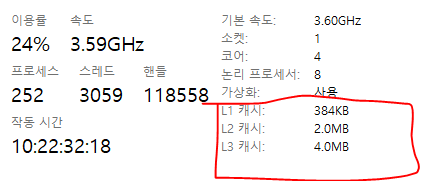

## 캐시와 캐싱

캐시는 컴퓨터의 성능을 향상시기기 위해 사용되는 메모리를 말하고, 캐싱은 자주 쓰이는 데이터를 더 빠른 메모리에 적재시켜 데이터 검색 성능을 높이는 것을 의미합니다. 캐싱을 사용하면 이전에 검색하거나 계산한 데이터를 효율적으로 재사용할 수 있어요.

## 메모리 계층 구조

캐싱에 대해 알아보기 위해서는 컴퓨터의 메모리 계층 구조에 대해서 알고 있어야 합니다.  
이전 시간에도 알아보았었던 메모리 구조에 대해 잠시 다시 확인하고 가보겠습니다.

메모리 계층 구조는 **'어떻게 하면 최대한 저렴한 가격에 최대한 빠른 컴퓨터를 만드는가?'** 라는 질문에 대한 대답에서 출발합니다. 싼 메모리는 용량이 크지만 느리고, 비싼 메모리는 용량이 작지만 빨라요. 대부분의 컴퓨터 프로그램들은 프로그램의 작은 부분에 자주 접근하기에, 그 작은 부분만을 비싼 메모리에 저장하고 사용하면 프로그램의 전체적인 성능이 향상됩니다. 이 때문에 컴퓨터 메모리는 용량이 많고 느린 아래쪽에서 시작해서 용량이 작고 빠른 위쪽으로 올라가는 계층구조를 지니고 있는데, 이를 '메모리 계층 구조'라 합니다.

메모리 계층 구조는 크게 register, cache, Ram, HDD, SSD 다섯가지로 정리할 수 있습니다.

아래로 갈 수록 속도는 느려지고, 가격은 저렴해집니다.

### 1. register (32 bit , 64 bit) 

레지스터는 CPU 안에 존재하는 저장 공간을 의미합니다.  
레지스터는 1bit의 정보를 저장할 수 있는 *flip-flop의 집합입니다. 데이터와 명령어를 저장하는 역할을 하며, 가장 빠른 속도로 접근 가능해요.

> **flip-flop (플립플롭 이란?)**
>
> 디지털 회로에서 1비트의 정보를 저장하는 장치. 즉, 한 번 상태가 설정되면 외부 신호가 들어오기 전까지 그 상태(0 또는 1)를 유지.
>
> - 기억 장치: 메모리의 가장 기본적인 단위
> - 두 가지 상태: 0 또는 1 (논리 LOW 또는 HIGH)
> - **입력 신호(클럭)** 에 따라 상태가 바뀜
> - 주로 레지스터, 카운터, 메모리 셀 등에 사용

레지스터는 CPU 코어 내부에도 몇 개 존재하지 않는 귀한 장치이며(100개 들어있으면 많이 들어있는 것이라고 해요,,), 대부분의 현대 프로세서는 메인 메모리에서 레지스터로 데이터를 옮겨와 데이터를 처리한 후 그 내용을 다시 레지스터에서 메인 메모리로 저장하는 *로드-스토어 설계를 사용하고 있습니다.

> **로드-스토어 (RISC) / 메모리-메모리 (CISC)**
>
>CPU의 명령어 집합 구조(ISA: Instruction Set Architecture)를 설계하는 방식이에요.
>
> - 로드-스토어 (RISC): 연산은 오직 레지스터끼리만 수행하고, 메모리 접근은 load와 store 명령어로만 가능해요. 명령어가 단순해서 실행 속도가 빠르고, 파이프라인 처리에 유리해요.
> - 메모리-메모리 (CISC): 연산 명령어가 메모리에도 직접 접근할 수 있어요. 복잡한 명령어로 더 많은 일을 한 번에 수행할 수 있지만, 명령어 해석이 복잡해지고 실행 시간이 길어질 수 있어요.
>
> | 항목 | 로드-스토어 (RISC) | 메모리-메모리 (CISC) |
> |------|--------------------|------------------------|
> | **연산 대상** | **레지스터끼리만** 연산 가능 | **메모리도 직접** 연산 가능 |
> | **메모리 접근** | `load` / `store` 명령어로만 접근 | 대부분의 명령어가 메모리 접근 가능 |
> | **명령어 수** | 작고 단순함 (Fixed size) | 많고 복잡함 (가변 길이) |
> | **명령어 실행 속도** | 빠름 (1클럭에 1명령) | 느릴 수 있음 (명령어 해석 복잡) |
> | **하드웨어 복잡도** | 단순 (파이프라이닝 최적) | 복잡 (명령어 디코딩 등 필요) |
> | **코드 길이** | 길어질 수 있음 (많은 명령 필요) | 짧을 수 있음 (한 줄로 많은 일) |
> | **대표 예시** | ARM, MIPS, RISC-V | x86, x86-64 (Intel, AMD) |

레지스터의 최대 처리 용량은 CPU의 처리 용량과 같은데, 32bit 컴퓨터는 2^32 까지, 64bit 컴퓨터는 2^64까지 인식이 가능합니다.

### 2. Cache

캐시 메모리는 CPU 내부에 존재하는 저장공간을 의미합니다.  
보통 명령어를 저장하는 Instruction Cache와 데이터를 저장하는 Data Cache로 구분되어 있으며, 때로는 캐시 메모리도 L1 Cache, L2 Cache 등 여러 레벨으로 분할해서 세부 계층화 하기도 합니다.​

> **Instruction Cache vs Data Cache**
>
> 메인 메모리는 CPU보다 느리기 때문에 명령어를 반복해서 메모리에서 가져오는 것은 비효율적입니다. 이때 캐시에서 자주 사용하는 명령어들을 Instruction Cache에, 데이터는 Data Cache에 저장하여 CPU가 빠르게 접근 가능하게 하여 실행 속도를 향상 시킵니다.  
> 보통 L1 캐시에 포함되며 고성능 CPU등에서 Instruction Cache와 Data Cache를 분리하는 것을 하바드 아키텍처(Harvard Architecture)라고 합니다.
>
> **Instruction Cache란?**  
> CPU 내부의 캐시 메모리 중 하나이며 프로그램의 명령어(instructions)를 임시로 저장합니다.  
>
> **Data Cache란?**  
> Data Cache는 CPU가 데이터를 빠르게 읽고 쓸 수 있도록 하는 캐시 메모리의 일종입니다. Instruction Cache가 명령어를 저장하는 것처럼, Data Cache는 프로그램에서 사용하는 데이터를 저장합니다.
>
> | | Instruction Cache | Data Cache |
> |------|--------------------|-------------|
> | 저장 대상 | 명령어 (코드) | 데이터 (변수, 값 등) |
> | 역할 | CPU가 실행할 명령어를 빠르게 불러옴 | CPU가 처리할 데이터를 빠르게 불러옴 |
> | 구조 | 보통 L1에서 분리되거나 통합됨 | Instruction Cache와 분리/통합 구조 있음 |

### 3. RAM

CPU와 별개인 메모리 중 최상위 메모리이자 '주기억장치'의 최하위 메모리입니다. SSD, HHD와 Cache의 속도차이를 메꾸기 위해 만들어졌습니다.  
PC당 수~수십GB정도로 이루어져있으며, 가정용에는 대부분 DRAM(삼성 시금치 램...)으로 구성되어 있습니다. 32bit 컴퓨터의 최대 메모리 용량은 4GB이고, 64bit 컴퓨터의 경우 이론상 16EB(엑사바이트)까지 램 용량을 추가할 수 있습니다.(이런 비현실적인 용량은 현재로써는 사용하지 않기 때문에, 하위 48비트만 사용해, 256TB까지 가능하다고 한다.... 256TB 는 커녕  2020년 현재 128G 램 가격이 100만원임.. 왕비싸더라요)

### 4. SSD

Solid State Drive의 줄임말.  
CPU, 그래픽카드, Ram은 전기적으로 동작하는 반면 하드디스크는 물리적으로 동작하기 때문에 병목현상이 걸리는 경우가 많았습니다. 하지만 SSD가 보급되고 가격이 낮아지면서 HDD와 가성비 경쟁이 될 정도가 되자 많은 소비자들이 SSD를 사용해 성능향상을 누리게 되었습니다. ( 여담이지만, Ram과 더불어 삼성전자가 선두를 달리고 있는 분야이기도 해요)

### 5. HDD

HDD는 비휘발성 데이터 저장소를 의미하며, 위의 기기와는 불허하는 엄청난 가성비를 가지고 있습니다.(1TB HDD가 5만원이 되지 않는다!) 하지만 속도는 최대 200MB/s, 평균 60~150MB로  느리기 때문에 최근에는 잘 안쓰는 것 같습니다.

---

​당연히, Disk -> Register 순으로 빠르고, 상대적으로 빠른 메모리를 임의로 사용하는 것이 캐싱 기술이라고 정의할 수 있습니다.

## Caching 과 Cache memory 의 관계

이전에 공부했듯이 캐싱은 당연히 캐시 메모리에 데이터를 올려두는 것이라고 생각했습니다. 캐싱을 하기 위해서는 캐시 메모리가 필요할텐데 캐시 메모리의 용량을 살펴보기 위해 맥인 제 컴퓨터 대신, 다른사람 컴퓨터 캡쳐를 훔쳐왔습니다.

가장 용량이 많은 L3 캐시조차 4MB 밖에 되지 않는데, 이 밤톨만한 용량에 데이터를 쌓는 것이 캐싱일까????

엄밀히 말하면 고급 프로그래밍 언어에서는 '진짜' 캐싱은 불가능하다고 해요.

다시 말해서, 캐싱은 
  1. 프로그래머가 직접 데이터를 저장하는 것이 아니고
  2. 대부분은 캐시에 저장되는 것도 아니다. ( 주로 RAM 에 저장한다고 해요..?)

그럼 캐싱이라는 것은 도대체 무엇일까요? 이에 대해 더 정확히 알기 위해서는 **공간 지역성** 이라는 개념이 필요합니다.

## 공간 지역성

잘 성명 된 아티클을 또 훔쳐 왔습니다. 모두 옮기기에는 글이 길어 이동해서 보겠습니다. [링크](https://parksb.github.io/article/29.html)

즉, 프로세서는 자주 접근하는 데이터를 스케줄러 에 따라 캐시에 올려놓고, 새로운 프로세서가 공간을 많이 차지하면 안쓰는 공간을 가져갑니다. ( 가상 메모리 기술, MMU )  
즉, 캐싱을 한다는 것은 메모리를 많이 *히트시켜서 스케줄러가 Ram 또는 Cache 에 데이터를 많이 올려주는 것을 의미합니다.

> 여기서 "히트(hit)"는 데이터를 메모리에서 찾을 수 있었을 때를 의미합니다. 즉, 메모리 히트는 CPU가 요청한 데이터를 빠르게 메모리에서 찾을 수 있었을 때 발생합니다.