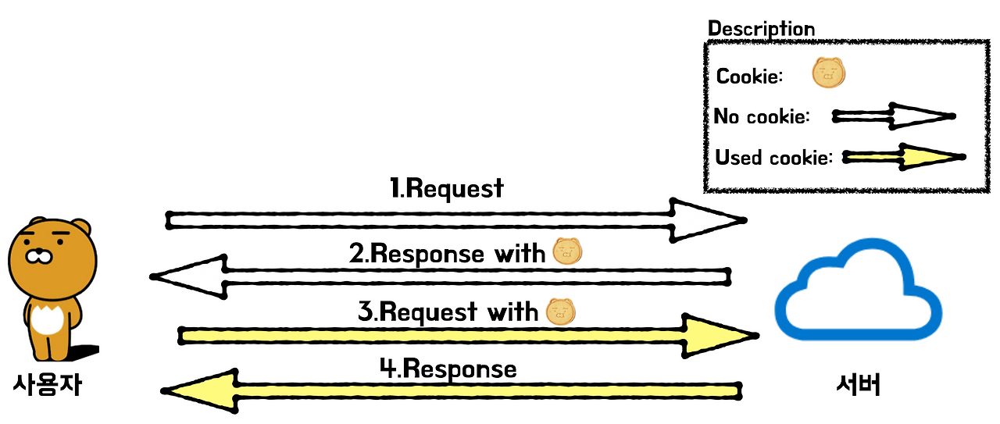
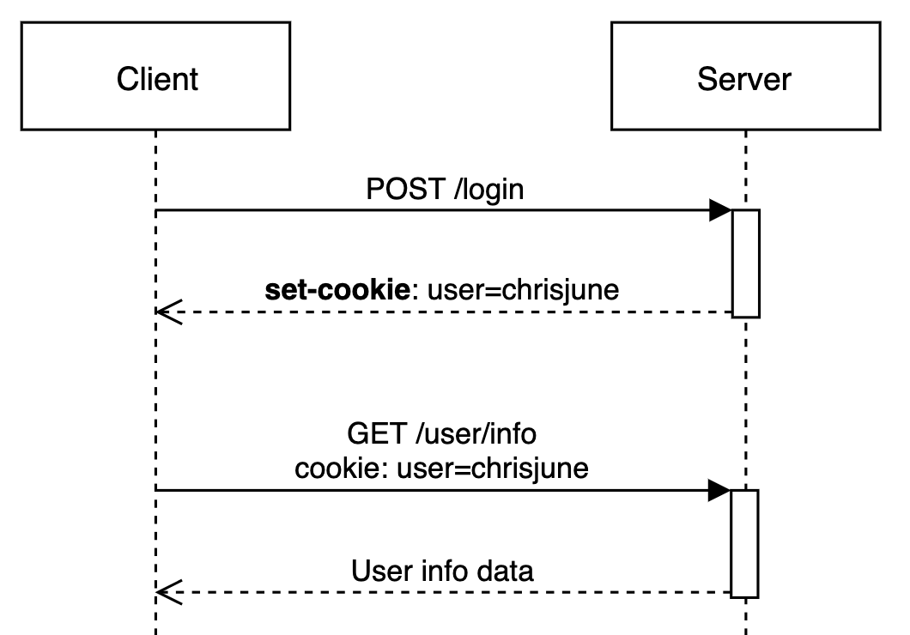

## HTTP 프로토콜의 특징

HTTP 프로토콜은 다음의 특징을 가지고 있습니다.

1. **비연결 지향(Connectionless)**  
HTTP 프로토콜은 클라이언트에서 서버에 요청(Request)을 보내면 서버는 클라이언트에 응답(Response)을 하고 '연결을 끊는 특징'을 가지고 있습니다.  
2. **상태정보 유지 안함(Stateless)**  
HTTP 통신은 연결을 끊는 순간 클라이언트와 서버의 통신이 끝나며 상태 정보를 유지하지 않는 특징이 있으며, 이를 Stateless하다고 합니다.

서버와 클라이언트끼리의 통신과 상태가 유지되지 않기 때문에 매번 요청, 페이지 이동이 필요 한 경우 서버에 유저의 상태를 넘겨 줄 필요가 있습니다.  
이때 사용하는 것이 **쿠키(Cookie)** 와 **세션(Session)** 입니다.

## 쿠키 (Cookie)

쿠키는 클라이언트의 로컬에 저장되는 키(key)와 값(value)로 이루어진 작은 데이터 파일입니다.  
사용자의 인증이 유효한 '시간'을 명시할 수 있으며, 유효 시간이 정해지면 브라우저가 종료되어도 인증이 유지 된다는 특징이 있습니다. (자동 로그인 등에 사용 가능)  
쿠키는 클라이언트에 300개 까지 저장 할 수 있고, 도메인당 20개의 key만 가질 수 있습니다. 하나하나의 쿠키값은 최대 4KB까지 저장할 수 있습니다.

쿠키 사용의 예로는 방문 사이트에서 로그인 시, "아이디와 비밀번호를 저장하시겠습니까?"등의 자동로그인, 팝업에서 "오늘 더 이상 이 창을 보지 않음" 체크, 쇼핑몰의 장바구니 등이 있습니다.

### 쿠키의 사용 목적

1. **세션 관리(Session Management)**  
로그인, 사용자 닉네임, 접속 시간, 장바구니 등의 서버가 알아야할 정보들을 저장합니다.
2. **개인화(Personalization)**  
사용자마다 다르게 그 사람에 적절한 페이지를 보여줄 수 있습니다.
3. **트래킹(Tracking)**  
사용자의 행동과 패턴을 분석하고 기록합니다

### 쿠키 생성 과정

1. 클라이언트가 서버에 로그인 요청
2. 서버는 클라이언트의 로그인 요청의 유효성을 확인하고(아이디와 비밀번호 검사) 응답헤더에 set-cookie: 를 통해 쿠키를 추가하여 응답
3. 클라이언트는 이후 서버에 요청(Request)할 때 전달받은 쿠키를 자동으로 요청헤더(Request Header)에 추가하여 요청 (별도의 설정이 필요 없음)

### 쿠키의 구성 요소

제 브라우저에서 쿠키창을 한번 가져와봤습니다.

- **이름 (key)** : 각각의 쿠키를 구별하는 데 사용하는 이름입니다.
- **값 (value)** : 해당 쿠키의 실제 데이터 값입니다. 서버 또는 클라이언트에서 설정한 문자열입니다. 보통 토큰, 세션 ID, 사용자 식별자 등을 담고 있습니다.
- **유효시간 (Expires / Max-Age)** : 쿠키의 유효 기간입니다.
- **도메인 (Domain)** : 쿠키가 유효한 도메인입니다. 해당 도메인에서만 쿠키가 전송됩니다.
- **경로 (Path)** : 쿠키가 유효한 경로입니다. 일반적으로 /는 전체 경로를 의미합니다.
- **크기(Size)** : 쿠키 값의 바이트 크기입니다. 브라우저는 도메인당 전체 쿠키 크기 제한이 있습니다 (일반적으로 4KB)
- **HttpOnly** : `✓`이면 JavaScript를 통해 쿠키 접근이 불가능합니다. 보안적으로 민감한 정보(예: 토큰)는 HttpOnly로 설정하는 것이 좋습니다.
- **Secure** : `✓`이면 HTTPS 연결에서만 전송됩니다. HTTP에선 쿠키가 전송되지 않아 보안에 유리합니다.
- **SameSite** : CSRF(Cross Site Request Forgery) 방지를 위한 속성입니다. None: 제약 없음 (단, Secure 필수), Lax: 일부 외부 요청 허용 (링크 클릭 등), Strict: 외부 사이트에서 전혀 전송 안됨
- **Partition Key Site / Cross Site** : 일반적으로 크로스사이트 쿠키 격리나 퍼스트 파티/서드 파티 구분에 쓰이는 열입니다. (브라우저마다 다름)
- **Priority** : 	브라우저가 리소스를 정리할 때 어떤 쿠키를 먼저 지울지를 결정하는 우선순위입니다. 보통 Medium이 기본입니다.

> ### **Partition Key Site / Cross Site**
>
> 이 항목은 **쿠키 격리(partitioning)** 와 퍼스트파티 / 서드파티 컨텍스트와 관련이 있습니다.
>
> **Partitioned Cookies (격리된 쿠키)**  
> 브라우저(특히 Chrome, Safari 등)는 최근 서드파티 쿠키를 격리하는 방식으로 보안을 강화하고 있습니다.  
> Partition Key Site는 어떤 "최상위 사이트(top-level site)"에 종속된 쿠키인지를 나타냅니다.  
> 예를 들어 A.com 페이지에서 iframe으로 B.com을 불러올 때, B.com은 자신의 쿠키를 설정할 수 있지만, 이 쿠키는 A.com 안에서만 유효한 별도의 공간에 저장됩니다 (partitioned).  
> 이렇게 하면 다른 사이트에서 동일 도메인의 쿠키를 공유하지 못하게 됩니다.
>
> **Cross Site**  
> Cross Site는 이 요청이 크로스 사이트 요청인지 (즉, 다른 출처에서 왔는지)를 판단하는 기준입니다. 브라우저는 다음을 체크합니다.
> - 요청 출처(origin)와 대상 도메인이 다른 경우 Cross Site
> - 요청한 페이지가 `<iframe>`, ``, `<script>` 등으로 포함된 경우
> - 주로 보안 정책 (CORS, SameSite, Partitioning 등)에 영향을 줍니다.

> ### **SameSite**
>
> 쿠키가 요청에 자동으로 포함되는 조건을 제한하여 CSRF(Cross-Site Request Forgery)를 방지하는 역할을 합니다.  
> ‼ SameSite=None 쿠키는 반드시 Secure(HTTPS만 허용) 옵션과 함께 설정되어야 브라우저에서 유효합니다.  
> **Strict** : 철저한 보호 / 외부 사이트에서 쿠키가 전혀 전송되지 않음 / A사이트에 로그인된 상태에서 B사이트 링크를 클릭 → 로그인 쿠키 미전송  
> **Lax** : 느슨한 보호 / 외부 링크 클릭이나 GET 요청은 허용, POST 폼 제출은 안 됨 / 검색 엔진 클릭은 쿠키 포함, POST 로그인은 쿠키 제외  
> **None** : 제약 없음 / 외부 요청에도 쿠키가 항상 포함됨 (단, Secure가 필수) / 페이스북 Like 버튼, 카카오톡 공유 등 외부 위젯에서 로그인 유지 가능

### 쿠키의 종류

| 쿠키 종류 | 특징 |
|---------|-----|
|Session Cookie	| 일반적으로 만료시간(Expire Date)를 설정하고 메모리에만 저장되며, 브라우저 종료 시 쿠키를 삭제|
|Persistent Cookie | 장기간 유지되는 쿠키이다. 파일로 저장되어 브라우저 종료와 관계없이 사용|
|Secure Cookie | HTTPS 프로토콜에서만 사용하며, 쿠키 정보가 암호화되어 전송|
|Third-Party Cookie | 방문한 도메인과 다른 도메인의 쿠키이다. 일반적으로 광고 배너 등을 관리할 때 유입 경로를 추적하기 위해 사용|

### 쿠키의 단점

브라우저 개발자도구의 네트워크에서 쿠키값을 확인할 수 있지만, 가독성이 떨어지고 수정이 불가능하지만 '브라우저의 쿠키 관리 탭' 또는 '쿠키 관리 플러그인'을 설치하면 쿠키를 쉽게 수정할 수 있습니다.

이러한 쿠키는 클라이언트에서 수정할 수 있기 때문에 위변조의 위험이 항상 존재해요. 따라서 쿠키값(value)를 암호화해야 하며, 민감하거나 중요한 정보를 담지 않도록 해야합니다.

## 세션 (Session)

일정 시간(브라우저를 통해 웹 서버에 접속한 시점부터, 브라우저를 종료하여 연결을 끝내는 시점) 동안 같은 사용자(브라우저)로부터 들어오는 일련의 요구를 하나의 상태로 보고, 그 상태를 유지시키는 기술을 말합니다. 즉, 브라우저가 종료되기 전까지 클라이언트의 요청을 유지하게 해주는 기술을 세션이라고 합니다.

세션은 쿠키를 기반하고 있지만, 사용자 정보 파일을 브라우저에 저장하는 쿠키와 달리 세션은 서버 측에서 관리합니다. 서버에서는 클라이언트를 구분하기 위해 세션 ID를 부여하며 웹 브라우저가 서버에 접속해서 브라우저를 종료할 때까지 인증상태를 유지합니다. 물론 접속 시간에 제한을 두어 일정 시간 응답이 없다면 정보가 유지되지 않게 설정이 가능 합니다.  
사용자에 대한 정보를 서버에 두기 때문에 쿠키보다 보안에 좋지만, 사용자가 많아질수록 서버 메모리를 많이 차지하게 됩니다. 즉 동접자 수가 많은 웹 사이트인 경우 서버에 과부하를 주게 되므로 성능 저하의 요인이 됩니다.

클라이언트가 Request를 보내면, 해당 서버의 엔진이 클라이언트에게 유일한 ID를 부여하는 데 이것이 세션 ID입니다.

### 세션의 사용 목적

사용자나 다른 누군가에게 노출되면 안되는 보안적으로 중요한 정보들을 서버 안에서 다루기 위해 사용합니다.

### 세션 생성 과정

1. 클라이언트가 서버에 접속 시 세션 ID를 발급 받음
2. 클라이언트는 세션 ID에 대해 쿠키를 사용해서 저장하고 가지고 있음
3. 클라리언트는 서버에 요청할 때, 이 쿠키의 세션 ID를 같이 서버에 전달해서 요청
4. 서버는 세션 ID를 전달 받아서 별다른 작업없이 세션 ID로 세션에 있는 클라언트 정보를 가져와서 사용
5. 클라이언트 정보를 가지고 서버 요청을 처리하여 클라이언트에게 응답

### 세션의 단점

세션의 내용은 서버에 저장되기 때문에 계속하여 늘어날 경우 서버에 부하가 발생할 수 있으며, 또한 세션에 대한 정보가 서버에 있어 쿠키에 비해 비교적 속도가 느립니다.

## 쿠키와 세션 비교

쿠키와 세션은 비슷한 역할을 하며, 동작원리도 비슷합니다. 그 이유는 세션도 결국 쿠키를 사용하기 때문입니다.  
가장 큰 차이점은 사용자의 정보가 저장되는 위치입니다. 때문에 쿠키는 서버의 자원을 전혀 사용하지 않으며, 세션은 서버의 자원을 사용합니다.  
보안 면에서 세션이 더 우수하며, 요청 속도는 쿠키가 세션보다 더 빠릅니다. 그 이유는 세션은 서버의 처리가 필요하기 때문입니다.  
보안, 쿠키는 클라이언트 로컬에 저장되기 때문에 변질되거나 request에서 스니핑 당할 우려가 있어서 보안에 취약하지만 세션은 쿠키를 이용해서 sessionid 만 저장하고 그것으로 구분해서 서버에서 처리하기 때문에 비교적 보안성이 좋습니다.  
라이프 사이클, 쿠키도 만료시간이 있지만 파일로 저장되기 때문에 브라우저를 종료해도 계속해서 정보가 남아 있을 수 있다. 또한 만료기간을 넉넉하게 잡아두면 쿠키삭제를 할 때 까지 유지될 수도 있습니다.  
반면에 세션도 만료시간을 정할 수 있지만 브라우저가 종료되면 만료시간에 상관없이 삭제됩니다. 예를 들어, 크롬에서 다른 탭을 사용해도 세션을 공유됩니다. 다른 브라우저를 사용하게 되면 다른 세션을 사용할 수 있습니다.  

| | Cookie | Session |
|--|--------|--------|
| 저장 위치 | Client | Server |
| 저장 형식 | Text | Object |
| 만료 시점 | 쿠키 저장 시 설정 (설정 없으면 브라우저 종료 시) | 정확한 시점 모름 |
| 리소스 | 클라이언트의 리소스 | 서버의 리소스 |
| 용량 제한 | 한 도메인 당 20개, 한 쿠키 당 4KB | 제한 없음 |
| 속도 | 쿠키에 정보가 있어 비교적 빠름 | 정보가 서버에 있어 비교적 느림 |

### 세션와 쿠키를 모두 사용하는 이유

세션은 서버의 자원을 사용하기 때문에 무분별하게 만들다보면 서버의 메모리가 감당할 수 없어질 수가 있고 속도가 느려질 수 있기 때문에 쿠키가 유리한 경우가 있습니다.  
따라서 자원관리 차원에서 쿠키와 세션을 적절한 요소 및 기능에 병행 사용하여 서버 자원의 낭비를 방지하며 웹사이트의 속도를 높일 수 있다.

### 쿠키/세션은 캐시와 엄연히 다르다

캐시는 이미지나 css, js파일 등을 브라우저나 서버 앞 단에 저장해놓고 사용하는 것입니다.  
한번 캐시에 저장되면 브라우저를 참고하기 때문에 서버에서 변경이 되어도 사용자는 변경되지 않게 보일 수 있는데 이런 부분을 캐시를 지워주거나 서버에서 클라이언트로 응답을 보낼 때 header에 캐시 만료시간을 명시하는 방법등을 이용할 수 있습니다.

보통 쿠키와 세션의 차이를 물어볼 때 저장위치와 보안에 대해서는 잘 말하는데 사실 중요한 것은 라이프사이클을 얘기하는 것입니다.

### 쿠키/세션의 라이프 사이클

#### 🍪 쿠키(Cookie)의 라이프사이클

1. **생성**
   - 서버 또는 클라이언트(자바스크립트)에서 생성.
   - 예: 서버에서 `Set-Cookie` 헤더를 통해 응답하거나, JS에서 `document.cookie`로 생성.

2. **저장**
   - **클라이언트(브라우저)**에 저장됨.
   - 기본적으로 텍스트 파일 형태로 저장.

3. **전송**
   - 같은 도메인으로 요청할 때마다 자동으로 요청 헤더(`Cookie`)에 포함되어 서버에 전송.

4. **만료**
   - 쿠키 생성 시 `Expires` 또는 `Max-Age` 속성으로 수명을 설정할 수 있음.
   - 설정 안 하면 **세션 쿠키**로 간주되어 브라우저 종료 시 삭제됨.
   - 명시된 시간에 도달하거나 수동으로 삭제되면 사라짐.

#### 🗂️ 세션(Session)의 라이프사이클

1. **생성**
   - 서버에서 사용자 요청을 처음 받을 때 세션을 생성하고 고유한 세션 ID 부여.
   - 이 세션 ID를 클라이언트에게 **쿠키 형태로** 전달함 (`Set-Cookie: JSESSIONID=...` 등).

2. **저장**
   - **서버 측**에 저장됨 (메모리, DB, Redis 등).
   - 사용자의 상태나 정보를 서버 메모리에 저장해두고 세션 ID를 통해 구분.

3. **유지**
   - 클라이언트는 이후 요청마다 세션 ID 쿠키를 함께 전송.
   - 서버는 이를 이용해 클라이언트 상태를 식별하고 유지.

4. **만료**
   - **서버에 설정된 세션 유효 시간**(예: 30분 동안 활동 없으면 만료)에 따라 자동 삭제.
   - 서버에서 수동으로 삭제하거나 로그아웃 등의 액션으로 종료될 수도 있음.
