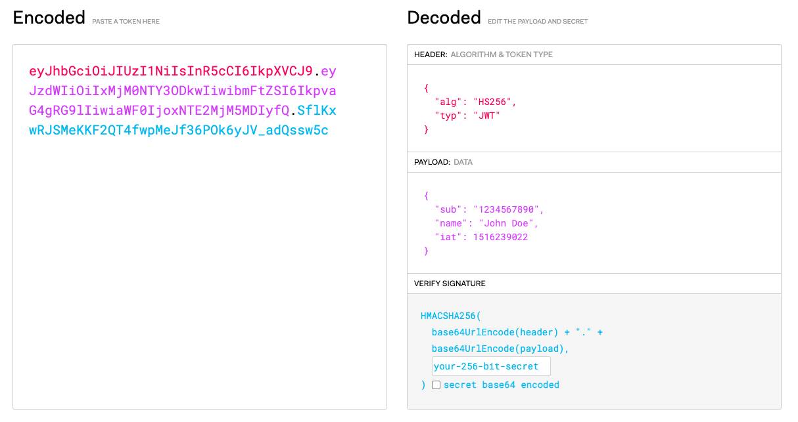

## JWT

[JWT를 생성해볼 수 있는 사이트](https://jwt.io/)

JWT(Json Web Token)는 사용자 인증 및 정보 교환을 위해 사용하는 개방형 표준(RFC 7519)인증 방식입니다. 말 그대로 인증에 필요한 정보들을 Token에 담아 암호화시켜 사용하는 것이에요. 서버가 클라이언트를 인증한 후, 해당 사용자에 대한 정보를 JSON 형태로 담아 서명한 토큰을 발급하고, 이후 요청 시 이 토큰을 통해 사용자를 식별할 수 있습니다.

사실 기본적인 인증을 진행하는 구조는 Cookie와 크게 다르지 않습니다. 다만, JWT는 **서명 된 토큰** 이라는 점이 중요합니다. 공개/개인 키를 쌍으로 사용하여 토큰에 서명할 경우 서명 된 토큰은 개인 키를 보유한 서버가 이 서명된 토큰이 정상적인 토큰인지 인증할 수 있습니다.

### JWT의 구조

JWT는 각각의 구성요소가 점(`.`)으로 구분되어 있습니다.

- Header (헤더): 토큰 타입과 해싱 알고리즘 정보를 담고 있습니다.
- Payload (페이로드): 사용자 정보 및 기타 클레임(Claim : 토큰에서 사용할 정보의 조각) 데이터가 담깁니다. 토큰에 대한 property를 key-value의 형태로 저장합니다.
- Signature (서명): 토큰의 무결성을 검증하기 위한 서명입니다.

> **Payload에 사용되는 표준 Claim 스펙** (필수 아님)
>
> 사실 어떤 Claim을 넣는 지는 개발자 마음이지만, 표준 스펙이 있다고 하여 가져와봤습니다.  
> 표준 스펙상 key의 이름은 세글자로 되어있습니다. JWT의 핵심 목표는 사용자에 대한, 토큰에 대한 표현을 답축하는 것이기 때문에 이를 정의 한 것이라고 하네용.
>
> 1. iss (Issuer) : 토큰 발급자
> 2. sub (Subject) : 토큰 제목 - 토큰에서 사용자에 대한 식별 값이 됨
> 3. aud (Audience) : 토큰 대상자
> 4. exp (Expiration Time) : 토큰 만료 시간
> 5. nbf (Not Before) : 토큰 활성 날짜 (이 날짜 이전의 토큰은 활성화 되지 않음을 보장)
> 6. lat (Issued at) : 토큰 발급 시간
> 7. jti (JWT Id) : JWT 토큰 식별자 (Issuer가 여러명일 때 이를 구분하기 위한 값)
>
> 이러한 표준 스펙으로 정의되어 있는 Claim 스펙이 있다는 것 뿐이지, 꼭 이 7가지를 모두 포함하거나 key를 사용해야하는 것은 아니고, 상황에 맞춰 해당 서버가 가져야 할 인증 체계에 따라 사용하면 됩니다.  
> 물론 표준 스펙 외에도 필요하다 싶으면 추가해도 전혀 문제가 없습니다.  
> 다만 중요한 것은 payload에 민감한 정보를 담지 않는 것입니다. header와 payload는 json이 디코딩 되어있을 뿐이지 특별한 암호화가 걸려있는 것이 아니기 때문에 누구나 jst를 가지고 디코딩을 한다면 header나 payload에 담긴 값을 알아낼 가능성이 있기 때문이에요.

## JWT를 웹 스토리지에 저장해야 한다면 어디다 저장하시겠나요? 이유는요?

JWT를 클라이언트 측에 저장해야 한다면, **가능하면 저장하지 않는 것이 가장 안전하지만**, 꼭 저장해야 한다면 일반적으로 다음 두 가지 선택지가 있습니다:

### 1. `sessionStorage`
- **장점**:
  - 탭을 닫으면 데이터가 삭제되므로 비교적 안전합니다.
  - XSS에만 노출되고, CSRF 공격에는 비교적 안전합니다.
- **단점**:
  - 탭 간 공유가 되지 않아 사용자 경험에 제한이 있을 수 있습니다.

### 2. `localStorage`
- **장점**:
  - 탭이나 브라우저를 닫아도 데이터가 유지되어 사용성이 좋습니다.
- **단점**:
  - XSS 공격에 매우 취약하며, 한번 탈취되면 장기간 사용될 수 있습니다.

### 추천: **sessionStorage 사용 권장**

XSS에 대한 방어는 어느 저장소를 사용하든 철저히 해야 하며, **가능하면 HttpOnly 쿠키 사용**이 가장 안전합니다. 하지만 웹 스토리지를 사용해야만 하는 상황이라면 **sessionStorage를 사용해 보안 리스크를 줄이는 것이 낫습니다.**

또한 다음과 같은 추가적인 보안 조치를 병행하는 것이 중요합니다:

- Content Security Policy (CSP) 설정
- 입력 값에 대한 철저한 필터링 및 이스케이핑
- JWT 만료시간 짧게 설정 및 재발급 로직 구현
- HTTPS를 통한 통신 보안 유지
