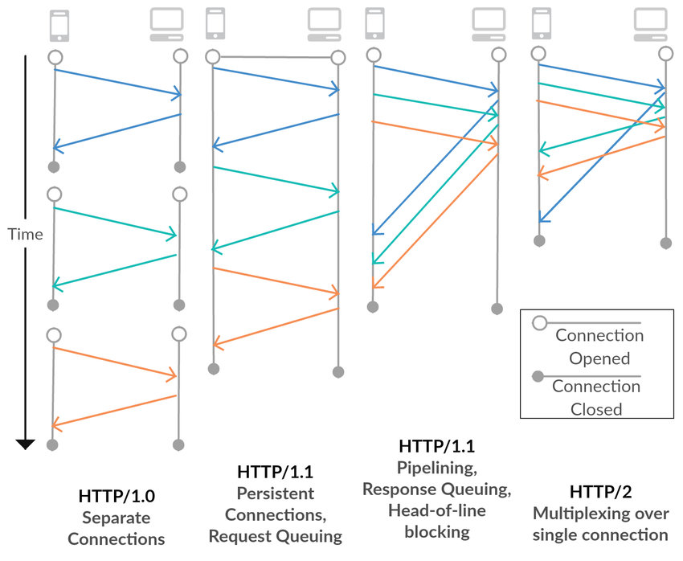

## HTTP Version 1.0

HTTP의 초기 버전은 서버로 부터 정보를 얻는(GET)만 가능했습니다.(HTTP version 0.9) 하지만 점점 인터넷이 발전하고 새로운 기능이 생겨나면서 정보를 얻는 것 만으로는 충분하지 않게 되었습니다.

HTTP 버젼 1.0에서는 새로운 유틸리티들이 추가되었습니다.

- Header : HTTP 헤더를 도입해 프로토콜 방식을 유연하고 확장가능하게 만든 메타데이터의 전송이 가능하게 되었습니다.

```http
GET /index.html HTTP/1.0
Host: www.example.com
User-Agent: Mozilla/4.0 (compatible; MSIE 5.0; Windows NT)
Accept: text/html, image/jpeg, */*
```

- Versioning : HTTP 요청시 사용된 버전을 명시적으로 알려주고 request line에 추가했습니다.
- Status Code : HTTP 요청은 상태 코드를 가지게 되었습니다. 상태 코드를 통해 receiver가 요청 처리상태(성공 또는 실패)를 확인할 수 있습니다.
- Content-type : Header 덕분에 HTTP는 일반 HTML 파일이 아닌 다른 문서 유형도 전송할 수 있습니다.(`json`등등..)
- New methods : HTTP1.0 버전은 GET외에도 새로운 method(POST 및 HEAD)를 제공했습니다.

### HTTP Version 1.0의 TTP 단점

- 단일 요청 : 요청마다 새로운 TCP 연결을 맺고 응답 후 닫습니다.
- 다중 요청 처리 불가 : 하나의 요청을 처리한 후에야 다음 요청을 보낼 수 있습니다.
- 캐싱 부족: HTTP 헤더를 이용한 캐싱 기능이 제한적이었습니다.

## HTTP Version 1.1

HTTP/1.0에서는 매 요청마다 새로운 TCP 연결을 만들어야 하고, 순차적으로 처리해야해 요청이 많을 경우 병목현상이 발생했습니다. HTTP/1.1이 HTTP/1.0을 개선한 버전입니다.

- Host header : 호스트 헤더는 프록시 서버를 통해 메시지를 라우팅 할때 특히 중요합니다, Host header를 통해 동일한 IP를 가리키는 도메인을 구분할 수 있습니다.
- Pipelining : 여러 요청을 동시에 보내고 처리할 수 있도록 하여 효율성을 개선 하였습니다.
- Persistent connections (연결 지속) : HTTP 1.0에서는 각각의 request와 response 가 새로운 연결을 엽니다. 반면 HTTP 1.1 에서는 여러 요청을 single connection을 사용하여 실행할 수 있습니다.
- Continue status : 서버가 처리할 수 없는 요청을 처리하는것을 거부하는 것을 방지하기 위해, 클라이언트는 먼저 요청 헤더만 보내고 계속 상태 코드(100)를 수신하는지 확인할 수 있습니다.
- New methods : HTTP 1.1에서는 PUT, PATCH, DELETE, CONNECT, TRACE, 그리고 OPTIONS 메서드가 추가 되었습니다.

### HTTP Version 1.1의 단점

- 헤더 크기 최적화 없음: 요청 및 응답 헤더가 크면 네트워크 대역폭 소모 증가 하였습니다.

## HTTP Version 2.0

HTTP/1.1에서는 아직 순차적으로 요청을 처리해야 했기 때문에 앞의 요청이 복잡해 빠르게 처리되지 않으면 뒤 요청이 간단하더라도 응답을 받을 수 없었습니다. HTTP/2.0은 HTTP/1.1의 성능 문제를 해결하기 위해 멀티플렉싱, 헤더 압축, 서버 푸시 등의 기능을 추가했습니다.

- Request multiplexing (멀티플렉싱) : HTTP 1.1은 순차적인 프로토콜 입니다. 그래서 한번에 하나의 요청만 보낼수 있습니다. 반면에 HTTP 2.0에서는 요청을 보내고 응답을 비동기적으로 수신 받을 수 있습니다. 그렇기 때문에 단일 연결을 사용하여 여러 요청을 동시에 수행할 수 있습니다.
- Request prioritization : HTTP 2.0을 사용하면 요청 배치에서 숫자 우선 순위를 설정할 수 있습니다. 따라서 JS 파일을 응답 받기전에 웹페이지 CSS를 받는 것과 같은 응답을 예상하는 순서를 명시할 수 있습니다.
- Automatic compressing : HTTP 1.1 버전에서는, 요청 및 응답의 압축을 명시적으로 요구해야 합니다. 반면에 HTTP2.0에서는 GZip 압축을 자동으로 실행합니다. 이때 HTTP/1.1에서는 요청과 응답 헤더가 커질수록 네트워크 대역폭을 많이 차지했으나, 중복된 헤더를 압축하여 이를 최적화 되었습니다.
- Connection reset : 어떤 이유로 인해 서버와 클라이언트 간의 연결을 닫고 즉시 새 연결을 열 수 있는 기능이 추가 되었습니다.
- Server push : 서버가 많은 요청을 받는 것을 피하기 위해, HTTP 2.0은 서버 푸시 기능을 도입했습니다. 이 기능을 통해 서버는 곧 요청될 리소스를 예측하려 합니다. 따라서 서버는 이러한 리소스를 클라이언트 캐시에 사전에 푸시합니다. 클라이언트의 요청을 최소화 해서 성능 향상을 이끌어 냅니다.

### 정리



| 특징 | HTTP/1.0 | HTTP/1.1 | HTTP/2.0 |
|------|---------|---------|---------|
| **Persistent Connection** | ❌ (요청마다 새로운 연결) | ✅ (Keep-Alive) | ✅ (기본적으로 유지됨) |
| **Pipelining** | ❌ | ✅ (한계 있음) | ✅ (멀티플렉싱으로 대체) |
| **Host Header** | ❌ | ✅ | ✅ |
| **Chunked Transfer** | ❌ | ✅ | ✅ |
| **Multiplexing** | ❌ | ❌ | ✅ |
| **Header Compression** | ❌ | ❌ | ✅ (HPACK) |
| **Server Push** | ❌ | ❌ | ✅ |
| **Binary Protocol** | ❌ (텍스트) | ❌ (텍스트) | ✅ (바이너리) |
| **Stream Prioritization** | ❌ | ❌ | ✅ |
