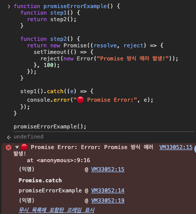
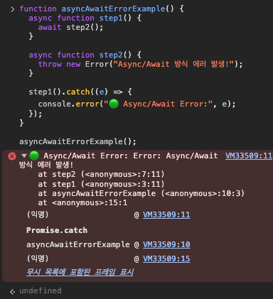

### Promise?
Promise는 자바스크립트에서 **비동기 작업의 완료 또는 실패를 처리하기 위한 객체**이다. 즉, **“미래에 어떤 일이 끝났을 때 결과를 알려줄게”**라는 약속(Promise)을 나타내는 것이다.

> **Promise는 미래의 어떤 시점에 완료될 수도, 실패할 수도 있는 비동기 작업의 결과를 나타내는 객체입니다.**   |  공식정의


```javascript
const promise = new Promise((resolve, reject) => {
  // 비동기 작업 수행
  if (성공) {
    resolve(결과); // 성공시 결과 전달
  } else {
    reject(에러); // 실패시 에러 전달
  }
});
```

#### Promise 는 3가지의 상태를 가진다.
1. pending (대기 중) → 처음 생성된 상태
2. fulfilled (이행됨) → resolve()가 호출됨
3. rejected (거부됨) → reject()가 호출됨

#### Promise 를 사용하는 이유? 
- 예전에는 **콜백(callback)** 기반으로 비동기 코드를 작성했는데, 복잡한 코드일수록 **콜백 지옥**(callback hell)이 생김.
- Promise는 **비동기 흐름을 더 깔끔하게** 구성할 수 있게 해줌.
- then, catch, finally 체인을 통해 **로직을 명확하게 분리** 가능.

## async / await?
async/await는 **비동기 코드를 더 읽기 쉽고 간결하게 작성할 수 있도록 도와주는 문법**이다.
**Promise를 더 쉽게 사용할 수 있도록 만든 문법적 설탕(syntactic sugar)** 이다.

기존 Promise 
```javascript
function fetchData() {
  return new Promise((resolve, reject) => {
    setTimeout(() => resolve("데이터 가져옴!"), 1000);
  });
}

fetchData()
  .then(data => {
    console.log(data);
  })
  .catch(err => {
    console.error(err);
  });
```

async/await 방법
```javascript
async function getData() {
  try {
    const data = await fetchData();
    console.log(data);
  } catch (err) {
    console.error(err);
  }
}

getData();
```

- async/ await 을 사용하면 동기 코드처럼 읽히는 비동기 코드를 작성할 수 있다.
- await는 **항상 async 함수 안에서만** 사용할 수 있음
- await는 실행을 **일시 중단**시키기 때문에 병렬로 처리할 작업은 Promise.all() 등으로 처리해야 효율적
```javascript
// 비효율적 (순차적으로 기다림)
await task1();
await task2();

// 효율적 (병렬 처리)
await Promise.all([task1(), task2()]);
```


**언제 사용하나요?**
- **순차적인 비동기 작업**이 필요한 경우: await를 순서대로 사용할 수 있음.
- **에러 처리를 try/catch로 명확히 하고 싶은 경우**
- **가독성이 중요한 복잡한 로직을 다룰 때**

| **구분**  | **Promise (**then**)**            | **async/await**                     |
| ------- | --------------------------------- | ----------------------------------- |
| 코드 가독성  | 콜백 지옥에서 벗어났지만, 중첩될 수 있음           | 동기 코드처럼 읽기 쉬움                       |
| 에러 처리   | .catch() 또는 then(undefined, err)  | try/catch로 직관적인 처리 가능               |
| 디버깅 편의성 | 콜 스택이 복잡함                         | 상대적으로 디버깅이 쉬움                       |
|         |  |  |
| 병렬 처리   | Promise.all() 등을 사용해야 함           | await를 병렬로 쓰면 오히려 느림                |
