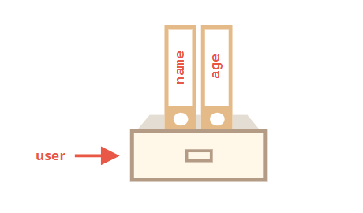

## 객체란
컴퓨터 과학에서 객체 또는 오브젝트는 클래스에서 정의한 것을 토대로 메모리(실제 저장공간)에 할당된 것으로 프로그램에서 사용되는 데이터 또는 식별자에 의해 참조되는 **공간** 을 의미함, 변수, 자료구조, 함수 또는 메서드가 될 수 있다. 

## 자바스크립트에서 객체란?
자바스크립트는 객체기반의 스크립트 언어이며 Javascript 를 이루고 있는 거의 모든것은 객체다. 

>객체란 여러 속성을 하나의 변수에 저장할 수 있도록 해주는 데이터 타입으로 key/value 를 저장할 수 있는 구조이다. 

### 객체의 특징
- 객체는 변수이다. 그러나 객체에는 많은 값이 포함될 수 있다.
    - (자바스크립트 변수처럼 단일 값을 포함 할 수 있다.)
- 객체는 중괄호 표기를 이용하여 만들 수 있다.
- 객체는 각각의 key/value에 대한 정보를 나열할 수 있다.
- Key는 문자열 또는 기호여야 한다.
- Value는 모든 유형이 될 수 있다.
- 객체는 한 쌍의 key/value 뒤에 쉼표를 이용하여 그 뒤에 오는 key/value와 구분해주어야 한다.
- 객체에서 명명된 값을 Properties라고 한다.
- 변수는 예약어의 이름을 가질 수 없지만 객체는 어떠한 이름이어도 상관없다.
- 객체 변수를 복사하면 참조가 복사되고 객체가 복제되지 않는다.

### 객체의 종류 
- 배열
- 함수
- 객체
- 날짜
- 수학
- 정규표현식
- Boolean은 객체일 수 있다. (new 키워드로 정의된 경우)
- 숫자는 객체가 될 수 있다. (new 키워드로 정의된 경우)
- 문자열은 객체가 될 수 있다. (new 키워드로 정의된 경우)

>JavaScript에서 원시값을 제외한 모든 JavaScript값은 객체이다.

## 자바스크립트의 객체 구성 
ECMA script 객체는 크게 3가지구성
1. Javascript 내장객체
    javascript 엔진이 구동되는 시점에서 바로 제공되며 javascript 코드 어디에서든 사용이 가능하다. 
    - Global
    - Object
    - String
    - Number
    - Boolean
    - Date
    - Array
    - Math

2. 브라우저 내장 객체
    브라우저 내장객체도 javascript가 구동되는 시점에서 바로 사용이 가능한 객체들이며 내장 객체다. 
    **javascript 엔진을 구동하는 것들에서 build 되는 객체이다.**
    이 객체들은 자바스크립트 내장객체 구성된 후에 구성이 된다. 
    - 브라우저 객체 모델 (BOM)
    - 문서 객체 모델 (DOM)

3. 사용자 정의 객체(Host Object)
    사용자가 생성한 객체들로 생성자 함수 또는 객체 리터럴을 통해 사용자가 객체를 정의하고 확장시킨 객체들이라서 내장 객체 구성 이후에 구성되어 짐. 
