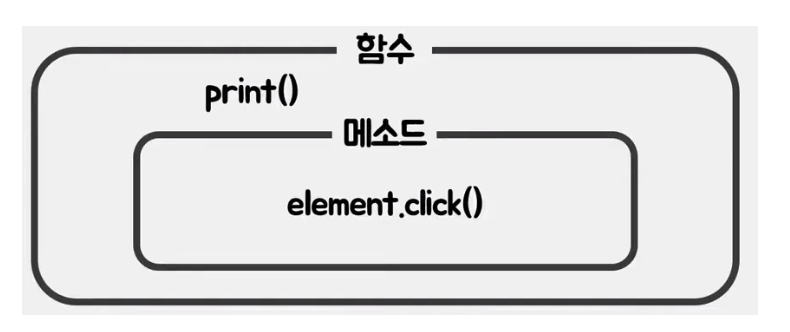

## 함수와 메서드의 차이 
호출 방식에 따라 함수와 메서드를 구분한다. 

### 함수란?
함수는 **특정 작업을 수행하도록 설계된 코드의 집합**

#### 함수는 일급 객체 (First-Class Citizen)

자바스크립트에서 함수는 값처럼 다룰 수 있는 일급 객체라서
-  변수에 할당 가능
-  다른 함수의 인자로 전달 가능
-  함수에서 반환값으로 사용 가능

```javascript
function sayHi() {
  return "안녕!";
}

const greet = sayHi;
console.log(greet()); 
```

### 메서드란? 
메서드란 **객체가 가지고 있는 동작** 이며 객체내의 함수를 메서드라고 칭한다.




**객체의 유무에 따라 구분됨.**

객체 유? -> 메서드 
객체 무? -> 함수

| 구분     | 함수(Function)                            | 메서드(Method)                                 |
|----------|--------------------------------------------|------------------------------------------------|
| 정의     | 독립적으로 정의된 코드 블록                | 객체의 프로퍼티로 정의된 함수                 |
| 소속     | 어디에도 속하지 않음                       | 특정 객체에 **속한** 함수                     |
| 호출 방식| 그냥 호출: `함수명()`                     | 객체를 통해 호출: `객체.메서드명()`           |
| 예시     | `function sayHi() {}`                      | `const obj = { sayHi: function() {} }`       |

### 예시

#### 1. 함수 (Function)
```javascript
function sayHello() {
  console.log("안녕하세요!");
}
sayHello();  // 호출
```

#### 2. 메서드 (Method)
```javascript
const person = {
  name: "홍길동",
  greet: function() {
    console.log("안녕하세요!");
  }
};
person.greet();  // 호출
```

---

# 자바스크립트에서 객체를 생성하는 방법


자바스크립트에서 객체를 생성하는 대표적인 방법들을 정리했습니다.


## 1. 객체 리터럴 (Object Literal)
객체 리터럴 방식으로 {} 를 사용하여 객체를 생성한다

```javascript
const person = {
  name: 'Alice',
  age: 25,
  greet: function () {
    console.log(`Hello, my name is ${this.name}`);
  }
};
```
특징
- 직관적이다. 
- object 생성자 방식보다 속도 측면에서 빠르다고 함.

    object 생성자 방식은 비어있는 객체를 생성후, 프로퍼티를 할당한다. 생성 -> 할당
    객체 리터럴방식은 객체를 생성함과 동시에 프로퍼티를 할당하기 때문에 속도에서 빠르다고 한다.
 

## 2. new Object() 생성자 사용
자바스크립트에 내장되어 있는 Object() 생성자 함수 를 사용하는 방법이다.

```javascript
const person = new Object();
person.name = 'Bob';
person.age = 30;
person.greet = function () {
  console.log(`Hello, my name is ${this.name}`);
};
```


## 3. 생성자 함수 (Constructor Function)
java에서 클래스를 만들고 해당 클래스의 객체를 만드는 방식과 유사하다.

```javascript
function Person(name, age) {
  this.name = name;
  this.age = age;
  this.greet = function () {
    console.log(`Hello, my name is ${this.name}`);
  };
}

const person1 = new Person('Charlie', 28);
```

특징
- 나의 생성자 함수(Person)을 만들어 놓으면 그 함수를 가리키는(?) 여러 개의 객체를 만들 수 있는 것 이 장점
- 객체 생성시 필요한 값들을 함수의 매개변수로 주면 된다.
- 생성자 함수 에서 사용한 코드는 메모리 효율 측면에서 좋지 않다

객체를 만들때마다 해당 프로퍼티공간이 만들어지기 때문에 메모리 효율이 좋지는 않다.

## 4. Object.create() 사용

상속과 확장을 위한 템플릿 개념으로 쓸 때는 Object.create() 메소드로 객체를 생성할때 사용한다.

```javascript
const proto = {
  greet: function () {
    console.log(`Hello, my name is ${this.name}`);
  }
};

const person = Object.create(proto);
person.name = 'Dana';
```

### new Object 와 Object.create 비교코드
```javascript
function test1() { 
  this.a = 10;
  this.b = 20;
  this.getA = function() {
    return this.a;
  }
};
test1.prototype.getB = function() { 
	return this.b; 
}

let t1 = Object.create(test1.prototype);
console.log(t1);

let t2 = new test1();
console.log(t2);
```
**new 연산자의 암묵적인 매커니즘**
new 연사자를 사용해서 인스턴스 객체를 만들기 위해 함수를 호출하면, 빈 객체를 만들어서 함수에 빈 객체를 전달해준다.
new 연산자를 사용하면, 함수의 인스턴스 객체를 만들면 일반 객체 프토타입을 코드로 연결시켜 놓은 걸 훨씬 더 단순하고 간편하게 객체의 상속관계를 만들 수 있다.

## 5. 클래스 (ES6+ class) 사용
- 사용언어의 벽이 있음. 자바와 상이함.
- 코드 귀찮고 유지보수 어려움.
- 상속어려움. 오류도 남.

 클래스 기반 객체지향 프로그래밍 언어와 매우 흡사한 새로운 객체 생성 메커니즘을 제시했다.

 ES6에서 클래스를 도입하여 자바스크립트의 객체 지향 프로그래밍을 더욱 간편하게 만들었다고 한다. 
 
```javascript
class Person {
  constructor(name, age) {
    this.name = name;
    this.age = age;
  }

  greet() {
    console.log(`Hello, my name is ${this.name}`);
  }
}

const person = new Person('Eve', 35);
```


| 방법                | 특징                                 |
|---------------------|--------------------------------------|
| 객체 리터럴         | 간단하고 직관적                       |
| `new Object()`      | 거의 사용되지 않음 (리터럴 권장)     |
| 생성자 함수         | 여러 객체를 생성할 때 사용            |
| `Object.create()`   | 프로토타입 기반 상속 구현 가능        |
| 클래스 (`class`)    | ES6 이후 등장, 객체지향 프로그래밍에 적합 |