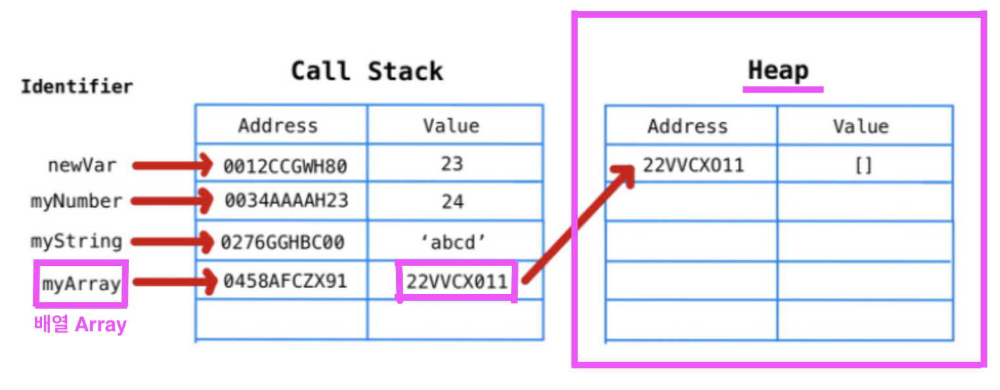

자바스크립트는 데이터 타입을 크게 두가지로 나눌 수 있습니다.

- **원시 타입(Primitive Type)** : 데이터 복사가 일어날 때 메모리 공간을 새로 확보하여 독립적인 값을 저장
- **참조 타입(Reference Type)** : 메모리에 직접 접근이 아닌 메모리의 공간(주소)에 대한 간접적인 참조를 통해 메모리에 접근하는 데이터 타입

원시 타입과 참조 타입으로 나누는 이유는 **메모리의 저장 방식과 데이터 처리 방식이 다르기 때문** 이에요.

| 구분        | 예시                      | 특징 |
|-------------|---------------------------|------|
| **원시 타입** | `string`, `number`, `boolean`, `null`, `undefined`, `symbol`, `bigint` | 값 자체를 저장 |
| **참조 타입** | `object`, `array`, `function`, `Date`, `Map`, `Set` 등 | 참조(주소)를 저장 |



> 💡 **메모리 구조 간단 복습**
>
> 자바스크립트 엔진은 메모리를 크게 두 공간으로 나눠서 관리해요
>
> | 구역 | 설명 |
> |-----|------|
> | 스택(Stack) | 고정 크기의 작은 데이터를 저장하는 공간. 빠르고 효율적. |
> | 힙(Heap) | 크기가 가변적인 복잡한 데이터(객체 등)를 저장하는 공간. 느리지만 유연함. |

### **원시타입 : 값에 의한 전달 (Pass by Value)**

**값 자체를 복사해서 전달**하는 방식으로 주로 **원시 타입**에서 사용됩니다.

이렇게 저장되는 값은 **스택** 에 저장되어 독립적인 값이 돼요.

스택은 빠르고, 값 복사도 간단합니다.

```js
let a = 10;
let b = a;

b = 20;

console.log(a); // 👉 10 (변하지 않음)
```

- `a`의 값 `10`이 `b`로 복사된 것뿐이기 때문에 `b`를 바꿔도 `a`는 영향을 받지 않아요.

### **참조 타입 : 참조에 의한 전달 (Pass by Reference)**

**데이터가 저장된 메모리 주소를 복사해서 전달** 하는 방식으로 **참조 타입** 에서 사용돼요.

참조 타입은 주소만 받아오고, 객체등은 **힙** 에 저장됩니다.

```js
let obj1 = { name: "Alice" };
let obj2 = obj1;

obj2.name = "Bob";

console.log(obj1.name); // 👉 "Bob"
```

- `obj2`는 `obj1`과 **같은 객체를 바라보고 있기** 때문에 하나를 수정하면 다른 하나도 바뀐 것처럼 보여요.


**중간 정리**

- 원시 타입은 값만 전달하므로 안전하고 단순함
- 참조 타입은 같은 데이터를 여러 곳에서 공유하므로 **부작용(side effect)** 이 발생할 수 있음

```js
function change(obj) {
  obj.name = 'Bob';
}

let user = { name: 'Alice' };
change(user);

console.log(user.name); // 👉 "Bob" (함수 내부에서도 변경됨)
```

→ 이런 특성 때문에 함수 설계, 상태 관리, 불변성 유지 등에서 중요한 기준이 돼요.

### 참조 타입은 왜 공유하게 만들을까요? 부작용이 있는데, 그렇게 사용하는 이유가 있나요?

“부작용도 있는데 왜 참조 타입을 공유하게 만들었는가?” — 자바스크립트(그리고 대부분의 언어)가 그렇게 설계된 데에는 성능과 유연성이라는 이유가 있습니다.

#### 1. 참조 타입(객체 등)은 크기가 클 수 있어요

```js
let obj = {
  name: 'Alice',
  age: 25,
  hobbies: ['reading', 'gaming', 'traveling'],
  address: { city: 'Seoul', zip: '12345' }
};
```

이런 복잡하고 큰 데이터를 매번 복사해서 넘긴다면?

- 메모리 낭비 심하고,
- 성능도 느려지고,
- 매번 복사하면 실시간 앱이나 대용량 처리에서 치명적임.

그래서 복사 대신, 주소(참조)를 넘기자는 결론에 도달합니다! → 훨씬 가볍고 빠름

#### 2. 공유를 통해 하나의 데이터에 여러 곳에서 접근 가능해요

```js
let user = { name: "Alice" };
let admin = user;

admin.name = "Bob";

console.log(user.name); // 👉 "Bob"
```

**"같은 것을 바라보는 여러 주체"** 가 필요할 때 유용하게 사용 할 수 있어요. (ex. 전역 상태 관리, DOM 참조, Form 상태 등)

사실 side-effect란 말은 지금 '부작용'이라고 사용하지만, 정확하게는 부수작용에 가까워요. 의약품에서 대표적인 '비아그라'의 부작용이 긍정효과를 낸 경우를 생각해보면 좋아요.

때문에 부작용(side effect)은 단점처럼 보이지만 나쁜 게 아니라 "예상 못하면 위험한 것", 제어하면 강력한 도구가 될 수 있어요.

### 해결책으로 도입 된 불변성(immutability), 상태 관리 패턴

리액트를 사용하면서 props를 내려받을 때 얕은 복사를 이용하라는 말을 많이 들어봤을 거에요.

```js
// 얕은 복사로 부작용 방지
let obj1 = { name: 'Alice' };
let obj2 = { ...obj1 }; // 전개 연산자로 복사

obj2.name = 'Bob';

console.log(obj1.name); // 👉 "Alice"

//또는 얕은 분해를 통해 부작용 방지
function Profile({ user }) {
  //얕은 분해
  const { name, address } = user;
}
```
