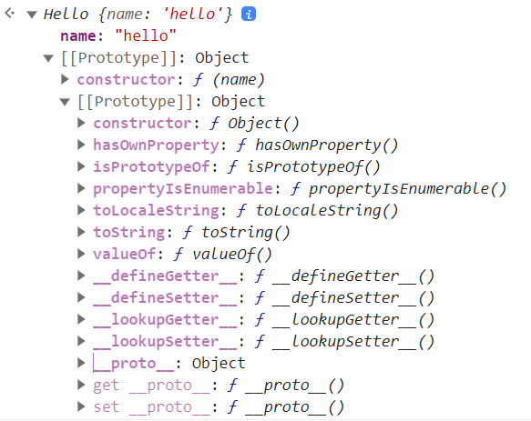
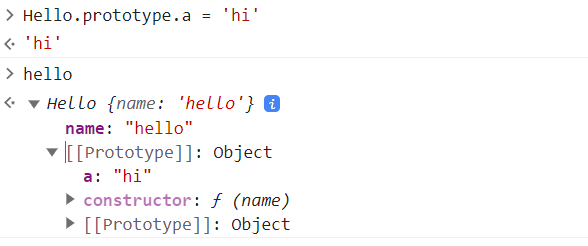
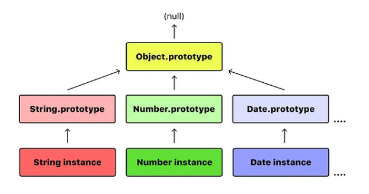

## 프로토타입 (Prototype) 이란?

**프로토타입은 객체 간 상속을 구현하는 핵심 메커니즘**입니다.

JavaScript에서 **모든 객체는 자신의 부모 역할을 하는 또 다른 객체에 대한 참조를 가지고 있으며** , 이를 `[[Prototype]]`이라 부릅니다. 이 `[[Prototype]]`에 접근할 때 사용하는 속성이 바로 **`__proto__`** 이고, 함수의 경우는 **`prototype` 속성** 을 통해 연결됩니다.

```js
const obj = { name: 'Alice' };
// 모두 같은 것
console.log(obj.__proto__ === Object.prototype); // true
console.log(obj.__proto__ === Object.getPrototypeOf(obj))//true
```

클래스 기반 언어에서는 클래스 내부에 모든 속성과 메소드가 정의되어있습니다.
해당 클래스를 기반으로한 객체가 인스턴스로 생성되면 이 객체는 클래스 내부에 정의되어있는 속성과 메소드에 접근하여 사용할 수 있는 형태에요.

프로토타입은 이런 클래스와 아주 유사하며 javascript의 모든 객체 프로토타입은 값을 할당하는 시점에 결정합니다.

## 프로토타입 기반 언어, 자바스크립트

JavaScript는 흔히 프로토타입 기반 언어(prototype-based language)라 불립니다.

모든 객체들이 메소드와 속성들을 상속받기 위한 명세로 프로토 타입 객체를 가진다는 의미입니다. (하다 못해 문자열, 배열까지도...)  
클래스 처럼 객체의 인스턴스를 위한 명세와 같은 역할을 하는데 객체 본인만이 가진 속성과 메소드에도 접근할 수 있으면서 프로토타입의 것들에도 접근할 수 있습니다.

```js
const Hello = function(name) {
  this.name = name;
}
```



Hello에 정의한 name 멤버 외에 프로토 타입 객체인 Object의 다른 멤버들도 존재해요.

이렇게 자바스크립트의 모든 객체는 자신의 부모 역할을 하는 객체와 연결되어있고 이 부모 객체를 프로토타입이라고 합니다.

생성되는 모든 객체는 이런 프토토타입 객체에 접근할 수 있고 동적으로 런타임 시에 멤버를 추가할 수도 있어요.



### 프로토타입 체인 (Prototype Chain)

모든 객체들은 메소드와 속성을 상속받기 위한 명세로 프로토타입 객체를 가진다고 했는데요, 이는 프로토타입 객체도 또 다시 상위 프로토타입 객체로부터 상속받을 수 있고 그 상위도 마찬가지인데 이를 프로토타입 체인이라고 합니다.

객체 자신의 것 뿐 아니라 [[Prototype]]이 가리키는 링크를 따라 부모 역할을 하는 모든 프로토 타입 객체의 속성이나 메소드에 접근할 수 있습니다.



객체가 특정 속성이나 메서드를 찾을 때

1. 자신의 속성에서 먼저 찾고,
2. 없다면 `__proto__`로 연결된 객체에서 찾고,
3. 그것도 없으면 그 객체의 `__proto__`를 따라가며 계속 찾습니다.
4. 끝까지 못 찾으면 `undefined`를 반환합니다.

이런 구조를 **프로토타입 체인**이라고 부릅니다.

```js
const animal = {
  eats: true,
};
const rabbit = Object.create(animal);
rabbit.jumps = true;

console.log(rabbit.eats); // true (animal에서 상속)
console.log(rabbit.jumps); // true (자기 자신)
```

### 왜 프로토타입 기반으로 만들었을까?

JavaScript는 1995년에 **10일 만에 설계된 언어**로, 당시의 목표는 "브라우저에서 간단한 동적 인터랙션을 위한 스크립트 언어"였습니다.

- **유연한 객체 생성 및 상속이 필요했고**
- **복잡한 클래스 문법 없이도 상속을 구현할 수 있도록** 간단한 방식이 요구되었습니다.

그 결과, **클래스 없이 객체 간 직접 상속이 가능한 프로토타입 기반 구조**가 채택되었습니다.

이는 **Self**라는 언어에서 영향을 받은 것으로, Java나 C++의 클래스 기반 구조보다는 **동적으로 구성되는 객체 간 상속**이 중심이 되었습니다.

- **메모리 효율성**  
    Javascript에서 모든 객체는 프로토타입을 공유합니다.  
    객체 자체가 스스로 메소드와 속성을 모두 가지는 대신 여러 객체가 동일한 프로토타입을 공유하도록하고 이를 사용하면 메모리를 효율적으로 사용할 수 있어요.

- **객체지향스러움**  
    프로토타입을 통해 클래스에서 상속해 사용하는 것 처럼 다른 객체로부터의 속성과 메소드를 사용할 수 있습니다.
    프로토타입 체인을 통해 가능한 것이며 이를 통해 코드 재사용이 가능해요.

- **생산성**  
    프로토타입을 통해 동일한 속성, 동작이 필요한 여러 객체들마다 이를 직접 선언하고 개발할 필요 없이 프로토타입을 이용해 관리할 수 있습니다.
