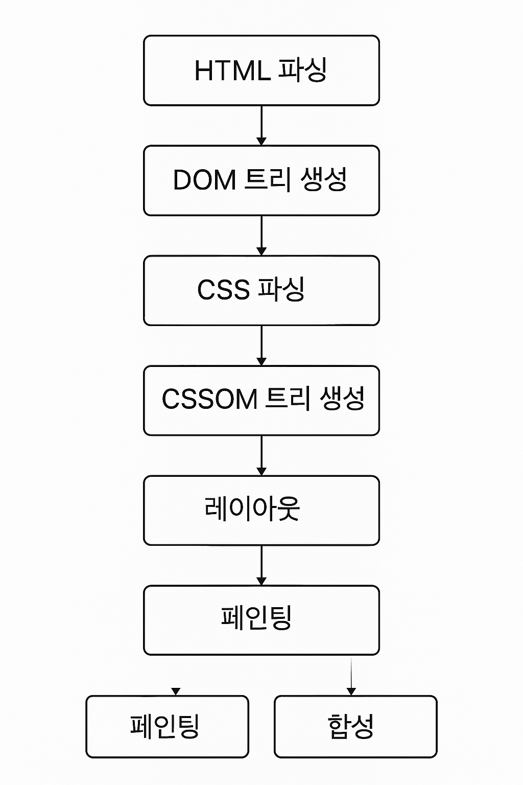

# 브라우저 렌더링 과정
브라우저는 서버와의 데이터 통신 이후, 해당 데이터를 사용자에게 보여주기 위한 **렌더링**을 수행한다.  
1. 서버로부터 자원을 요청한 뒤 응답받기  
2. HTML 파싱 후 DOM 생성하기  
3. CSS 파싱 후 CSSOM 생성하기  
4. 렌더 트리 생성하기  
	- JS 파싱 하게되면, AST(추상 구문 트리) 생성하기  (브라우저의 내부동작임)
		1. HTML 파싱 중, JS를 의미하는 **script** 태그를 만나게 되면 블로킹되어 제어권을 JS엔진에게 넘겨주어 JS 파싱으로 넘어간다.
5. 렌더 트리를 통해 HTML을 브라우저에 레이아웃 후 페인팅

의 과정을 가진다.

브라우저의 **렌더링(Rendering) 과정**은 HTML, CSS, JavaScript로 작성된 웹 페이지를 **화면에 시각적으로 표시**하는 전 과정이다.

## **렌더링 파이프라인 (Rendering Pipeline)**

 **1.**  **HTML 파싱 → DOM 트리 생성**
- HTML 문서는 문자열입니다.
- 브라우저는 **HTML 파서**를 통해 이를 **토큰화(tokenize)** → **노드로 변환(parse)** → **DOM 트리**로 구성합니다.
- DOM은 문서의 구조를 트리 형태로 나타낸 객체입니다.

> 예시: `

Hello

` → div 노드 안에 p 노드 → Hello 텍스트 노드 포함

 **2.**  **CSS 파싱 → CSSOM 트리 생성**
- HTML 문서의 `<style>`태그나  `<link>` 로 불러온 CSS는 **CSS 파서**를 통해 파싱됩니다.
- 이를 **CSSOM(CSS Object Model)** 이라는 트리 구조로 변환합니다.
- 각 CSS 규칙들은 셀렉터별로 구조화되어 적용됩니다.
 
 **3.**  **렌더 트리(Render Tree) 생성**
- DOM 트리 + CSSOM 트리를 바탕으로 **렌더 트리** 생성
- 렌더 트리는 실제 **화면에 보여지는 요소들만 포함**
    - display: none 요소는 포함되지 않음
    - visibility: hidden은 포함되지만 보이지 않게 처리됨
- 각 노드는 스타일 정보(CSS)를 포함하고 있음
.png)
 **4.**  **레이아웃 (Layout, 또는 Reflow)**
- 렌더 트리를 기반으로 각 노드의 **위치(position)** 와 **크기(size)** 를 계산합니다.
- 이것을 **박스 모델(Box Model)** 에 따라 계산합니다.
- 브라우저 뷰포트 내에서 요소들의 배치를 결정

> 레이아웃은 계산 비용이 크며, DOM 변경 또는 창 크기 변경 등으로 인해 다시 실행될 수 있음

 **5.**  **페인팅(Paint)**
- 각 렌더 트리 노드(시각적 요소)는 **화면에 무엇을 어떻게 그릴지 결정**
- 색상, 텍스트, 테두리, 배경 이미지 등 **픽셀 단위로** 처리
- 브라우저는 이 정보를 **레이어(layer)** 로 나눠 저장함

 **6.** **합성(Compositing)**
- 복수의 레이어들을 **GPU 가속**을 사용해 하나의 화면 이미지로 합성
- 예를 들어, position: fixed, transform, opacity 등이 다른 레이어로 분리될 수 있음
- 각 레이어는 독립적으로 렌더링 후, 최종적으로 하나로 합쳐짐
 
 **Event Loop, JS, 스타일 변경 시 동작**
- **JavaScript로 DOM을 변경**하면 → Recalculate Style → Layout → Paint → Composite
- **CSS 속성 변경**(예: 색상 변경)은 → Paint부터 다시 실행
- **배치 관련 속성 변경**(예: width, padding)은 → Layout부터 다시 실행
- 일부 속성 변경은 **Reflow** 없이 동작하여 성능 최적화 가능

