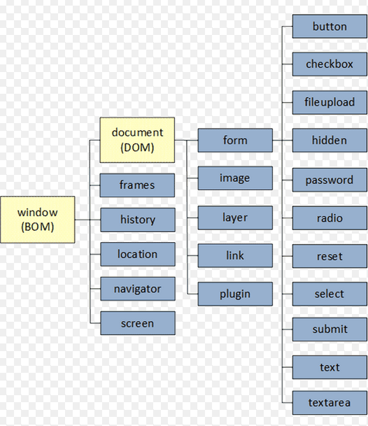

# 먼저 BOM 이란? 
브라우저와 관련된 객체들의 집합을 브라우저 객체 모델 (Browser Object Model) 이라고 부른다.
브라우저 객체 모델의 최상위 객체는 window 객체다. DOM 은 이 window 객체의 하위 객체이다. 

### 75. DOM 이란? 
Document Object Model 의 약자이다. 
**문서 객체 모델(DOM)** 은 HTML, XML 문서의 프로그래밍 interface 이다. 
- DOM은 HTML, XML과 같은 마크업 문서를 객체 트리 구조로 변환하여 문서의 구조화된 표현을 제공하여, 프로그래밍 언어(예: 자바스크립트)에서 문서를 **문서 구조, 스타일, 내용등을 변경 할 수 있게** 해주는 프로그래밍 인터페이스라고 할 수 있다.

DOM 이 없다면 Javascript 언어는 웹 페이지 또는 XML 페이지 및 요소들과 관련된 모델이나 개념들에 대한 정보를 갖지 못하게 된다. 
table, table header, table cell 안의 text 는 문서를 위한 DOM 의 한 부분이다. 이러한 요소들은 DOM 과 Javascript 와 같은 스크립팅 언어를 통해 접근하고 조작이 가능하다. 

DOM은 HTML, XML 문서를 프로그래밍적으로 접근하고 조작할 수 있도록 표준화된 API(인터페이스)를 제공한다.
>API (web or XML page) = DOM + JS (scripting language)

### 76. DOM 의 내부 구조 (구성요소)

**트리 구조와 노드**
- DOM은 트리 자료구조로, 각 요소는 *노드(node)*로 표현됩니다. 트리 구조이기 때문에 부모-자식, 형제 관계가 명확하게 나타나며, 최상위에는 루트 노드(보통 `<document>` 또는 `<html>`)가 있다
- HTML 문서의 각 태그, 속성, 텍스트 등이 모두 각각의 노드로 변환됩니다. 예를 들어, `
Hello
`는 다음과 같은 노드로 이루어진다:
    - 요소 노드(Element Node): `
`
    - 어트리뷰트 노드(Attribute Node): `id="main"`
    - 텍스트 노드(Text Node): `"Hello`

**주요 노드 타입**

DOM에는 여러 종류의 노드가 있지만, 주요한 것은 다음 세 가지다
- 요소 노드(Element Node): HTML 태그 자체를 나타냄
- 어트리뷰트 노드(Attribute Node): 태그의 속성
- 텍스트 노드(Text Node): 태그 내부의 실제 텍스트

**DOM 노드의 상속 구조**
DOM의 각 노드는 자바스크립트 객체로, 프로토타입 기반의 상속 체계를 가진다. 주요 상속 구조는 아래와 같다

| 계층               | 예시 클래스           | 주요 기능/프로퍼티                               |
| ---------------- | ---------------- | ---------------------------------------- |
| Object           | Object           | 모든 객체의 최상위                               |
| EventTarget      | EventTarget      | 이벤트 관련 메서드 (addEventListener 등)          |
| Node             | Node             | 트리 구조 관련 메서드 (appendChild, parentNode 등) |
| Element          | Element          | id, classList, innerHTML 등               |
| HTMLElement      | HTMLElement      | HTML 요소 전용 프로퍼티/메서드                      |
| HTMLDivElement 등 | HTMLDivElement 등 | 각 태그별 고유 기능                              |
이 구조 덕분에 하위 객체는 상위 객체의 프로퍼티와 메서드를 모두 사용할 수 있다

**DOM 내부 탐색 및 조작**
DOM의 각 노드는 자식, 부모, 형제 노드와 연결되어 있어, 다양한 메서드로 탐색 및 조작이 가능하다. 예를 들어, `parentNode`, `childNodes`, `firstChild`, `nextSibling` 등으로 트리 구조를 탐색할 수 있다