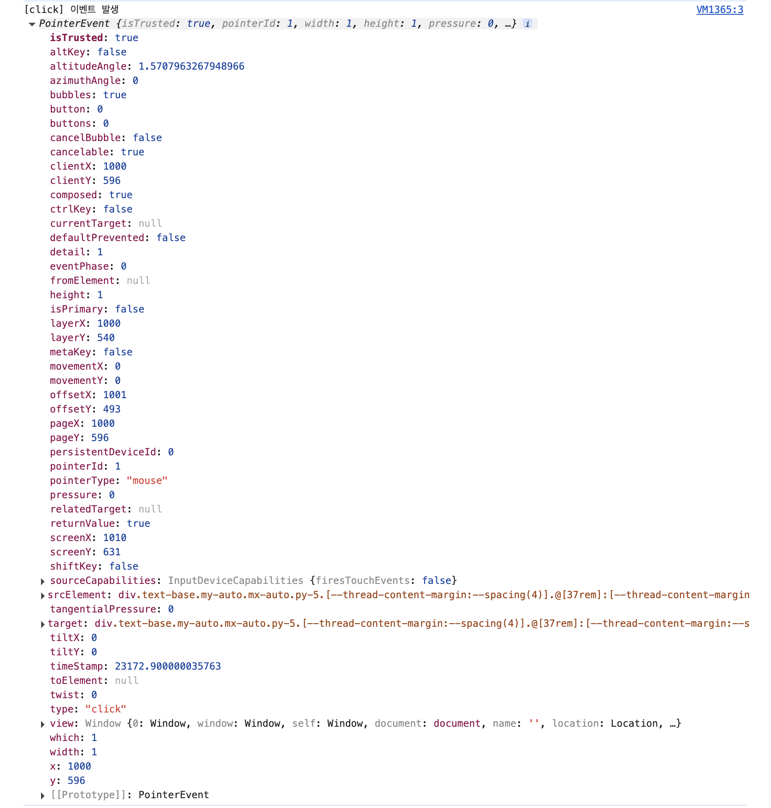

## 자바스크립트에서 이벤트란 무엇일까?

웹 페이지는 단순히 내용을 보여주는 것을 넘어, 사용자의 **행동에 반응**해야 합니다.

예를 들어 버튼을 클릭하거나, 키보드를 누르거나, 마우스를 움직일 때 어떤 동작이 일어나도록 하려면 자바스크립트에서는 **이벤트(event)** 라는 개념을 사용합니다.

즉, 자바스크립트에서 이벤트란, **웹 페이지에서 발생한 특정 상황(사용자 또는 브라우저에 의해)** 에 반응하도록 **자바스크립트가 실행되는 메커니즘** 입니다.

### 이벤트란?

**이벤트(event)** 는 웹 브라우저에서 발생하는 **사건 또는 상황**입니다. 이 사건들은 대부분 사용자의 행동에서 비롯됩니다.

이벤트는 크게 두 가지 방식으로 발생할 수 있습니다.

1. **사용자에 의해 발생 (가장 일반적)**

   * 클릭, 터치, 입력 등

2. **브라우저나 자바스크립트 엔진이 자동으로 발생**

   * 페이지 로드 완료, 네트워크 응답 수신 등

| 사용자 행동    | 발생하는 이벤트                       |
| --------- | ------------------------------ |
| 마우스를 클릭함  | `click`                        |
| 키보드를 누름   | `keydown`, `keypress`, `keyup` |
| 마우스를 움직임  | `mousemove`                    |
| 폼 제출      | `submit`                       |
| 페이지 로드 완료 | `load`                         |
| 창 크기 조절   | `resize`                       |

이러한 이벤트가 발생했을 때 실행할 코드를 **이벤트 핸들러(event handler)** 또는 **리스너(listener)** 라고 부릅니다.

### 이벤트를 감지하려면?

자바스크립트에서는 이벤트를 감지하고 반응하는 코드를 등록할 수 있습니다.  
이를 **이벤트 리스닝(event listening)** 이라고 합니다.

```javascript
const button = document.querySelector('button');

button.addEventListener('click', () => {
  alert('버튼이 클릭되었습니다!');
});
```

위 코드에서 `addEventListener('click', ...)`는 "버튼이 클릭되면 이 코드를 실행해줘"라는 의미입니다. 이렇게 이벤트가 발생했을 때 동작할 코드를 **콜백 함수(callback)** 로 넘겨줍니다.

> 사실 실제로 사용하는 형태에서는 콜백 함수를 따로 선언해서, return으로 초기화 과정을 거치는 등의 형태가 조금 다르죠!

### + DOM 이벤트의 특징

* 이벤트는 **DOM 요소** 에 바인딩됩니다.
* 하나의 요소에 여러 이벤트 핸들러를 등록할 수 있습니다.
* 이벤트는 **전파(propagation)** 라는 과정을 통해 상위 또는 하위 요소로 퍼질 수 있습니다.

## 이벤트 객체(Event Object)

이벤트가 발생하면 브라우저는 해당 이벤트에 대한 정보가 담긴 **이벤트 객체** 를 핸들러 함수에 넘겨줍니다.

```javascript
element.addEventListener('click', function (e) {
  console.log(e); // 클릭한 요소
});
```

### **이벤트 객체에는 어떤 정보들이 담겨 있을까?**



`e`는 이벤트 객체이며, 이벤트의 종류, 발생 위치, 관련된 키 값, 마우스 좌표 등 다양한 정보를 담고 있습니다.

이벤트가 발생하면 브라우저는 이벤트에 대한 정보를 `Event` 객체에 담아 전달합니다.  
이 객체에는 클릭한 요소, 좌표, 키보드 입력 등 다양한 정보가 들어있습니다.

**`e.target`과 `e.currentTarget`의 차이는 무엇일까?**

`target`과 `currentTarget`이라는 헷갈리기 쉬운 속성이 있습니다.

1. `e.target` -> 실제로 이벤트가 발생한 요소

    ```html
    <ul id="menu">
    <li>Home</li>
    <li>About</li>
    </ul>
    ```

    ```javascript
    document.querySelector('#menu').addEventListener('click', (e) => {
    console.log('target:', e.target);  // 클릭한 li 요소
    });
    ```

    `e.target`은 `li` 요소입니다. (진짜 클릭한 대상)

2. `e.currentTarget` -> 이벤트 핸들러가 바인딩된 요소

    ```javascript
    document.querySelector('#menu').addEventListener('click', (e) => {
    console.log('currentTarget:', e.currentTarget);  // 항상 #menu
    });
    ```

`e.currentTarget`은 `ul#menu`입니다. (핸들러가 등록된 곳)

| 속성                | 의미           | 언제 유용할까?               |
| ----------------- | ------------ | ---------------------- |
| `e.target`        | 실제 클릭된 하위 요소 | 이벤트 위임 시, 클릭한 세부 요소 구분 |
| `e.currentTarget` | 이벤트를 등록한 요소  | 핸들러가 어디에 연결됐는지 확인      |

**`e.type`, `e.timeStamp`, `e.key`, `e.clientX`는 언제 쓰일까?**

이 속성들은 이벤트의 **종류와 맥락을 판단하거나**, **세부 정보를 활용**할 때 사용됩니다.

1. `e.type`: 이벤트의 종류 확인

    이벤트가 `click`, `keydown`, `submit` 중 어떤 종류인지 구분할 수 있음

    ```javascript
    element.addEventListener('click', (e) => {
    console.log(e.type);  // 'click'
    });
    ```

2. `e.timeStamp`: 이벤트 발생 시간 (페이지 로드 이후 경과 시간, ms)

    디버깅이나 퍼포먼스 분석에 사용

    ```javascript
    element.addEventListener('click', (e) => {
    console.log(e.timeStamp);  // 예: 10384.25
    });
    ```

3. `e.key`: 눌린 키 값 (키보드 이벤트 전용)
    키보드 단축키 구현, 폼 제어 등에서 자주 사용

    ```javascript
    document.addEventListener('keydown', (e) => {
    console.log(`입력된 키: ${e.key}`);
    });
    ```

4. `e.clientX`, `e.clientY`: 마우스 좌표 (화면 내 위치)

    마우스 위치에 따라 툴팁을 보여주거나 요소를 이동시킬 때 유용

    ```javascript
    document.addEventListener('click', (e) => {
    console.log(`X좌표: ${e.clientX}, Y좌표: ${e.clientY}`);
    });
    ```

5. e.pageX, e.screenX, e.clientX 차이

    | 속성          | 기준 위치                     | 설명              |상황                           | 적절한 속성               |
    | ----------- | ------------------------- | --------------- |---------------------------- | -------------------- |
    | `e.clientX` | **브라우저 창(viewport)** 왼쪽 위 | 스크롤을 고려하지 않은 위치 |  **요소 위치 계산 (툴팁, 모달 위치 등)**   | `clientX`, `clientY` |
    | `e.pageX`   | **문서 전체(document)** 왼쪽 위  | 스크롤을 고려한 위치     |  **스크롤을 고려한 절대 위치 계산**        | `pageX`, `pageY`     |
    | `e.screenX` | **운영체제 화면(screen)** 왼쪽 위  | 모니터 기준의 절대 위치   | **브라우저 외 위치 (멀티모니터 등 디버깅용)** | `screenX`, `screenY` |

### 이벤트 전파(Event Propagation)란?

DOM 요소는 계층 구조(Tree)로 되어 있고, 이벤트는 한 요소에서만 발생하는 게 아니라 **트리를 따라 전파**됩니다.

이벤트 전파가 중요한 이유는 아래와 같습니다.

* 어떤 핸들러가 먼저 실행되는지 제어할 수 있음
* **이벤트 위임**, **전파 차단**, **성능 최적화** 같은 고급 테크닉과 연결됨
* `stopPropagation()` 같은 제어 메서드는 **이 전파 흐름에 개입**하기 위해 존재함

이 전파는 다음 세 단계를 거칩니다.

1. **캡처링 단계 (Capturing Phase)**
    * 이벤트가 \*\*최상위 요소(document)\*\*부터 시작해 **타깃 요소까지 내려가는 과정**

2. **타깃 단계 (Target Phase)**
    * 이벤트가 **실제로 발생한 요소**에 도달하는 순간

3. **버블링 단계 (Bubbling Phase)**
    * 이벤트가 **타깃 요소에서 상위 요소들로 다시 전파**되는 과정

```html
<div id="outer">
  <div id="middle">
    <button id="inner">Click me</button>
  </div>
</div>

# 이 구조에서 `<button>`을 클릭했을 때 이벤트 전파 과정을 표현하면 다음과 같습니다.
[ Capturing Phase ]
document → html → body → #outer → #middle → #inner

[ Target Phase ]
#inner  ← (실제 클릭한 요소)

[ Bubbling Phase ]
#inner → #middle → #outer → body → html → document
```

```javascript
['outer', 'middle', 'inner'].forEach(id => {
  const el = document.getElementById(id);

  // 캡처링 핸들러
  el.addEventListener('click', () => {
    console.log(`CAPTURE: ${id}`);
  }, true); // 세 번째 인자를 true로 → 캡처링

  // 버블링 핸들러
  el.addEventListener('click', () => {
    console.log(`BUBBLE: ${id}`);
  });
});

// `inner` 버튼을 클릭하면, 콘솔에는 아래 순서로 출력됩니다:

CAPTURE: outer
CAPTURE: middle
CAPTURE: inner
BUBBLE: inner
BUBBLE: middle
BUBBLE: outer
```

### **이벤트를 제어할 수 있는 메서드에는 뭐가 있을까?**

1. `e.preventDefault()`

    브라우저의 기본 동작(기본 이벤트)을 막는 함수입니다.

    ```javascript
    document.querySelector('a').addEventListener('click', (e) => {
    e.preventDefault(); // 링크 이동 방지
    console.log('기본 동작 막음');
    });
    ```

2. `e.stopPropagation()`

    이벤트가 상위 요소로 **버블링되지 않도록 막는 메서드** 입니다.

    ```javascript
    document.querySelector('.child').addEventListener('click', (e) => {
    e.stopPropagation();
    console.log('이벤트 전파 멈춤');
    });
    ```

3. `stopImmediatePropagation()`

    stopPropagation()의 기능 + 같은 요소 내의 나머지 핸들러 실행도 차단합니다.

    ```js
    //실행 안됨
    element.addEventListener('click', () => {
    console.log('첫 번째 핸들러');
    });

    element.addEventListener('click', (e) => {
    e.stopImmediatePropagation();
    console.log('두 번째 핸들러');
    });
    ```

### **모든 이벤트가 버블링 되는 건 아닐까?**

사실 모든 이벤트가 버블링되지는 않습니다.
`focus`, `blur`, `mouseenter` 같은 이벤트는 캡쳐링만 되고 버블링 되지 않습니다.

focus와 blur는 브라우저의 기본 동작과 밀접하게 연결된 이벤트라서, 전파 중간에 버블링으로 변형되면 의도치 않은 동작이 발생할 수 있기 때문입니다.

그래서 보다 안전하고 예측 가능한 동작을 보장하기 위해 캡처링만 지원됩니다.

## 마우스 이벤트 타입에는 뭐가 있을까?

자바스크립트에서 DOM 요소와 상호작용할 수 있게 해주는 다양한 **마우스 이벤트 타입** 이 존재합니다. 그중 가장 흔한 게 `click`이지만, 실제로는 여러 종류가 있습니다.

### 대표적인 마우스 이벤트 타입

| 이벤트           | 설명                         |
| ------------- | -------------------------- |
| `click`       | 요소를 클릭했을 때                 |
| `dblclick`    | 더블 클릭했을 때                  |
| `mousedown`   | 마우스 버튼을 눌렀을 때              |
| `mouseup`     | 마우스 버튼을 뗐을 때               |
| `mousemove`   | 마우스를 움직일 때                 |
| `mouseenter`  | 요소 안으로 마우스가 들어왔을 때 (버블링 X) |
| `mouseleave`  | 요소 밖으로 마우스가 나갔을 때 (버블링 X)  |
| `mouseover`   | 마우스를 올렸을 때 (버블링 O)         |
| `mouseout`    | 마우스를 뗐을 때 (버블링 O)          |
| `contextmenu` | 마우스 오른쪽 버튼을 눌렀을 때 (우클릭 메뉴) |

## 클릭을 대체할 수 있는 이벤트가 있나요?

`click`은 가장 기본적인 사용자 인터랙션이지만, 다음 이벤트로 대체하거나 보완할 수 있어요.

* `click`은 기본적으로 `mousedown` → `mouseup`이 모두 발생해야 동작합니다.
* 개별 제어가 필요할 땐 이 둘을 따로 사용하는 것이 유용합니다.

```javascript
element.addEventListener('mousedown', () => {
  console.log('마우스 눌림');
});
element.addEventListener('mouseup', () => {
  console.log('마우스 뗌');
});
```

## 이벤트 핸들러를 등록하는 방식에는 어떤 것들이 있나요?

핸들러 등록 방식은 크게 세 가지로 나눌 수 있어요.

### (1) HTML 속성 방식

```html
<button onclick="alert('클릭됨')">Click me</button>
```

### (2) DOM 프로퍼티 방식

```javascript
const btn = document.querySelector('button');
btn.onclick = () => alert('클릭됨');
```

### (3) `addEventListener` 방식 (권장)

```javascript
btn.addEventListener('click', () => {
  alert('클릭됨');
});
```

* 가장 **유연하고 확장성 있는 방식**
* 동일한 이벤트에 여러 핸들러를 추가할 수 있음
* 이벤트 제거도 가능 (`removeEventListener`)

## 이벤트 위임 (Event Delegation)

**이벤트 위임**은 많은 자식 요소에 각각 이벤트를 붙이지 않고, **부모 요소 하나에만 이벤트를 등록하는 기법**입니다.

```javascript
document.querySelector('#list').addEventListener('click', (e) => {
  if (e.target.tagName === 'LI') {
    console.log(`클릭한 항목: ${e.target.textContent}`);
  }
});
```

* **장점**:

  * 성능 개선 (특히 동적으로 생성되는 요소 처리 가능)
  * 유지보수 편리
