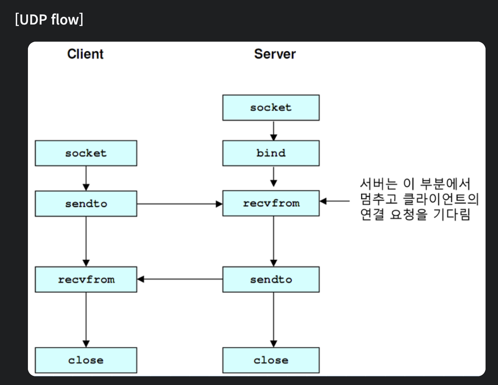

### TCP와 UDP 비교

전송 계층의 대표적인 방식으로는 **TCP(Transmission Control Protocol)**와 **UDP(User Datagram Protocol)**가 있습니다.  
이 두 프로토콜은 각각 다른 특성을 가지고 있어 다양한 네트워크 통신 상황에서 사용됩니다.

---

## 🏛 TCP (Transmission Control Protocol)
- **연결 지향적 프로토콜**로, 데이터 전송 전에 연결을 설정합니다.  
- 데이터 전송 전에 3-way handshake를 통해 연결을 설정
- 데이터의 **신뢰성과 순서**를 보장합니다.  
- **오류 감지 및 수정** 기능이 있습니다.  
- **흐름 제어와 혼잡 제어**를 제공합니다.  
- **웹 브라우징, 이메일 전송, 파일 전송** 등에 주로 사용됩니다.  

---

## ⚡ UDP (User Datagram Protocol)
- **비연결 지향적 프로토콜**로, 연결 설정 없이 데이터를 전송합니다.  
- **TCP보다 빠른 속도**로 데이터를 전송합니다.  
- 데이터의 **신뢰성이나 순서**를 보장하지 않습니다.  
- **오류 감지 및 수정** 기능이 없습니다.  
- **실시간 스트리밍, 온라인 게임, 음성 통화** 등에 주로 사용됩니다.  

---

### 🧐 TCP vs UDP 선택 기준
TCP와 UDP는 각각의 장단점을 가지고 있어, **애플리케이션의 요구사항에 따라 적절한 프로토콜을 선택하는 것이 중요하다.**  

- **TCP** → 데이터의 **정확성과 순서**가 중요한 경우  
- **UDP** → **속도와 효율성**이 중요한 경우  

### 📊 TCP vs UDP 비교 표
| 특성          | TCP                                   | UDP                          |
|--------------|--------------------------------------|-----------------------------|
| **연결 방식** | 연결 지향적 (**3-way handshake**)  | 비연결 지향적               |
| **신뢰성**   | 높음 (**데이터 전달 보장**)         | 낮음 (**데이터 전달 보장 안 함**) |
| **순서 보장** | 순서 보장                           | 순서 보장 안 함              |
| **속도**     | 상대적으로 느림                     | 빠름                        |
| **오류 검사** | 있음                                | 기본적인 검사만 있음        |
| **흐름 제어** | 있음                                | 없음                        |
| **혼잡 제어** | 있음                                | 없음                        |
| **헤더 크기** | 20-60 바이트                        | 8 바이트                    |
| **사용 사례** | 웹 브라우징, 이메일, 파일 전송      | 실시간 스트리밍, 온라인 게임, VoIP |

[이미지 출처]: https://1yoouoo.tistory.com/31