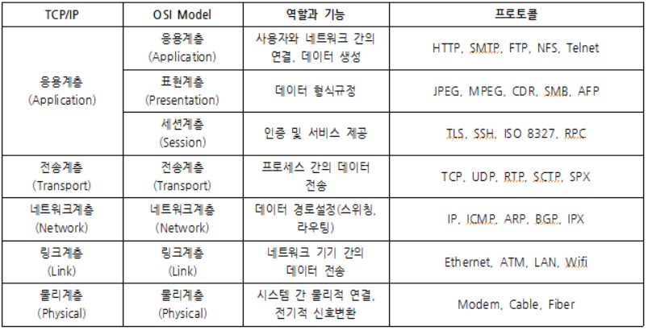
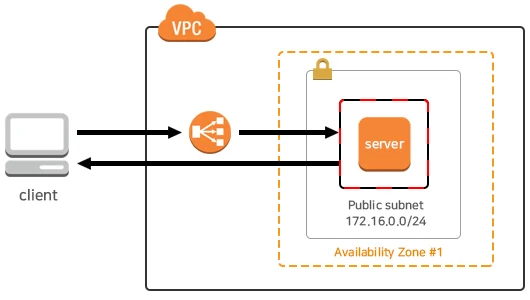

## 로드 밸런싱(load balancing)과 로드 밸런서(Load Balancer)

부하분산 또는 로드 밸런싱(load balancing)은 컴퓨터 네트워크 기술의 일종으로 둘 혹은 셋 이상의 중앙처리장치 혹은 저장장치와 같은 컴퓨터 자원들에게 네트워크 트래픽을 여러 서버로 분산하여 작업해 시스템의 성능과 가용성을 높이는 것을 의미합니다.

**그럼 로드 밸런서는 뭘까?**

로드 밸런서는 로드 밸런싱의 트래픽을 여러 서버로 분배하는 기술을 제공하는 서비스 또는 장치(하드웨어, 소프트웨어)입니다.

주요 역할은 다음과 같습니다:

1. 클라이언트 요청을 분산 → 여러 서버가 균등하게 트래픽을 처리하도록 조정
2. 서버 상태 모니터링 → 특정 서버가 다운되면 트래픽을 정상적인 서버로 우회
3. 세션 유지 (Sticky Session) → 동일 사용자의 요청을 동일한 서버로 전달 가능
4. SSL 종료 (SSL Termination) → HTTPS 트래픽을 해석하여 서버 부하 감소

## 로드 밸런싱 방식

- **라운드 로빈 (Round Robin)**: 순차적으로 각 서버에 요청을 배분
- **가중 라운드 로빈 (Weighted Round Robin)**: 서버의 성능에 따라 가중치를 설정하고 트래픽을 배분
- **최소 연결 (Least Connection)**: 현재 연결 수가 가장 적은 서버로 요청을 보냄
- **IP 해시 (IP Hash)**: 사용자의 IP를 해싱하여 특정 서버로 고정 매핑

## 로드 밸런싱의 종류

로드 밸런싱의 종류는 OSI 7계층에 따라 나뉩니다.

- **L4 (Layer 4) 로드 밸런서**: 네트워크 계층(전송 Transport 계층, TCP/UDP)을 기반으로 IP 주소와 포트 번호 부하 분산
- **L7 (Layer 7) 로드 밸런서**: 애플리케이션 Application 계층(HTTP, HTTPS)에서 URL, 쿠키, 헤더 등을 분석하여 트래픽을 분산

>**OSI 7 계층이란?**  
>
>OSI 7 계층은 네트워크 통신이 어떻게 이루어지는지를 설명하는 계층화된 모델입니다.  
>각 계층은 특정한 역할을 수행하며, 하위 계층에서 상위 계층으로 데이터를 전달합니다.
>
>1. **물리 계층 (Physical Layer)**  
>데이터를 0과 1의 전기 신호, 빛, 전파 형태로 변환하여 전달  
>네트워크 장비: LAN 케이블, 리피터, 허브  
>데이터 단위: 비트(Bit)  
>🛠 예제: UTP 케이블, 광케이블, Wi-Fi 신호, RS-232 (시리얼 통신), 이더넷
>
>2. **데이터 링크 계층 (Data Link Layer)**  
>MAC 주소를 기반으로 데이터 전송  
>같은 네트워크(브로드캐스트 도메인) 내에서 통신 담당  
>네트워크 장비: 스위치, 브리지  
>데이터 단위: 프레임(Frame)  
>🛠 예제: 이더넷 (Ethernet), MAC 주소 기반의 통신, VLAN
>
>3. **네트워크 계층 (Network Layer)**  
>IP 주소를 기반으로 패킷을 목적지까지 라우팅  
>서로 다른 네트워크 간 통신 가능 (인터넷 통신)  
>네트워크 장비: 라우터, L3 스위치  
>데이터 단위: 패킷(Packet)  
>🛠 예제: IPv4, IPv6, ICMP (핑), 라우팅 프로토콜 (OSPF, BGP)
>
>4. **전송 계층 (Transport Layer)**  
>포트 번호를 사용하여 프로세스 간 통신  
>신뢰성 보장 (TCP) vs 속도 우선 (UDP)  
>데이터 단위: 세그먼트(Segment, TCP) / 데이터그램(Datagram, UDP)  
>🛠 예제: TCP (신뢰성 있는 연결, 흐름 제어, 오류 검출), UDP (빠른 전송, 실시간 스트리밍), 포트 번호 (예: HTTP - 80, HTTPS - 443)
>
>5. **세션 계층 (Session Layer)**  
>클라이언트와 서버 간의 세션(연결) 관리  
>연결 유지, 인증, 재연결 기능 제공  
>🛠 예제: 로그인 세션 유지 (예: 웹사이트 로그인), RPC (원격 프로시저 호출), 소켓 통신 (WebSocket)
>
>6. **표현 계층 (Presentation Layer)**  
>데이터의 인코딩, 암호화, 압축 처리  
>서로 다른 데이터 형식을 변환하여 이해 가능하게 만듦  
>🛠 예제: JPEG, PNG (이미지 포맷 변환), TLS/SSL (데이터 암호화), UTF-8, ASCII (문자 인코딩)
>
>7. **응용 계층 (Application Layer)**  
>사용자가 직접 접하는 계층  
>웹 브라우저, 이메일 클라이언트, 파일 전송 등이 해당됨  
>🛠 예제: HTTP, HTTPS (웹 브라우징), FTP (파일 전송), SMTP (이메일 전송), DNS (도메인 네임 시스템)

## NLB와 ALB

「여러 서버가 분산 처리 하는것을 로드 밸런싱이라고 한다」 까지는 알겠는데, 그럼 대체 로드 밸런서 L4와 L7의 차이는 무엇일까요?

먼저, 로드 밸런서는 몇 계층에서 분산작업을 수행하느냐에 따라 NLB(Network LoadBalancer)와 ALB(Application LoadBalancer)로 나눌 수 있습니다. 기존에는 CLB(Classic LoadBalancer)라고 하는 여러 EC2 인스턴스간에 간단한 트래픽 부하 분산 하는 로드 밸런서도 있었지만, 최근에는 잘 사용하지 않습니다.

### **NLB(Network LoadBalancer)**

- Client IP와 서버사이에 서버로 들어오는 트래픽은 Load Balancer를 통하고 나가는 트래픽은 Client IP와 직접 통신합니다.
- NLB는 Security Group 적용이 되지 않아서 서버에 적용된 Security Group 에서 보안이 가능합니다.
- Client → Server에서 Access 제한 가능
- NLB는 할당한 Elastic IP 를 Static IP로 사용이 가능하여 DNS Name과 IP주소 모두 사용이 가능합니다.
- Name Server 또는 Route 53에서 A Record 사용이 가능합니다.

### **ALB(Application LoadBalancer)**

- Reverse Proxy 대로 Client IP와 서버사이에 들어오고 나가는 트래픽이 모두 Load Balancer 와 통신합니다.
- CLB/ALB는 Security Group 을 통한 보안이 가능합니다.
- Client → Load Balancer의 Access 제한 가능
- ALB/CLB는 IP 주소가 변동되기 때문에 Client 에서 Access 할 ELB의 DNS Name을 이용해야 합니다.
- Name Server 또는 Route 53에서 CNAME 을 사용해야 Domain Name 연동이 가능합니다.

## Load Balancing algorithm 종류

로드 밸런싱의 알고리즘 종류는 어떤 것이 있을까요. 로드 밸런싱의 알고리즘은 여러가지가 있지만 그 중에서 몇가지만 정리 해봤습니다.

### 라운드 로빈 방식

라운드 로빈(Round Robin Method)은 클라이언트로부터 받은 요청을 로드밸런싱 대상 서버에 순서대로 할당받는 방식입니다. 첫 번째 요청은 첫 번째 서버, 두 번째 요청은 두 번째 서버, 세 번째 요청은 세 번째 서버에 할당합니다. 로드밸러닝 대상 서버의 성능이 동일하고 처리 시간이 짧은 애플리케이션의 경우, 균등하게 분산이 이루어지기 때문에 이 방식을 사용합니다.

### 가중 라운드 로빈 방식

가중 라운드 로빈 방식(Weighted Round Robin Method)은 실제 서버에 서로 다른 처리 용량을 지정할 수 있습니다. 각 서버에 가중치를 부여할 수 있으며, 여기서 지정한 정숫값을 통해 처리 용량을 정합니다.

### 최소 연결 방식

최소 연결 방식은 연결 수가 가장 적은 서버에 네트워크 연결방향을 정합니다. 동적인 분산 알고리즘으로 각 서버에 대한 현재 연결 수를 동적으로 카운트할 수 있고, 동적으로 변하는 요청에 대한 부하를 분산시킬 수 있습니다.

## 로드 밸런서의 종류와 비교

- **AWS ELB**: 클라우드 환경에서 자동 확장 및 관리 편의성이 필요할 때 적합.
- **Nginx**: 웹 서버와 함께 리버스 프록시 및 L7 로드밸런서 역할을 할 때 유용.
- **HAProxy**: 고성능, 저지연이 필요한 환경에서 효율적인 로드밸런싱을 원할 때 선택.

| **구분**         | **AWS ELB** | **Nginx** | **HAProxy** |
|-----------------|------------|----------|------------|
| **유형**        | 클라우드 기반 로드밸런서 | 소프트웨어 기반 리버스 프록시 & 로드밸런서 | 소프트웨어 기반 로드밸런서 |
| **설치 방식**   | AWS 관리형 서비스 (설치 불필요) | 수동 설치 (서버에서 실행) | 수동 설치 (서버에서 실행) |
| **지원 계층**   | L4 (NLB), L7 (ALB) | L7 (HTTP/HTTPS) + 일부 L4 | L4, L7 (완벽 지원) |
| **로드밸런싱 알고리즘** | 라운드 로빈, Least Outstanding Requests, IP 해시 | 라운드 로빈, Least Connections, IP 해시 | 라운드 로빈, Least Connections, IP 해시, 가중 라운드 로빈 |
| **SSL 종료**   | 지원 (ALB, NLB) | 지원 (단, 별도 설정 필요) | 지원 (단, 별도 설정 필요) |
| **세션 유지 (Sticky Session)** | 지원 | 쿠키 기반 설정 가능 | 지원 |
| **헬스 체크 (Health Check)** | 기본 제공 | 별도 설정 필요 | 기본 제공 |
| **고가용성** | AWS가 자동으로 관리 | Active-Passive 설정 가능 | Active-Passive 및 Active-Active 설정 가능 |
| **확장성** | 자동 스케일링 지원 | 수동 확장 필요 | 수동 확장 필요 |
| **사용 사례** | 클라우드 환경에서 확장성과 관리 편의성을 중시하는 경우 | 웹 서버와 함께 사용하는 리버스 프록시 & 로드밸런서 | 고성능, 저지연이 필요한 로드밸런싱 환경 |
| **주요 특징** | AWS 서비스와 통합, 자동 확장 및 복원력 제공 | 정적 콘텐츠 캐싱, 리버스 프록시 기능 포함 | 높은 성능과 낮은 리소스 사용량 |
