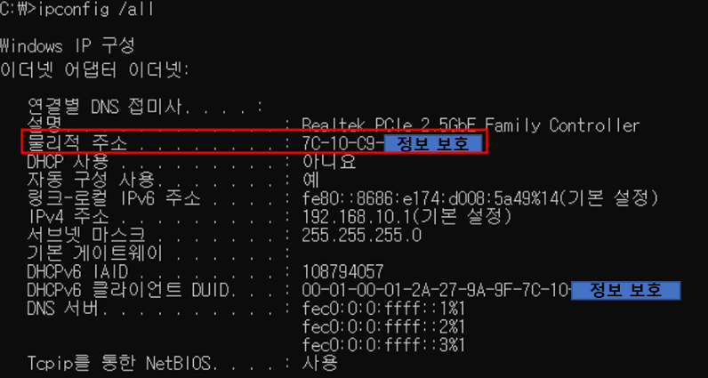
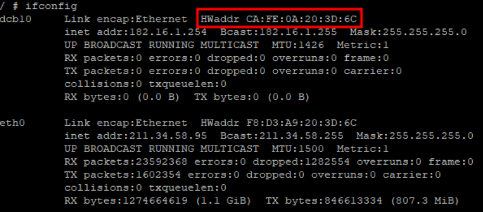
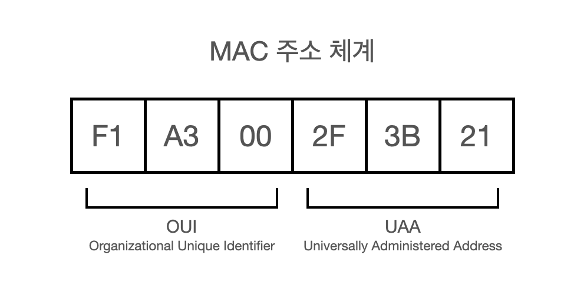
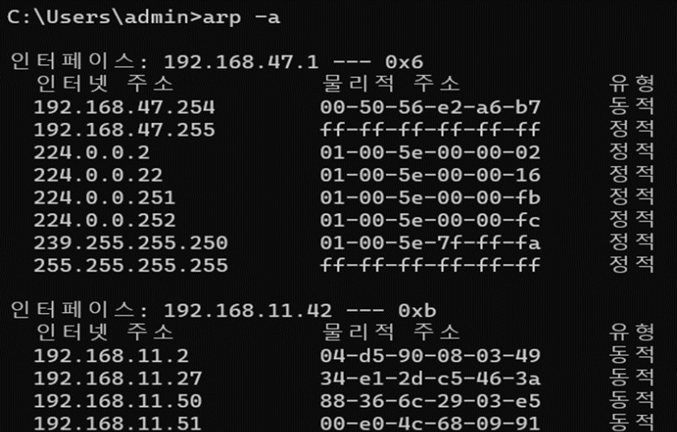

## MAC 주소 (Media Access Control Address, 물리적 주소)

MAC 주소는 네트워크 인터페이스 카드(NIC, Network Interface Card)에 할당된 **고유한 하드웨어(물리적인) 주소**입니다.  

IP(논리적인 주소) 만으로 통신을 하게 되면 언제든 지 변경 될 수 있는 유동성 때문에 원활한 통신이 되지 않아 혼선이 올 수 있습니다.  
단말간의 통신에서 사용되는 MAC 주소는 논리적인 IP와 다르게 변경이 어렵고, 고유한 성질을 가지고 있습니다.

예를 들어, IP 주소는 사람 이름, MAC 주소는 핸드폰 번호라고 생각해 보겠습니다.  
이떤 이벤트에서 김헤란이라는 사람이 당첨 되었을 때, 참여한 모든 김혜란에게 상품을 주는 것은 말이 되지 않습니다.
김혜란이라는 이름에 전화 번호가 010-1234-5678 이라는 번호를 가진 사람이 이벤트에 당첨 되었다면 같은 전화 번호가 두개일 수 없기 때문에 김혜란을 특정 할 수 있습니다.

이 논리 주소인 IP와 물리 주소인 MAC을 연결 시켜주는 프로토콜이 **ARP 프로토콜** 입니다.

### 조회 방법

윈도우 환경에서 MAC 주소를 조회하는 방법은 cmd 창에 `ipconfig /all` 명령어를 입력하면 조회가 가능합니다.  
리눅스 환경에서는 `ifconfig` 명령어를 통해 조회가 가능합니다.

MAC 주소는 원도우 환경에서 하이픈(-) 기호, 리눅스에서는 콜론(;) 기호로 구분하는 차이가 있다.

- `00:1A:2B:3C:4D:5E`
- `AC:DE:48:00:11:22`

### MAC 주소 구조

MAC 주소는 48bit의 숫자로 표기되며, 앞의 24bit는 제조사 식별 코드, 뒤의 24bit의 단말 일련번호로 이루어져 있습니다.

1. **OUI (Organizationally Unique Identifier, 조직별 식별자, 앞 24비트)**
   - 제조업체를 나타냄
2. **NIC Specific (개별 장치 식별자, 뒤 24비트)**
   - 제조업체가 장치마다 고유하게 할당

## ARP (Address Resolution Protocol, 주소 결정 프로토콜)

ARP를 직역하자면 주소(Address) 결정(Resolution) 프로토콜(Protocol)로 논리적인 IP 주소를 물리적인 MAC 주소로 매칭 시켜주는 프로토콜 입니다.

MAC 주소를 매칭 시키기 때문에 데이터링크 계정(2계층)에서 동작하는 프로토콜로 착각하는 경우도 있지만, IP 주소와 MAC 주소 둘다 필요하기 때문에 IP가 속해있는 네트워크 계층(3계층)에서 사용되는 프로토콜입니다.

### ARP의 통신 과정

1. **ARP Request** : 호스트 A가 호스트 B의 MAC 주소를 알아야 할 때 상대의 IP를 가지고 MAC 주소 정보를 요청하는 패킷
   - LAN 구간의 모든 호스트에게 전달해야 하기 때문에 Broadcast(ff:ff:ff:ff:ff:ff) 통신을 합니다.
   - 예시 ) Request who-has 192.168.10.1 tell 192.168.19.3, length 46 -> 나는 192.168.10.1 인데, 192.168.19.3을 가진 호스트의 MAC 주소는 뭐야?
2. **ARP Reply** : ARP Request를 받은 호스트가 해당 IP를 가지고 있으면, 자신의 MAC 주소를 담아 응답하는 패킷
   - ARP Request를 요청한 호스트에게만 전달하면 되기 때문에 해당 호스트에게 Unicast 통신으로 응답합니다.
   - 자신의 IP와 다른 ARP Request를 받은 호스트들은 해당 패킷을 무시합니다.
   - 예시 ) ARP (0x0906), length 62:Reply 192.168.10.1 is-at aa:aa:aa:aa:aa:aa, length 46 -> 내 IP는 192.168.10.1 이고, 나의 MAC 주소는 aa:aa:aa:aa:aa:aa 야
3. **ARP 캐시 테이블에 저장** : A는 B의 MAC 주소를 캐시에 저장하여 다음 요청 시 재사용
   - `arp -a` 명령어로 현재 캐시에 저장된 ARP 테이블을 확인할 수 있습니다.

> **Broadcast 통신과 Unicast 통신**
>
> Broadcast는 네트워크 내 모든 장치에게 정보를 전달할 때 사용되고, Unicast는 특정 대상에게만 데이터를 전송하는 방식입니다.
>
> 1. **Broadcast 통신**  
> 네트워크에서 하나의 송신자가 모든 수신자에게 데이터를 보내는 방식입니다.  
> 특징  
>     - 네트워크의 모든 노드가 데이터를 수신합니다.
>     - 특정 대상을 지정하지 않기 때문에 네트워크 트래픽이 증가할 수 있습니다.
>     - LAN(Local Area Network) 환경에서 주로 사용됩니다.
>
> 2. **Unicast 통신**
> 한 송신자가 특정 수신자에게만 데이터를 보내는 방식입니다.
> 특징
>     - 데이터가 목표 수신자 1명에게만 전달됩니다.
>     - 네트워크 트래픽이 효율적으로 관리됩니다.
>     - 대부분의 인터넷 트래픽이 Unicast 방식으로 이루어집니다.

### ARP 스푸핑 공격

공격자가 가짜 ARP 응답을 보내 다른 장치의 MAC 주소를 자신의 것으로 속여, 데이터를 가로챌 수 있습니다.

공격자는 네트워크 내에서 가짜 ARP 패킷을 보내 특정 IP 주소의 MAC 주소를 자신의 MAC 주소로 속여 중간자(MITM, Man-In-The-Middle) 공격으로 네트워크 트래픽을 감청하거나 변조할 수 있습니다. 가장 나쁜 시나리오는 로그인 정보나 금융 거래 데이터를 탈취하는 데 악용되는 것 입니다.

**해결책**

- **Dynamic ARP Inspection (DAI) 활성화**: 네트워크 스위치에서 ARP 패킷을 검사하여 신뢰할 수 없는 ARP 응답을 차단.
- **ARP 테이블 정적 할당**: 중요한 장치의 IP-MAC 매핑을 정적으로 설정하여 스푸핑 공격을 방지.
- **패킷 필터링 및 모니터링**: IDS/IPS(침입 탐지 및 방지 시스템)를 사용하여 비정상적인 ARP 트래픽을 감지하고 차단.

## ARP 캐시 테이블

ARP 캐시 테이블은 네트워크 인터페이스 카드(NIC)가 IP 주소와 대응하는 MAC 주소를 저장하는 메모리입니다.  
ARP 캐시에는 최근에 수행된 ARP 요청에 대한 응답으로 얻은 매핑 정보가 저장되며, 이를 통해 Broadcast 메세지를 통한 주소 해결을 줄이고 네트워크 성향을 향상 할 수 있습니다.

### ARP 캐시 테이블 구조

| IP 주소          | MAC 주소           | TTL (Time To Live) | 상태     |
|------------------|--------------------|--------------------|----------|
| 192.168.1.1      | 00:14:22:01:23:45  | 120s               | 동적     |
| 192.168.1.2      | 00:14:22:67:89:AB  | 120s               | 동적     |
| 192.168.1.3      | 00:14:22:45:67:CD  | 120s               | 동적     |

### ARP 캐시 관리

- **동적 항목**: 네트워크 상에서 자동으로 생성되는 ARP 항목으로 TTL이 만료되면 삭제됩니다.
- **정적 항목**: 사용자가 수동으로 ARP 캐시 테이블에 항목을 추가한 경우 TTL이 없거나 길게 설정되어 자동으로 삭제되지 않습니다.

## ARP 캐시 확인 명령어

- **Windows**: `arp -a`
- **Linux**: `ip neighbour` 또는 `arp -n`
