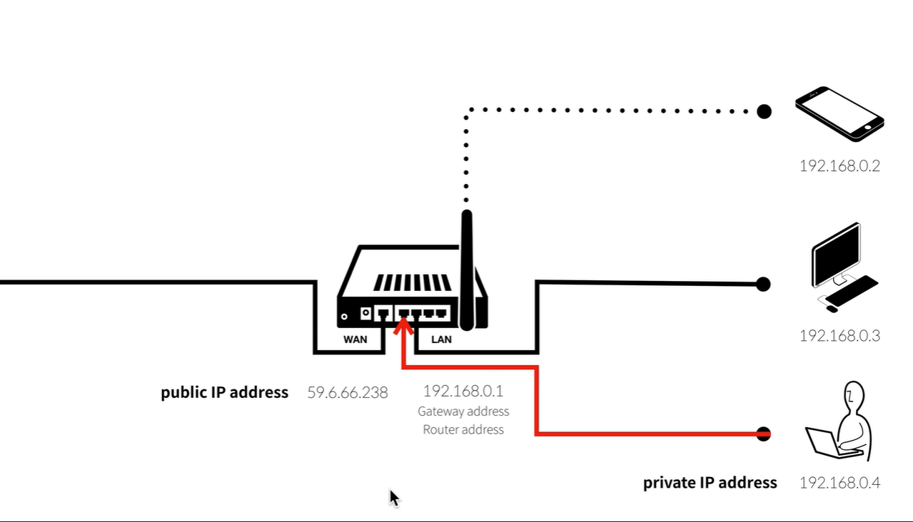
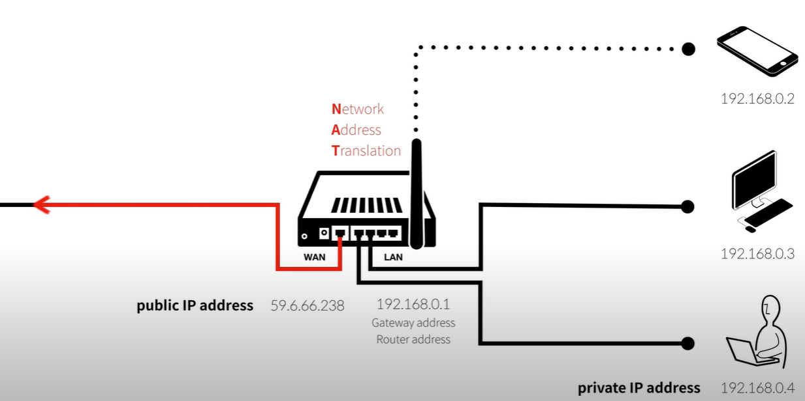

## NAT (Network Address Translation, 네트워크 주소 변환)

네트워크 주소 변환(network address translation, 줄여서 NAT)은 컴퓨터 네트워킹에서 쓰이는 용어로서, IP패킷의 TCP/UDP 포트 숫자와 소스 및 목적지의 IP 주소 등을 재기록하면서 라우터를 통해 네트워크 트래픽을 주고 받는 기술을 말한다. 한 마디로 Network Address인 IP를 변환(Translation)하는 기술입니다.

NAT는 대부분 사설 네트워크(Private Network)에 속한 여러 개의 호스트가 하나의 공인 IP 주소를 사용하여 인터넷에 접속하기 위하여 이용합니다.

> **Private Network에서 사용 가능한 Private IP**
>
> 10.0.0.0 ~ 10.255.255.255  
> 172.16.0.0 ~ 172.31.255.255  
> 192.168.0.0 ~ 192.168.255.255  

### 왜 필요할까?

IPv4 주소는 한정적이지만, 인터넷에 연결되는 기기는 계속 증가하고 있습니다.

IP 주소에는 Public(공인) IP와 Private(사설) IP가 있습니다. IP를 굳이 두 종류로 나눈 이유는 IPv4 주소의 낭비를 막고, 공인 IP가 필요하지 않은 단말들에게 중복 사용 가능한 IP를 제공하기 위함입니다.

NAT를 사용하면 하나의 공인 IP를 여러 장치가 공유할 수 있습니다.

공인인터넷망과 제 컴퓨터 사이에는 내 컴퓨터에게 IP를 할당해주는 공유기가 있습니다. 그리고 공유기는 공인 IP를 보유하며 인터넷과 맞닿아 있습니다. Private IP 뿐인 내 컴퓨터가 외부 서비스를 사용하고자 공유기로 나아가면, 공유기는 Private IP 뿐인 내 컴퓨터의 IP를 공유기 자신의 공인 IP로 변환(Translation) 하게 됩니다.

즉, 공유기를 지나 외부 인터넷으로 나아갈 때에는 공유기의 공인 IP를 가지고 원하는 Destination Address로 향하는 것입니다.

이 기술을 **NAT**이라고 합니다.

**용도**

1. **IP 주소 절약**: NAT는 여러 내부 기기들이 공인 IP 주소 하나를 공유하여 인터넷에 연결할 수 있게 도와줍니다. 이로 인해 공인 IP 주소의 낭비를 줄이고, 부족한 공인 IP 주소 자원을 효율적으로 사용할 수 있습니다.

2. **보안**: NAT는 외부에서 내부 네트워크로의 직접적인 접근을 차단하는 역할을 할 수 있습니다. 외부에서 내부 IP 주소를 알 수 없기 때문에, 공격자가 내부 시스템을 직접 공격하는 것을 방지할 수 있습니다.

3. **다중 연결 지원**: NAT는 내부 네트워크에서 여러 기기들이 인터넷에 접속할 때 각각 고유한 포트를 할당하여, 하나의 공인 IP 주소로 여러 기기들이 동시에 연결할 수 있게 해줍니다.

4. **네트워크 경계 보호**: NAT는 네트워크의 내부와 외부를 구분짓는 역할을 하며, 내부 네트워크의 구조나 주소를 외부에서 알 수 없게 만들어 외부 공격자로부터 보호합니다.

NAT는 주로 홈 네트워크나 기업 내에서 사용하는 라우터나 방화벽 장비에서 사용되며, 일반적으로 SNAT(Source NAT)와 DNAT(Destination NAT) 방식이 있습니다.

### NAT의 종류

1. **정적 NAT (Static NAT)**
   - 내부 IP와 외부 IP를 1:1로 매핑
   - 특정 서버(예: 웹 서버)에 고정된 공인 IP를 할당할 때 사용

2. **동적 NAT (Dynamic NAT)**
   - 내부 IP가 NAT 테이블에 등록될 때마다 외부 IP가 동적으로 할당됨

3. **PAT (Port Address Translation, 다중 주소 변환, 흔히 NAT라고 부름)**
   - **하나의 공인 IP를 여러 사설 IP에서 공유**
   - 장치마다 다른 포트 번호를 할당하여 여러 기기가 동시에 인터넷을 사용할 수 있도록 함
