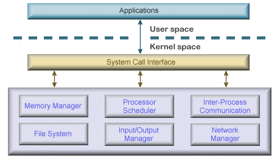

## 운영체제(OS)

**운영체제(OS, Operating System)** 는 컴퓨터 시스템의 핵심 소프트웨어로, 컴퓨터 하드웨어와 응용 프로그램 간의 상호작용을 관리하고 제어하는 역할을 합니다.(크롬, 엑셀, 카카오톡 같은 프로그램과 실제 하드웨어 사이에 통신을 시켜주는 것)  

운영체제의 목적은 사용자와 하드웨어 사이의 인터페이스를 제공해 효율적으로 응용 프로그램이 동작하도록 지원하고, 시스템 자원을 효율적으로 관리하여 응용 프로그램이 원활하게 동작할 수 있도록 해줍니다.  
운영체제의 코어(핵심) 부분을 **커널(Kernel)** 이라고 하는데(용어 자체도 '핵심의'를 의미..), 일반적으로는 커널에 여러가지 기능(라이브러리, 시스템 프로그램 등등)이 추가된 상태를 통칭해서 운영체제(OS)라고 불립니다.

### 운영체제 종류

1. **윈도우(windows)** : microsoft사에서 개발한 운영체제로, 노트북 및 서버 시스템에서 주로 사용
2. **macOS** : Apple사에서 개발한 운영체제로, mac 컴퓨터 및 노트북에서 사용된다. 시스템 안정성과 사용자 편의성에 중점을 둔 운영체제
3. **리눅스(Linux)** : 오픈 소스 운영체제로, 다양한 배포판이 있다. 서버 시스템 및 임베디드 시스템에서 주로 사용되며, 안정성과 보안성이 높은 운영체제
4. **유닉스(UNIX)** : 다중 사용자 및 다중 작업을 지원하는 운영체제로, 서버 환경에서 주로 사용, 안정성과 신뢰성이 높다.

### 운영체제의 역할

#### 1. 자원 관리

운영체제는 컴퓨터 시스템의 하드웨어 자원을 효율적으로 관리하는 역할을 합니다. CPU(중앙처리장치), 메모리(Memory), 저장장치(Storage), 입출력 장치(I/O Device) 등 하드웨어의 자원을 할당하고 관리하여 여러 응용 프로그램이 동시에 실행될 수 있도록 합니다.

#### 2. 메모리 관리

운영체제는 컴퓨터의 메모리를 효율적으로 관리하여 응용 프로그램이 필요로하는 메모리 공간을 할당합니다. 여기서 메모리의 할당과 해제, 가상 메모리 관리 등을 포함합니다.

#### 3. 프로세스 관리

운영체제는 실행 중인 응용 프로그램인 프로세스(Process)를 관리합니다. 여기서 프로세스의 생성, 실행, 일시 정지, 시스템 중지 등의 작업을 제어하며, 여러 프로세스 간의 자원 공유와 협력을 관리합니다.

#### 4. 디스크 및 파일 시스템 관리

운영체제는 디스크와 파일 시스템을 관리하여 파일의 생성, 삭제, 복사, 이동 등의 작업을 처리합니다. 파일 시스템은 데이터의 영구적인 저장과 접근을 제공하여 사용자 및 응용 프로그램이 데이터를 쉽게 관리할 수 있도록 합니다.

#### 5. 입출력 관리

운영체제는 입출력 장치와의 상호작용을 관리합니다. 사용자와 응용 프로그램이 키보드, 마우스, 디스플레이, 프린터 등과의 통신을 할 수 있도록 지원하며, 입출력 장치의 성능을 최적화 합니다.

#### 6. 사용자 인터페이스

운영체제는 사용자와 컴퓨터 간의 상호작용을 지원하는 사용자 인터페이스를 제공합니다. 텍스트 기반의 터미널 환경(CLI, Command Line Interface)과 그래픽 사용자 환경(GUI, Graphical User Interface)을 통해 사용자가 컴퓨터를 조작할 수 있도록 합니다.

#### 7. 네트워킹

운영체제는 컴퓨터 네트워크를 관리하고, 네트워크 프로토콜을 지원하여 컴퓨터 간의 통신을 가능하게 합니다. 인터넷 연결, 데이터 전송, 네트워크 보안 등을 관리합니다.  

#### 8. 오류 처리

운영체제는 시스템 내부 또는 외부에서 발생하는 오류와 예외 상황을 처리합니다. 여기서 프로세스의 비정상 종료, 메모리 오버플로우, 입출력 오류 등을 감지하고 처리하여 시스템의 안정성과 신뢰성을 유지합니다.

#### 9. 시스템 보안

운영체제는 시스템의 보안을 유지하기 위해 접근 제어, 사용자 인증, 암호화 등의 기능을 제공합니다. 여기서 불법적인 접근과 데이터 유출 등으로부터 시스템을 보호하고 안전한 환경을 제공합니다.

### 운영체제의 구조

1. **커널(Kernel)**  
운영체제의 핵심 부분으로, 하드웨어와 소프트웨어를 제어합니다.  
운영체제 커널이라고 하면 전반적인 프로세스(또는 프로그램)를 뜻합니다.  
프로세스 관리, 메모리 관리, 파일 시스템 관리, 입출력 장치 제어 등의 핵심 기능을 수행합니다.  
커널의 종류: 모놀리식 커널(Monolithic Kernel), 마이크로커널(Microkernel)

    커널이 하는 일은 크게 5가지로 볼 수 있습니다.
    - 프로세스 관리 : 프로세스에 CPU를 배분하고 작업에 필요한 제반 환경을 제공
    - 메모리 관리 : 프로세스에 작업 공간을 배치하고 실제 메모리보다 큰 가상공간을 제공
    - 파일 시스템 관리 : 데이터를 저장하고 접근할 수 있는 인터페이스를 제공
    - 입출력 관리 : 필요한 입력과 출력 서비스를 제공
    - 프로세스 간 통신 관리 : 공동 작업을 위한 각 프로세스 간 통신 환경을 지원

> 1. **모놀리식 커널(단일형 구조 커널, Monolithic Kernel)**  
> 모놀리식 커널은 운영체제의 핵심 기능(프로세스 관리, 메모리 관리, 파일 시스템, 드라이버 등)을 **커널 공간(Kernel Space)** 에서 모두 실행하는 구조입니다.  
> 호출에 대한 오버헤드가 적어 성능이 빠르지만 커널 코드에서 오류가 발생하면 시스템 전체가 다운 될 가능성이 있어 안정성이 낮습니다. 또 전체 공간을 사용하기 때문에 커널을 수정하면 전체 시스템을 다시 컴파일 해야하는 경우가 많아 드라이버 및 기능 추가가 어렵습니다.  
> 대표적인 운영체제 : Linux, Windows(초기 버전), Unix, MS-DOS
>
> 2. **마이크로커널 (Microkernel)**  
> 마이크로커널은 운영체제의 핵심 기능 중 최소한의 기능만 커널 공간에서 실행하고, 나머지는 **유저 공간(User Space)** 에서 실행하는 구조입니다.  
> 최소한의 기능만 커널 공간에서 실행기 때문에, 커널에서 오류가 발생해도 유저 공간에서 실행되는 서비스는 영향을 덜 받으며, 새로운 기능 추가 시 운영체제 전체를 다시 빌드할 필요 없이 개별 추가가 가능합니다. 다반 커널과 유저 공간 사이의 메세지 전달(IPC) 오버헤드가 발생하여 성능이 다소 저하될 수 있습니다.
> 대표적인 운영체제 : macOS, QNX, Minix

2. **인터페이스(Interface)**  
사용자의 명령을 컴퓨터에 전달하고, 결과를 알려주는 소통의 역할을 합니다.  
인터페이스 종류 : GUI(Graphical User Interface), CLI(Command Line Interface), Touch-Screen Interface

> 1. **GUI(Graphical User Interface)**  
> 윈도우 바탕화면처럼 아이콘과 마우스 클릭이 되게끔 만들어져서 사용자 편의성을 가진 인터페이스
> 2. **CLI(Command Line Interface)**  
> 터미널로 연결하고, 마우스가 없고 명령어를 키보드로 입력하면 글씨만 나오는 인터페이스
> 3. **Touch-Screen Interface**  
> 모바일 시스템에서 주로 사용하며, 사용자가 터치 등의 제스처를 취하여 시스템을 제어

3. **시스템 호출(System Call)**  
시스템콜(System Call)은 운영체제에서 제공하는 서비스에 접근하기 위한 프로그래밍 인터페이스입니다.  
프로그램에서 시스템콜을 호출하면 운영체제의 커널에 있는 함수가 실행되어 하드웨어 자원에 접근하거나, 프로세스 간 통신, 파일 I/O, 메모리 관리 등과 같은 다양한 운영체제 서비스를 이용할 수 있습니다.

    운영체제가 직접 하드웨어 자원을 제어하면, 여러 프로그램이 동시에 하드웨어 자원을 사용하려고 할 때 충돌이 발생할 수 있기 때문에 운영체제는 시스템콜을 통해 프로그램들이 운영체제의 서비스를 공유하도록 합니다.  
    이를 통해 운영체제는 하드웨어 자원을 안전하게 관리하고, 프로그램들은 운영체제의 기능을 활용하여 안정적이고 효율적인 동작을 할 수 있습니다.

    - **modebit**  
    시스템콜의 modebit은 사용자 모드(1)와 커널 모드(0) 사이를 전환하기 위한 비트입니다. 사용자 모드에서는 일반적인 응용 프로그램을 실행 커널 모드에서는 운영체제가 하드웨어 자원을 직접적으로 제어 따라서 사용자 모드에서 시스템콜을 호출하면, 커널 모드로 전환되어 시스템콜 함수를 실행하고, 실행이 완료되면 다시 사용자 모드로 돌아갑니다. modebit이 설정되어 있지 않은 상태에서 시스템콜을 호출하면, 운영체제는 프로세스를 강제로 종료시키는 등의 에러 처리를 수행합니다. modebit은 이러한 전환이 안전하게 이루어지도록 보호합니다.
    - **드라이버**  
    드라이버는 운영체제와 장치 간의 인터페이스를 담당하는 소프트웨어입니다. 이는 장치와 운영체제 간의 프로토콜을 구현하여, 운영체제가 장치를 제어할 수 있도록 합니다. 일반적으로, 운영체제는 하드웨어 자원을 직접 제어하지 않고, 드라이버를 통해 하드웨어 자원에 접근합니다. 따라서, 운영체제와 장치 간의 호환성을 보장하기 위해서는 적절한 드라이버가 필요합니다.
