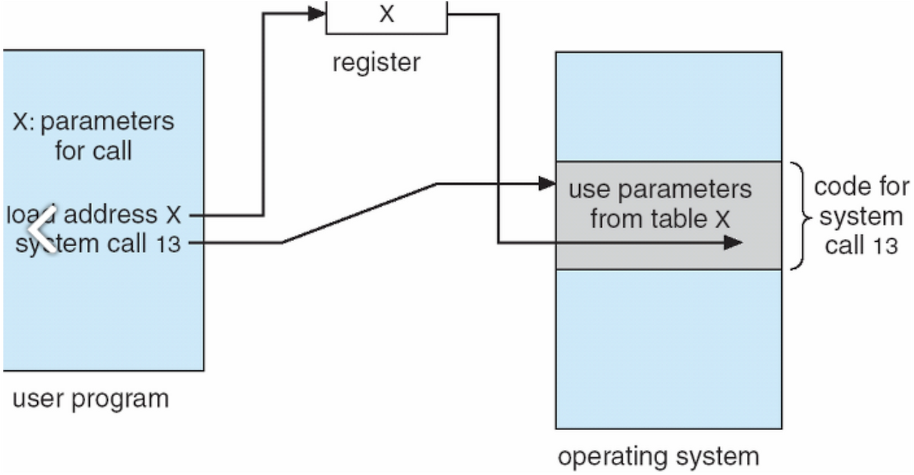

## 시스템 콜의 동작 과정

1. 사용자 프로세스가 시스템 콜 호출(Kernel mode 진입)
2. 커널은 내부적으로 시스템 콜을 분하기 위해 기능별로 고유번호를 할당하고 그 번호에 해당하는 제어 루틴을 정의
3. 커널은 요청받은 시스템 콜에 대응하는 고유번호 확인하고 번호에 맞는 서비스 루틴 호출
4. 커널은 서비스 루틴을 처리하고, 사용자 모드(User mode)로 전환

필요한 기능이나 시스템 환경에 따라 시스템 콜이 발생할 때 좀 더 많은 정보가 필요할 수 있습니다. 그러한 정보가 담긴 매개변수를 운영체제에 전달하기 위해서는 3가지 방법이 있습니다.

1. 매개변수를 CPU 레지스터 내에 전달합니다.
    - 이 경우에 매개변수의 갯수가 CPU 내의 총 레지스터 개수보다 많을 수 있습니다.
2. 위와 같은 경우에 매개변수를 메모리에 저장하고 메모리의 주소가 레지스터에 전달됩니다.
3. 매개변수는 프로그램에 의해 스택(stack)으로 전달(push)될 수 있습니다.

2, 3번 방법의 경우 전달되는 매개변수의 개수나 길이에 제한이 없기 때문에 몇몇 운영체제에서 선호하는 방식입니다.

## 시스템 콜 유형

### 1. 프로세스 제어

끝내기(exit), 중지(abort), 적재(load), 실행(execute)
프로세스 생성(create process) - fork

### 2. 파일 조작

읽기(read), 쓰기(write), 열기(open), 닫기(close)
파일 생성(create file), 파일 삭제(delete file)

### 3. 장치 관리

하드웨어의 제어와 상태 정보를 얻음(ioctl), 장치를 요구(request devices), 장치를 방출(release device)

### 4. 정보 유지

시간과 날짜의 설정과 획득(time)
시스템 데이터의 설정과 획득(date)

### 5. 통신

pipe(), shm_open(), mmap()
통신 연결의 생성 및 제거
메시지의 송신 및 수신
