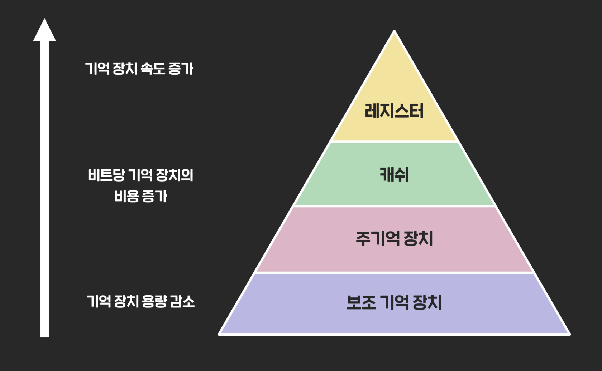

# 메모리는 어떤 계층 구조로 이루어져 있나요?

메모리 계층 구조는 컴퓨터 시스템에서 데이터 접근 속도, 용량, 비용 간의 균형을 맞추기 위해 설계된 구조입니다. 이 구조는 다음과 같은 계층으로 이루어져 있습니다:

## 1. 레지스터 (Register)

- CPU 내부에 위치한 가장 빠른 메모리입니다
- CPU가 직접 접근하여 연산에 필요한 데이터를 일시적으로 저장합니다
- 접근 시간이 0~1 CPU 사이클로 가장 빠르지만, 용량이 매우 작고 비용이 높습니다

## 2. 캐시 메모리 (Cache Memory)

- CPU와 주 메모리 사이의 속도 차이를 줄이기 위한 고속 메모리입니다
- 일반적으로 다음과 같은 레벨로 구분됩니다:
    - L1 캐시: CPU 코어 내부에 위치하며, 가장 빠르고 용량이 작습니다 (8~64KB)
    - L2 캐시: L1보다 느리지만 더 큰 용량을 가집니다 (64KB~4MB)
    - L3 캐시: 일부 프로세서에서 사용되며, L2보다 더 큰 용량을 제공합니다

## 3. 주 메모리 (Main Memory)

- 일반적으로 RAM(Random Access Memory)을 의미합니다
- CPU가 직접 접근할 수 있는 휘발성 메모리로, 실행 중인 프로그램과 데이터를 저장합니다
- 레지스터나 캐시보다 느리지만, 더 큰 용량을 제공합니다

## 4. 보조 기억 장치 (Secondary Storage)

- 하드 디스크 드라이브(HDD)나 솔리드 스테이트 드라이브(SSD)와 같은 비휘발성 저장 장치입니다
- 주 메모리보다 훨씬 큰 용량을 제공하지만, 접근 속도가 가장 느립니다

이러한 계층 구조에서 상위로 갈수록 접근 속도는 빨라지지만 용량은 작아지고 비용은 높아집니다. 반대로 하위로 갈수록 접근 속도는 느려지지만 용량은 커지고 비용은 낮아집니다. 이 구조를 통해 컴퓨터 시스템은 성능과 비용 사이의 최적의 균형을 달성할 수 있습니다