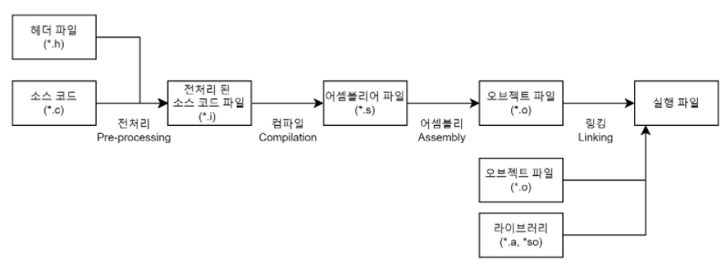

## 컴파일(Compile) 이란?

소스 코드가 실행 가능한 프로그램(기계어)로 번역되는 과정을 말합니다. (컴퓨터는 0, 1로 이루어진 기계어만 이해할 수 있기 때문)

## 컴파일 과정

컴파일은 **전처리** -> **컴파일** -> **어셈블리** -> **링킹** 으로 4가지 단계로 나뉘어집니다.

### 전처리 (Pre-Processing)

소스 코드 파일을 전처리 된 소스 파일로 변환하는 과정입니다. 이 과정에서 아래 세가지 작업을 수행해요.

1. **주석 제거**  
  소스 코드에서 주석을 전부 제거합니다.  
  주석은 사람이 알아보기 위해 작성한 것이므로 컴퓨터 한테는 필요없기 때문이에요
2. **헤더 파일 삽입**
  헤더 파일을 찾아 헤더 파일에 있는 모든 내용을 복사해서 소스 코드에 삽입합니다.
  헤더 파일에 선언 된 함수 원형은 후에 링킹 과정을 통해 실제로 함수가 정의되어 있는 '오브젝트 파일(컴파일 된 소스 코드 파일)'과 결합됩니다.
3. **매크로 치환 및 적용**

### 컴파일 (Compile)

전처리 된 소스 코드 파일을 어셈블리어 파일로 변환하는 과정입니다.  
이 과정에서 **언어의 문법 검사**가 이루어 집니다.(오류 처리, 코드 최적화 작업)  
또, Static한 영역 (Data, BSS 영역)들의 메모리 할당을 수행하고 있습니다.

> **BSS (Block Started By Symbol)**
>
> 초기화 되지 않은 전역 데이터를 위한 영역을 말해요.  
> 정적으로 할당 된 변수가 포함 된 데이터 세그먼트의 일부로 컴파일러나 링커에 의해 사용됩니다.
>
> 이해를 쉽게 하기 위해 javascript로 예시를 들어볼께요.  
> `var a;` -> 전역 변수이고, 초기값이 없기 때문에 BSS에 저장됩니다.  
> `var b = 0;` -> 초기값이 있기 때문에 Data 영역에 저장됩니다.

### 어셈블리 (Assembly)

어셈블리과정은 중간 단계로서 어셈블리 언어로 작성된 코드(소스 코드, `.s`)를 컴퓨터가 이해할 수 있는 **기계어(Object Code)** 로 변환하는 과정입니다.

**왜 어셈블리(assembly : 조립하다, 모으다)라고 불리울까?**  
 `.asm` 파일에는 여러 함수, 전역 심볼, 상수, 데이터 등 많은 구송요소를 하나의 오브젝트 파일로 '조립'해서 CPU가 쓸 수 있게 만들어줍니다.  
 즉, 여러 부품(명령어, 코드 등)을 조립해서 → **작동 가능한 하나의 형태(기계어 코드)**로 마치 레고 블록을 맞추듯, 기계가 실행 가능한 프로그램을 “조립”해 만든다는 개념에서 유래했습니다.

> ***왜 오브젝트 파일(object file)이라고 하는걸까?***  
>
> 오브젝트 파일(object file)은 '기계어로 번역된 목적 코드(target code)'를 담고 있기 때문에 "목적 파일"이라고도 불리고, 영어로는 object file이라고 합니다.
> "목적(object)"이란 뜻은: "최종 실행 파일을 만들기 위한 중간 결과물"  
> 즉, 링커(linker)가 실행 파일을 만들기 위해 처리해야 할 '대상(object)'이라는 의미예요.  
>
> **전체 과정 다시 보기**
> - main.c → 컴파일 → main.o (오브젝트 파일)
> - utils.c → 컴파일 → utils.o (오브젝트 파일)
> - main.o + utils.o → 링크 → main.exe (실행 파일)
>
> 이때 각각 .o 파일은 CPU가 이해할 수 있는 기계어 코드 일부이며 외부 함수/심볼은 아직 연결이 안되어있는 상태라 **완전한 실행 파일이 아니라 단독 실행도 불가합니다!**
>
> 즉, 오브젝트 파일은 목적(target)이 있어서 만들어지는, 최종 실행 파일을 만들기 위한 중간 산물입니다. 그래서 'object file' 또는 '목적 파일'이라고 부르게 된 거예요.
>
> **왜 그냥 "기계어 파일"이라고 안 했을까?**  
> 오브젝트 파일은 기계어 코드 + 메타데이터(심볼, 디버깅 정보 등)가 포함된 특수한 형식의 바이너리 파일이에요. 단순한 기계어 코드 파일보다 더 풍부한 정보를 담고 있어서, 링커나 디버거가 처리할 수 있도록 설계되어 있습니다.

### 링킹 (Linking)

링커(Linker)를 통해 오브젝트 파일들을 묶어 실행 파일로 만드는 과정입니다.  
이름에서부터 알 수 있듯 여러 개의 **오브젝트 파일(.o)**이나 **라이브러리(.a, .so, .dll 등)**를 하나로 묶어서(또는 연결해서 = Link) 실행 가능한 **최종 실행 파일(.exe, ELF 등)**을 만드는 과정입니다.

- 심볼 해결 : 어떤 심볼(변수, 함수 등)이 어디서 정의 되었는 지 찾습니다.
- 주소 할당 : 각 코드 / 데이터 블록에 메모리 주소를 배정합니다.
- 결합 : 여러 오브젝트 파일과 라이브러리를 하나의 실행 파일로 결합합니다.

링커가 없으면 오브젝트 파일 안의 '외부 참조(symbol)'의 정의를 알 수 없습니다.  
대표적인 링킹 에러로는 레퍼런스 에러(`undefined reference to 'foo'`)가 있습니다.

> **라이브러리를 링킹하는 방법 두가지! 정적 링킹과 동적 링킹**
>
> 1. **정적 링킹 (Static Linking)**  
>   정적 링킹은 도시락 싸들고 가는 여행이라고 생각하면 좋아요.  
>   필요한 걸 다 싸서 가니까, 외부에 의존하지 않음. 하지만 가방이 무거워... 🎒
>    - 프로그램을 빌드할 때 필요한 라이브러리의 코드를 통째로 실행 파일 안에 포함시키는 방식
>    - 실행 파일 : 크기가 큼 (필요한 코드 전부가 포함 됨)
>    - 실행 속도 : 빠름 (외부 참조 없이 바로 실행 가능)
>    - 의존성 : 없음 (배포 시 실행 파일만 있으면 됨)
>    - 업데이트 : 어려움 (라이브러리 바뀌면 다시 컴파일 해야함)
> 2. **동적 링킹 (Dynamic Linking)**  
>   동적 링킹은 여행지에서 사 먹는 여행입니다.  
>   도시락 안 싸도 되니까 가방 가벼움. 하지만 주변에 식당 없거나 문닫는 등 현지 상황을 많이 타요. 🍜  
>    - 실행 파일에는 코드 일부만 포함하고, 실행 중에 외부 라이브러리를 참조해서 사용하는 방식
>    - 실행 파일 : 작음 (필요한 코드 일부만 포함)
>    - 실행 속도 : 약간 느릴 수 있음 (실행 시에 동적으로 연결)
>    - 의존성 : 있음 (시스템에 있어야지만 사용 가능)
>    - 업데이트 : 쉬움 (라이브러리만 교체하면 됨)
