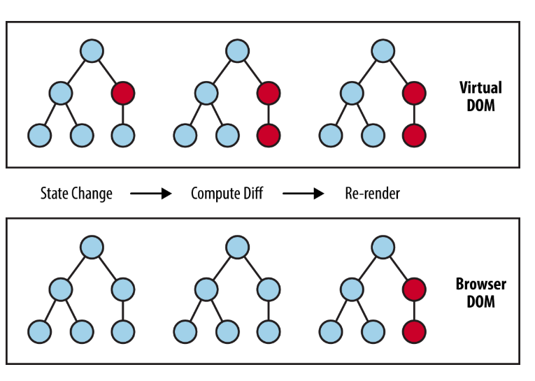

## virtual DOM 이란?
> 실제 DOM 의 가벼운 복사본으로 볼 수 있다.
메모리상에서 존재하고, 
실제 DOM을 모방한 가상의 DOM을 구성해 원래 DOM과 비교하여 **달라진 부분을 리렌더링** 하는 방식으로 작동한다

#### virtual DOM 을 왜 사용하나요? 
실제 DOM에는 브라우저가 화면을 그리는데 필요한 모든 정보가 들어있기 때문에 실제 DOM 을 조작하는 방식은 무거운 작동방식이 된다. 리액트에서는 깜빡거림 없이 부드러운 UX 를 사용자에게 제공하고자 변경사항만 빠르게 파악하고 리렌더링하기 위해 DOM 을 만들어 비교하는 방식을 채택하였다. 

### virtualDOM 특징
- JavaScript 객체를 활용
- 메모리 상에서 동작하기에 훨씬 더 빠르게 동작
- 실제 렌더링이 되지 않기 때문에 연산 비용이 적음

### DOM vs virtualDOM

| 구분      | 실제 DOM            | Virtual DOM                |
| ------- | ----------------- | -------------------------- |
| 위치/형태   | 브라우저 화면에 직접 연결    | 메모리 내 자바스크립트 객체            |
| 업데이트 방식 | 직접 조작, 전체/부분 리렌더링 | 변경사항만 비교 후 한 번에 실제 DOM 반영  |
| 성능      | 대규모 변화 시 느림       | 대규모 변화에 효율적, 불필요한 연산 최소화   |
| 불변성     | 상태 가짐, 직접 수정 가능   | 불변 객체, 변경 시 새 객체 생성        |
| 사용 목적   | 모든 웹 페이지          | 동적 UI, SPA 등 성능 최적화를 위해 도입 |

- 불변객체 - Virtual DOM은 불변성을 유지하는(immutable) 객체로, 변경이 필요할 때마다 새로운 객체를 만들어 비교(diff)한다. 이 덕분에 어떤 부분이 바뀌었는지 효율적으로 파악할 수 있다
 - 대규모 변화 효율적 - 요소가 30개가 바뀌었다고 레이아웃을 30개씩 새로 하는 것이 아니라 모든 변화를 하나로 묶어서 딱 한번만 실행시킨다. 이렇게 연산 횟수를 줄일 수 있기 때문에 실제 DOM 리렌더링에 비해서 효율적이다

## 리액트의 렌더링? 

리액트가 virturalDOM 을 비교하는 과정

리액트는 실제 DOM 의 UI 를 가진 자바스크립트 객체를 메모리상에 가지고 있다. 가상 돔은 변화를 감지하면 재조정(Reconcilation) 과정을 통하여 실제 DOM 과 동기화 한다. 재조정 과정은 크게 3 단계로 나뉜다.

1. UI 가 변경을 감지하면 UI 를 virtualDOM 으로 렌더링한다.(실제 화면상 렌더링 되는 것이 아닌 비교를 위한 가상 렌더링)
2. 현재 Virtual DOM 과 이전 virtualDOM 을 비교해 차이를 계산한다.
3. 변경된 부분을 실제 DOM 에 반영한다.

### 리액트의 얕은 비교
리액트는 노드를 비교할때 얕은 비교를 한다. 리액트의 얕은 비교는 같은 레벨에서만 일어난다.

- 숫자나 문자열, Boolean 같은 원시값을 가진 자료형은 값을 비교한다.
- 배열, 객체 등 참조값을 가진 자료형은 그 안의 값 혹은 attribute를 비교하지 않고 그들의 레퍼런스(참조되는 위치) 를 비교한다.

배열은 직접 수정하는 방식인 `push` , `pop` , `unshift()` 와 같은 메서드로 배열을 수정한 뒤 setState에 담아주어도 같은 참조 위치를 가지고 있기 때문에 실제 값의 변화가 있다 하더라도 감지할 수 없다.

#### React 객체 불변성을 유지
리액트에서 배열 값을 변경할 경우에는 객체와 마찬가지로 불변성을 지켜주어야한다. 배열 혹은 객체의 **원본을 수정하지 않고** 상태변경을 원하는 배열과 함수를 복사(깊은복사, 얕은복사X) 하고 사용해야 한다.

>원본을 수정하는 매서드인 `push()`, `pop()` 과 같은 메서드를 사용하여 원본을 직접 수정하는 것은 리액트를 사용할 때는 지양해야한다.
>`assign()` 메서드를 사용하거나, 전개구문을 사용해서 복사를 한 뒤 그 복사된 값을 수정하고 setState에 담아주면 변경을 감지 할 수 있다.

리액트의 렌더링 과정은 이후의 커밋단계와 렌더단계를 다룰때 자세하게 다루겠습니다!!