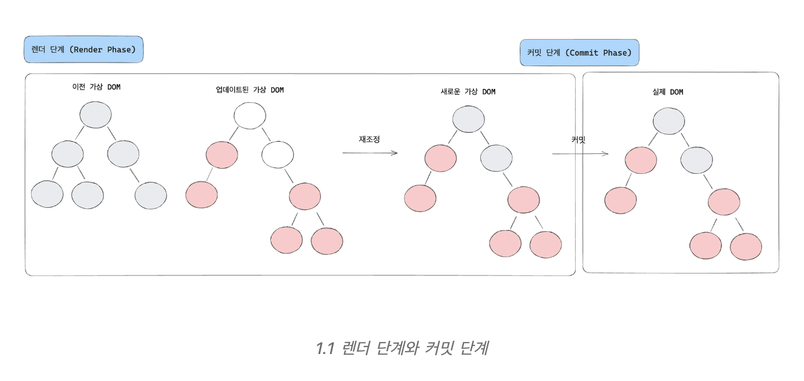

### 리액트의 동작 단계
[출처-naver d2 doc]
React 의 내부 동작을 몇 개의 단계로 구분하여 대략적인 동작을 추적하고자 한다. 
- Render 단계: JSX 선언 또는 `React.createElement()`를 통해 일반 객체인 Reat 엘리먼트를 생성한다.
- Reconcile 단계: 이전에 렌더링된 실제 DOM 트리와 새로 렌더링할 React 엘리먼트를 비교하여 변경점을 적용한다.
- Commit 단계: 새로운 DOM 엘리먼트를 브라우저 뷰에 커밋한다.
- Update 단계: props, state 변경 시 해당 컴포넌트와 하위 컴포넌트에 대해 위 과정을 반복한다.

위 과정을 보면 우리가 일반적으로 생각하는 DOM 렌더링 동작은 React 내에서 '커밋'이라고 불리는 것을 알 수 있다. 
반대로 React에서 '렌더링'은 React 엘리먼트를 생성하는 동작을 의미한다

## 랜더단계와 커밋 단계 ? 
렌더 단계에서는 화면에 그릴 것 들을 "파악" 하고,
커밋 단계에서는 직전에 파악한 것들을 화면에 "적용"한다. 

#### 랜더 단계
랜더 단계는 무엇이 바뀌어야 하는지 계산하는 단계이다. 이 단계에서는 가상 DOM 을 기반으로 변경사항을 비교하고 실제 DOM 을 수정하기 위한 "작업목록" 을 생성한다. 
렌더 단계에서 초기렌더와 리랜더를 했을 때 각각 다른 동작을 한다.

- **초기 렌더** | render() 메소드의 루트 컴포넌트를 호출한다.
- **리렌더** | 상태 업데이트가 발생한 컴포넌트를 호출한다.

##### **주요 작업:**
- 컴포넌트 함수 실행 (render(), 함수형 컴포넌트의 body)
- state, props 처리
- 새로운 Virtual DOM 트리 생성
- 이전 트리와 비교 (reconciliation)
- 변경 사항 추적 (diffing)
- Fiber tree 생성/업데이트
##### **특징:**
- **렌더 단계에서는 실제 DOM 조작이 발생하지 않음**
- 사이드 이펙트(예: useEffect)는 실행되지 않음
- 이 단계에서 오류가 발생하면 커밋 단계로 가지 않음

#### 커밋 단계
커밋 단계는 렌더 단계에서 계산된 변경사항을 **실제 DOM에 반영하는 단계**입니다. 
또한 이 단계에서 React는 **라이프사이클 메서드**나 **Effect 훅**도 실행합니다.

커밋 단계에서도 초기 렌더와 리렌더에 다르게 동작하는데 
- **초기 렌더** | 렌더 단계에서 파악한 DOM 노드들을 DOM에 반영한다.
- **리렌더** |  렌더 간 발생한 최소한의 변경 사항들을 DOM에 반영한다.

렌더 단계에서 계산한 변경 사항들을 실제 DOM에 적용할 때 "적용"이라는 것은 DOM 노드를 새로 생성, 수정 또는 삭제해 새로운 컴포넌트 트리와 동기화하는 과정을 의미한다. 
DOM의 조작이 발생하면 전체 UI를 다시 렌더링 하는 것처럼 보이지만 실제로는 변경된 DOM 노드만 파악해서 최소한의 변경만 실제 DOM에 반영합니다.

##### **주요 작업:**
- DOM 업데이트 (실제 변경)
- ref 업데이트
- componentDidMount, componentDidUpdate, componentWillUnmount 등 라이프사이클 메서드 실행
- useEffect, useLayoutEffect 등 훅 실행
##### **특징:**
- 커밋 단계는 **중단 불가** (atomic)
- 가능한 빠르게 실행되어야 함
- 실제 브라우저 DOM이 바뀌는 시점