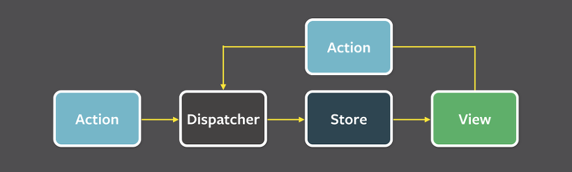

React의 등장 이전에도 프론트엔드 단에 수 많은 라이브러리/프레임워크가 존재했어요. 그 시작은 2006년에 등장한 Jquery부터인데 Javascript에서 DOM을 다루는 것을 효율적으로 도와주고 웹브라우저들마다 자바스크립트를 불러오는 방식이 달라 어려웠던 점을 해결해 주었다고 합니다.

이후 웹 생태계가 더 발전하고 어플리케이션의 크기가 커지자 자바스크립트 파일이 넘쳐나면서 통제가 어려워졌어요.

이것을 효율적으로 관리하기 위해 *backbone.js 같은 라이브러리가 등장하면서 자바스크립트 파일의 조직적인 관리가 용이해졌고, 빠르고 큰 웹을 위해 Single Page Application이 등장했습니다.

> **Backbone.js란?**
>
> Backbone.js는 2010년에 등장한 자바스크립트 MV* 프레임워크(MV*는 MVC(Model-View-Controller) 또는 MVVM 등 다양한 아키텍처 패턴을 포함한 표현입니다.)로, 웹 애플리케이션에서 구조화된 코드 작성을 도와주는 경량 라이브러리입니다.  
> 다만 대형 앱에서 사용하기에는 구조가 부족하고, 상태 관리와 뷰 갱신도 아쉬운 부분이 있어 인기가 없어졌어요.
>
> - 경량(Lean): 필수 기능만 제공하며, 필요 시 다른 라이브러리와 쉽게 조합할 수 있음 (예: jQuery, Underscore.js).
> - 단방향 데이터 흐름 지원
> - Model-View 구조: 데이터를 Model로, 화면을 View로 분리
> - Router 기능 내장 → SPA(Single Page Application) 라우팅 구현 가능
> - Event 기반 구조: Observer 패턴을 활용해 뷰와 모델 간 동기화 처리

그리고 이러한 흐름과 함께 Facebook에서도 XHP에서 모티브를 얻어 만든 React.js를 공개했습니다. XHP는 PHP에서 HTML을 편하게 출력 할 수 있게 도와주는 프레임워크인데 이 아이디어를 JSX 문법으로 발전시켰습니다. (이거는 그때 웹 개발자들에게 진짜 신세계였을 듯하다.)

React는 Virtual DOM, 라이프사이클 메서드, 단방향 데이터 흐름 등의 특징을 가지고 있는데, 가만 보면 다 View쪽을 효율적이고 독립적으로 다루기 위함을 알 수 있어요.

위의 사진처럼 React는 View만을 위한 라이브러리이고 공식문서에서도 그렇게 설명하고 있어요. 사용자와 인터렉션을 통한 UI의 표현을 효율적으로 해주는 것에만 집중 한 것, 그래서 가볍고 자유로워요.

개발자들을 이게 마음에 들었는지 발전해 나가기 시작했는데, 라우팅(react-router), 상태 관리(redux)를 만들고 빌드(Webpack, Babel)를 접목시켜 SPA(완제품)를 만들어냈고 아주 인기 있는 라이브러리가 되었어요.

### Facebook이 직면한 문제점

새로운 것이 나왔다면 기존 것의 문제점을 해결하거나 더 좋게 만들기 위함이 분명한데 Facebook은 무엇을 해결하기 위해 React를 만들었을까?

이즈음 Facebook은 기존 MVC 패턴을 가진 대규모 애플리케이션에서 구조가 너무 복잡해지고 예측성이 떨어지는 문제점에 직면했다고 생각했습니다. 대표적으로 "Facebook 알림 버그" 사례가 있는데, Facebook에 로그인하면 화면 위 메시지 아이콘에 새로운 알림이 있다고 표현되지만 클릭하면 아무런 메시지가 없는 버그였어요.

이 버그는 수정하면 나오고 수정하면 또~ 나오고 하는 고질적인 문제였고, 아마 의존성이 많아 이걸 고치면 저게 문제고 저걸 고치면 이게 문제고 했지 않았을까 예상됩니다. (원인 예측 불가능)

이 문제를 해결하기 위해서는 좀 더 예측 가능한 형태로 코드를 구조화하는 것이 필요했고, React와 Flux를 이용해서 그것을 달성하고자 하였습니다.

## MVC 패턴의 한계

Flux에 들어가기 앞서 잠깐 MVC 패턴(Model-View-Controller)에 대해 설명하자면, 데이터를 다루는 로직(Controller), 데이터(Model), 사용자 인터페이스(View)를 나누어 어플리케이션을 구현하는 하나의 개발 모델입니다.

- Model: 데이터와 비즈니스 로직 (DB, 상태 등)
- View: 사용자에게 보여지는 화면
- Controller: 사용자 입력 처리 및 Model-View 연결

Controller는 Model의 데이터를 조회하거나 업데이트하는 역할을 하며, Model의 변화는 View에 반영됩니다. 그리고 사용자가 뷰를 통해 데이터를 입력하면, 모델에 영향을 주면서 데이터를 관리하게 되어요.

아주 간단하고 이해하기도 쉬운 패턴이에요.  
로직, 데이터, 뷰를 나누어 관리하기 때문에 참 효율적이죠.

그러나 앞서 말했듯 Facebook 웹 앱에서의 MVC 구조는 앱이 커지면서 굉장히 복잡해졌다고 해요. View가 다양한 상호작용을 위해 여러개의 Model을 동시에 업데이트하는 상황이 나타났기 때문! 이렇게 많은 의존성을 가지게 되면 개발 시에 당연히 예측불가능한 상황이 많이 나오게 됩니다.

하지만 MVC는 지금도 많이 쓰이고 좋은 디자인 패턴이에요.

> 아직도 쓰이는 곳 : Django, Ruby, Spring MVC 등

## FLUX란?

그래서 Facebook은 단방향 데이터 흐름을 가지는 Flux라는 아키텍처 패턴을 만들어 해결 했습니다. 복잡한 사용자 인터페이스에서 **데이터 흐름을 예측 가능하게 만들기 위한 설계 방식** 으로, MVC 패턴의 복잡함을 해결하고자 등장하였습니다.

### **단방향 데이터 흐름 (Unidirectional Data Flow)**

각 요소들은 단방향 흐름에서 순서대로 역할이 수행되고 또 다시 새로운 데이터 변경이 있으면 처음부터 이 흐름이 다시 시작됩니다. 이렇게 하면 데이터 처리에 예외가 없어지게 돼요.

Facebook은 이 Flux 패턴을 고안하고 View의 역할로 React를 이용했습니다. 이 쿵짝이 잘 맞는 조합은 더 예측 가능하고 확장성이 높은 앱을 만들 수 있게되었어요. (알림 버그도 고쳤다고 ㅋㅋ)

### **구성요소 4가지**

- **Action**: 사용자 입력에 대한 ‘의도’ 설명 객체 (예: 버튼 클릭)
    정확히 말하면 Action Creater 메서드인데 View에서의 사용자 상호작용에서 발생한다. 첫 흐름을 발생시키는 요소이며 Dispatcher에게 해당 액션 메시지를 보내준다. 타입(type)과 데이터(payload)를 가지고 있다.

- **Dispatcher**: 모든 액션을 수신하고, 관련 Store에 전달
    Flux의 모든 데이터 흐름을 관리하는 중앙허브이다. 여기에는 Store들이 등록해놓은 Action Type에 대한 맞춤 Callback이 있다. 그래서 Action이 넘어오면 Store들이 타입에 맞는 Store의 Callback을 실행하도록 해준다.

- **Store**: 상태(state)와 비즈니스 로직을 보유
    Store는 데이터와 데이터를 가공하는 로직을 가지고 있다. 앞서 말했듯 Dispatcher에 자신을 등록하고 Callback을 제공한다. Action이 넘어오면 등록된 Callback을 활용해 타입에 맞는 로직을 실행하고 데이터를 업데이트해준다. Store는 변경된 데이터를 View에게 알려주고 자신의 컴포넌트 트리에 속해 있는 자식 노드 모두를 다시 랜더링하게 한다.

- **View**: 상태에 따라 사용자 인터페이스를 렌더링
    말그대로 View인데 Flux에서의 View는 MVC의 뷰와는 달리 화면을 보여주는것 외에도 Controller의 성격또한 가지고 있다. 특히 최상위 View는 스토어에서 데이터를 가져와 이를 자식 View 로 내려보내주는 역할을 하고 있다.

### Flux는 너무 좋지만 복잡했다

Flux는 좋은 개념이지만, 실제 구현에서는 Dispatcher, 여러 Store, 이벤트 등록/제거가 복잡하고 장황했습니다.

그래서 아래와 같은 특징을 가지고 등장한 게 Redux 입니다.

Redux는 이렇게 생각했죠: "Store는 하나로 충분하지 않나? 액션을 리듀서라는 순수 함수로 처리하면 더 예측 가능하고 테스트도 쉬울 텐데?"

- Dispatcher 제거
- 여러 Store → 단일 Store
- 이벤트 구독 대신 상태 변경은 순수 함수(reducer)로만 처리

## Redux란?

**Redux** 는 Flux 아키텍처에서 영향을 받아 만든 **상태 관리 라이브러리** 입니다.  
JavaScript 앱, 특히 React에서 자주 사용되며, **예측 가능한 상태 컨테이너** 로 불립니다.

### Redux의 작동 과정

1. 사용자가 UI에서 이벤트를 dispatch한다면 Redux store에 사용자의 이벤트 정보를 저장하는 Action이 전달된다.
2. store는 이전의 상태로부터 상태를 업데이트하는 reducer 함수를 실행하고 새로운 State를 저장한다.
3. store가 현재 변경된 State를 구독하는 모든 UI들에게 스토어가 업데이트 됐음을 알린다.
4. 각 UI 구성 요소는 필요한 상태가 부분이 업데이트 됐는지 확인하고 새 데이터로 다시 렌더링한다.

### Redux의 3가지 기본 원칙

1. **Single Source of Truth (단일 출처)**
   모든 애플리케이션 상태는 하나의 스토어 객체 트리에 저장됩니다.  
   이를 통해 디버깅, 상태 추적, 직렬화/역직렬화, 서버 사이드 렌더링이 용이합니다.

2. **State is Read-Only (상태는 읽기 전용)**
   상태를 직접 수정하지 않고, 상태 변경은 **액션(action)** 을 디스패치해서만 가능하게 합니다.  
   이로 인해 **예측 가능성**이 생기고, 사이드 이펙트가 줄어듭니다.

3. **Changes are Made with Pure Functions (변경은 순수 함수로)**
   상태의 변화는 순수 함수인 **리듀서(reducer)** 를 통해 정의됩니다.  
   같은 입력이 들어오면 항상 같은 출력을 반환하며, 외부 상태에 의존하지 않습니다.

### **Flux와 Redux의 차이점은 무엇인가요?**

1. Flux에는 디스패처가 존재해 모든 작업이 해당 디스패처를 통과해야 합니다. 그러나 Redux는 디스패처가 존재하지 않으며 스토어에 디스패치 과정이 내장되어 있어요.
2. Redux는 데이터의 상태를 바꾸지 않는다고 가정해요. 대신 항상 상태가 변경된 새로운 상태를 반환해서 업데이트합니다.

### 단점...

Redux는 전역 상태를 관리하기 위한 정말 좋은 솔루션이지만, 너무 많은 코드를 작성해야합니다. 아주 간단한 예시를 적기 위해서라도 많은 코드를 적고, 또 그 코드를 이해하는 것은 너무 어려워요.

어플리케이션의 규모가 작은 경우에는 Redux 코드를 설계하고 작성하는 데에 대부분의 시간을 보낼 수도 있을 정도로..

## 그래서 요새는 Zustand!

단순히 전역적으로 토큰을 저장하고 싶을 뿐이라면, 몇장이나 되는 문서를 읽어야 하는 Redux는 부담스럽죠.. 그런 당신을 위해 zustand가 두둥등장!

Zustand는 "작고 빠르고 간단한" 상태 관리가 필요했던 개발자들의 요청에 따라 등장한 현대적으로 flux 패턴을 따르는 상태 관리 라이브러리 입니다.

### 🐻 Zustand는 왜 등장했을까?

### 1. **Redux는 너무 복잡하고 설정이 많다**

Redux는 좋지만...

* `actions`, `reducers`, `store`, `middlewares`...
* 너무 많은 설정과 보일러플레이트 코드 (반복되는 상용구)
* 특히 **작은 프로젝트**에서는 오히려 부담

→ 상태 하나 관리하려고 `4~5줄` 넘게 써야 한다면 과하다!

### 2. **Context API는 성능 문제가 있다**

React의 Context API는 간단하지만,

* **상태가 바뀌면 해당 Context를 구독한 모든 컴포넌트가 재렌더링**됨
* 성능 최적화가 어렵고, 상태 분리가 안 되어 **규모가 커질수록 비효율적**

→ 앱 전체가 리렌더링되는 구조는 대형 앱에선 문제가 됨

### 3. **Hook 기반, 간단한 API로 만든 상태 관리가 필요했다**

Zustand는 이런 생각에서 출발합니다:

> "React의 useState처럼, 간단한 코드로 글로벌 상태를 만들 수 없을까?"

그래서 Zustand는:

* `create()` 하나로 store 생성
* `useXXX()` 형태의 훅으로 상태 접근
* `Immer`, `middleware`, `persist` 등도 플러그인처럼 선택 가능

## 📌 Zustand의 주요 특징

| 특징                          | 설명                                          |
| --------------------------- | ------------------------------------------- |
| **Hook 기반 API**             | `useStore()`처럼 간단한 방식으로 상태 사용               |
| **Selector 지원**             | 필요한 상태만 구독해서 성능 최적화                         |
| **Redux와 달리 보일러플레이트 거의 없음** | 액션/리듀서 따로 작성 필요 없음                          |
| **다양한 미들웨어 지원**             | `persist`, `devtools`, `immer` 등 쉽게 붙일 수 있음 |
| **Vanilla JS 가능**           | React 외부에서도 사용할 수 있음 (use 외 API도 있음)        |
