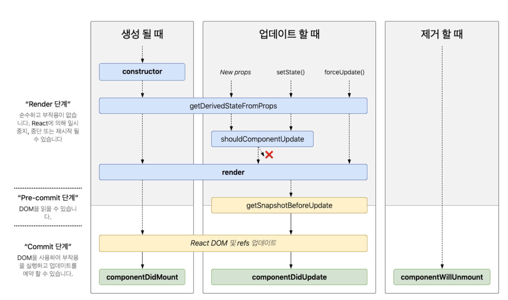

# 컴포넌트의 라이프사이클
컴포넌트의 라이프사이클(Component Lifecycle)은 **컴포넌트가 생성되고 업데이트되며 제거될 때까지의 전체 과정을 의미**합니다.



컴포넌트는 생성(mounting) -> 업데이트(updating) -> 제거(unmounting)의 생명주기를 갖는다.
리액트 클래스 컴포넌트는 라이프 사이클 메서드를 사용하고, 함수 컴포넌트는 Hook을 사용합니다.
### **클래스형 컴포넌트의 라이프사이클**

## **1. 마운트(Mount) – 컴포넌트가 처음 DOM에 삽입될 때**
- 컴포넌트가 생성 될때 발생하는 생명주기들을 알아봅시다.
#### ☑️  **constructor(props)**
컴포넌트 생성자 메서드, 컴포넌트가 생성되면 가장 먼저 실행되는 메서드  
this.props, this.state에 접근이 가능하고 리액트 요소를 반환합니다.
**state 초기화**나 **인스턴스 바인딩 작업**에 사용됩니다.
##### **사용 목적**
- 초기 state 설정
- 이벤트 핸들러 바인딩
##### **사용예시**
```jsx
constructor(props) {
  super(props);
  this.state = { count: 0 };
  this.handleClick = this.handleClick.bind(this);
}
```
##### **⚠️ 주의**
- 반드시 super(props)를 호출해야 this.props를 사용할 수 있습니다.
- DOM에는 아직 접근할 수 없습니다.

#### ☑️ getDerivedStateFromProps
props로부터 파생된 state를 가져옵니다. 즉 props로 받아온 것을 state에 넣어주고 싶을때 사용합니다.
**static getDerivedStateFromProps(props, state)**
props가 변경될 때 호출되며, **state를 props에 따라 동기화할 수 있습니다.**
##### **사용 목적**
- props 기반으로 state를 계산해야 할 때 사용
##### **예시**
```jsx
static getDerivedStateFromProps(nextProps, prevState) {
  if (nextProps.value !== prevState.value) {
    return { value: nextProps.value };
  }
  return null;
}
```
##### **⚠️ 주의**
- **side effect (예: API 호출)** 금지
- 거의 사용되지 않음. 대부분 useEffect 또는 다른 방식으로 처리 가능

#### ☑️ render
컴포넌트를 실제로 그리는 단계입니다. **React 요소를 반환**합니다.
##### **사용 목적**
- JSX를 반환 (뷰 정의)
##### **예시**
```jsx
render() {
  return (
    <div>{this.state.value}</div>
  );
}
```
##### **⚠️ 주의**
- 순수 함수처럼 동작해야 함 (side effect 금지)
- 상태(state)나 props에 따라 결과를 결정

#### ☑️ componentDidMount
컴포넌트가 처음 **DOM에 삽입된 직후 실행**됩니다. 이 시점에 DOM 사용 가능.
컴포넌트가 마운트 됨, 즉 컴포넌트의 첫번째 렌더링이 마치면 호출되는 메서드 입니다.  
이 메서드가 호출되는 시점에는 화면에 컴포넌트가 나타난 상태입니다.  
여기서는 주로 DOM을 사용해야 하는 외부 라이브러리 연동, 해당 컴포넌트에서 필요로 하는 데이터를 ajax로 요청, 등의 행위를 합니다.
##### **사용 목적**
- 초기 데이터 fetch
- 구독 설정, 타이머 등록 등
##### **예시**
```jsx
componentDidMount() {
  fetch('/api/data')
    .then(res => res.json())
    .then(data => this.setState({ data }));
}
```
##### **⚠️ 주의**
- setState를 호출하면 다시 render 발생
- 마운트 이후 한 번만 실행됨

## **2. 업데이트(Update) – props 또는 state가 변경될 때**
컴포넌트가 업데이트되는 시점에 어떤 생명주기 메서드들이 호출되는지 알아봅니다.
#### ☑️ getDerivedStateFromProps
컴포넌트의 props나 state가 바뀌었을때도 이 메서드가 호출됩니다.
업데이트 단계에서는 props/state 변화를 감지한다.
#### ☑️ **shouldComponentUpdate(nextProps, nextState)**
컴포넌트가 **다시 렌더링될지 결정**하는 메서드 (성능 최적화 목적)
##### **사용 목적**
- 불필요한 렌더링 방지
- `React.memo`와 유사함, boolean 반환으로 결정
##### **예시**
```jsx
shouldComponentUpdate(nextProps, nextState) {
  return nextProps.value !== this.props.value;
}
```
#### **⚠️ 주의**
- 기본적으로 항상 true를 반환함
- 복잡할 경우 React.memo나 PureComponent를 고려

#### ☑️ **getSnapshotBeforeUpdate(prevProps, prevState)**
업데이트가 일어나기 직전 호출되며, **렌더 직후 DOM에서 어떤 정보를 저장**하고 싶을 때 사용
##### **사용 목적**
- 스크롤 위치 저장 등
##### **예시**
```jsx
getSnapshotBeforeUpdate(prevProps, prevState) {
  if (this.listRef.scrollHeight > this.listRef.clientHeight) {
    return this.listRef.scrollTop;
  }
  return null;
}
```

#### **⚠️ 주의**
- 반환값은 componentDidUpdate의 세 번째 인자로 전달됨

#### ☑️ **componentDidUpdate(prevProps, prevState, snapshot)**
- 업데이트 후 호출되며, **DOM이 실제로 변경된 뒤 실행됩니다.**
- 컴포넌트가 업데이트 되고 난 후 발생합니다.
- 의존성 배열이 변할때만 useEffect가 실행하는 것과 같음
##### **사용 목적**
- 외부 데이터 fetch
- getSnapshotBeforeUpdate의 결과 처리
##### **예시**
```jsx
componentDidUpdate(prevProps, prevState, snapshot) {
  if (snapshot !== null) {
    this.listRef.scrollTop = snapshot;
  }
}
```
##### **⚠️ 주의**
- setState를 조건 없이 호출하면 무한 루프 발생


## **3. 언마운트(Unmount) – 컴포넌트가 DOM에서 제거될 때**
- 언마운트라는 것은 컴포넌트가 화면에서 사라지는 것을 의미합니다. 언마운트에 관련된 생명주기 메서드는 `componentWillUnmount` 하나입니다.
#### ☑️ **componentWillUnmount()**
컴포넌트가 **DOM에서 제거되기 직전에 호출**됩니다.
##### **사용 목적**
- 타이머 정리
- 이벤트 리스너 제거
- 구독 해제
##### **사용예시**
```jsx
componentWillUnmount() {
  clearInterval(this.timerID);
}
```
##### **⚠️ 주의**
- DOM 조작은 가능하지만 이미 제거되는 시점이므로 최소한의 작업만하는게 좋다.

## **함수형 컴포넌트의 라이프사이클 (Hook 사용)**

함수형 컴포넌트는 useEffect를 활용해 라이프사이클을 처리합니다.
```jsx
import { useEffect } from 'react';

function MyComponent() {
  // 마운트될 때 한 번 실행
  useEffect(() => {
    console.log('컴포넌트 마운트됨');

    // 언마운트 시 정리 작업
    return () => {
      console.log('컴포넌트 언마운트됨');
    };
  }, []);

  // 특정 state가 바뀔 때 실행
  useEffect(() => {
    console.log('특정 값이 변경됨');
  }, []);

  return <div>...</div>;
}
```

#### **요약**

| **단계** | **클래스형 메서드**         | **함수형 방식**                  |
| ------ | -------------------- | --------------------------- |
| 마운트    | componentDidMount    | useEffect(() => {}, [])     |
| 업데이트   | componentDidUpdate   | useEffect(() => {}, [deps]) |
| 언마운트   | componentWillUnmount | useEffect의 return 함수        |
| 공통 초기화 | constructor, render  | 함수 자체                       |
#### **전체 순서 요약 (마운트~언마운트)** - 시간순 요약
각 단계에서 언제 실행되는지 시간 순으로 나열해보겠습니다.

```javascript
Mount:
  constructor → getDerivedStateFromProps → render → componentDidMount
  
	constructor()                // 1. 컴포넌트 생성자 (state, 바인딩)
	getDerivedStateFromProps()   // 2. props 기반으로 state 동기화
	render()                     // 3. JSX를 DOM에 그리기
	componentDidMount()          // 4. DOM 생성 후 실행 (API 호출 등)

Update:
	getDerivedStateFromProps → shouldComponentUpdate → render → getSnapshotBeforeUpdate → componentDidUpdate
  
	getDerivedStateFromProps()   // 1. props/state 변화 감지
	shouldComponentUpdate()      // 2. 리렌더 여부 결정
	render()                     // 3. JSX 다시 그림
	getSnapshotBeforeUpdate()    // 4. 변경 전 DOM 정보 저장
	componentDidUpdate()         // 5. 변경 완료 후 후처리

Unmount:
  componentWillUnmount()       // 제거 직전에 정리 작업
```

React 16 이후로 함수형 컴포넌트와 Hook이 대세이긴 하지만, **클래스형 컴포넌트를 유지보수하거나 마이그레이션할 경우**, 이 라이프사이클 흐름은 반드시 이해하고 있어야 합니다.


## render() 메서드

#### render()** **의 역할은 항상** **“React 요소를 반환하는 것”**
render()는 단순히 **“어떤 UI를 그릴 것인지 정의”** 하는 메서드입니다. 실제로 DOM에 바로 그리는 것이 아니라, **가상 DOM(Virtual DOM)** 을 생성합니다.
### **마운트(Mount) 시**  **render()**
##### **상황**
- 컴포넌트가 처음 화면에 나타날 때
- 최초의 Virtual DOM이 생성됨
##### **동작 방식**
1. render()를 호출하여 Virtual DOM 생성
2. 실제 DOM에 적용 (브라우저에 보여짐)

```
render() {
  return <h1>Hello, world!</h1>;
}
```
### **업데이트(Update) 시**  **render()**
##### **상황**
- setState() 또는 props 변경 → 상태 변경 발생
- React가 다시 render()를 호출하여 새로운 Virtual DOM을 생성
##### **동작 방식**
1. 새로운 Virtual DOM을 다시 생성
2. 이전 Virtual DOM과 비교 (diffing)
3. 달라진 부분만 실제 DOM에 반영 (reconciliation)
  
> **“기존 DOM을 통째로 덮어씌우지 않고, 변경된 부분만 바꾼다.”**
> **업데이트 시 render()는 전체 UI를 “정의”하긴 하지만, 실제 DOM에는 달라진 부분만 갱신됩니다.**

### render() 동작예시
#### **초기 렌더링**
```jsx
this.state = { count: 0 };

// render 결과
<p>Count: 0</p>
```
#### **업데이트 시 (setState({ count: 1 }))
```jsx
// render 결과
<p>Count: 1</p>
```
#### 🔧 React 내부 처리
- 이전: `<p>Count: 0</p>`
- 새로 렌더링: `<p>Count: 1</p>`
- React는 비교 후 0 → 1만 **부분 갱신**
    → p 태그는 그대로 두고, 텍스트 노드만 바뀜
    
#### **정리**

| **단계** | render() **목적**    | **실제 DOM 처리**                        |
| ------ | ------------------ | ------------------------------------ |
| 마운트    | UI를 처음 정의          | 전체 DOM 생성                            |
| 업데이트   | 새로운 Virtual DOM 생성 | **변경된 부분만 실제 DOM에 반영** (효율적 diffing) |

React는 항상 전체 render()를 호출하는 것처럼 보이지만, **실제로는 내부에서 매우 효율적으로 업데이트**하기 때문에 성능 걱정은 거의 없습니다. 직접 DOM 조작하는 것보다 훨씬 빠릅니다.


