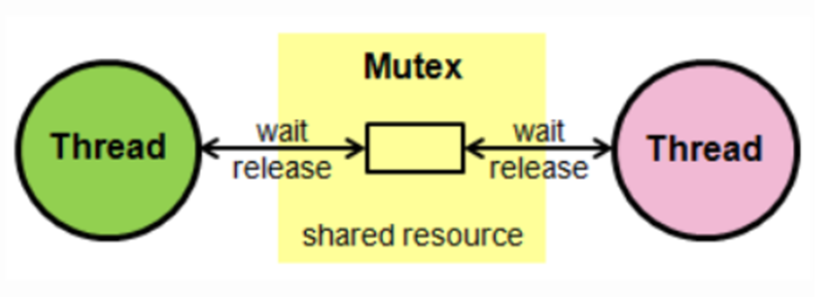

뮤텍스와 세마포어에 대해 알아보기 전에, 다음 가정에 대해 얘기해봅시다.
> 만약, 동시에 여러 스레드가 공유 자원에 접근하면 어떻게 될까? 아마 race condition에 놓여 프로그램의 안정성과 일관성을 해치게 될 것이다.
>
> **Race condition(경쟁 상태)** 란?  
> 여러 개의 비동기 작업이나 스레드가 동시에 같은 자원에 접근하거나 변경하려고 할 때, 실행 순서에 따라 결과가 달라질 수 있는 상황
>
> 은행 계좌 잔액이 1000원이 있다고 합시다. 두 개의 프로세스가 동시에 이 계좌에서 각각 500원을 출금하려고 할 때,
>
> - 프로세스 A: 현재 잔액 조회 → 1000원
> - 프로세스 B: 현재 잔액 조회 → 1000원
> - A가 1000 - 500 = 500 → 저장
> - B도 1000 - 500 = 500 → 저장
>
> 결과적으로 잔액은 500원이 남게 되는 데, 실제로는 1000원에서 1000원이 빠졌어야 하니까 0원이 되어야하기 때문에 비정상 동작입니다.

다음과 같은 문제가 발생할 것 같습니다.

1. 일관성 없는 데이터 : 두 개 이상의 스레드가 동시에 공유 자원을 변경하거나 읽을 때 서로 다른 데이터를 읽게되어 다른 정보를 제공 받을 수 있습니다.
2. 데드락(deadlock) : 두 개 이상의 스레드가 서로 다른 자원을 점유하고, 서로 상대방의 자원을 기다릴 때 교착상태가 발생할 수 있습니다.
3. 성능 저하 : 스레드간의 경쟁 상황으로인해 성능이 저하됩니다.

이러한 상황을 방지하기 위해서 동기화 기법인 뮤텍스나 세마포어를 사용하여 하나의 스레드만이 공유자원에 접근할 수 있도록 제한 해야하며, 이때 등장하는 것이 **뮤텍스**와 **세마포어**입니다.

## 뮤텍스(Mutex)

Mutual Exclusion(상호간의, 제외)의 합성어로, 공유된 자원의 데이터나 임계영역(critical section) 같은 곳에 스레들의 running time이 서로 겹치지 않게 하나의 프로세스 또는 스레드가 접근하는 것을 막습니다.

뮤텍스는 동기화 대상이 하나인게 특징입니다.  
다른 스레드들은 뮤텍스의 lock을 가지기 위해 대기하며. 락을 해제하는 스레드가 있을 때까지 다른 스레드들은 접근하지 못합니다.

뮤텍스는 화장실이 하나 밖에 없는 식당과 비슷합니다. 화장실을 가기 위해서는 카운터에서 열쇠를 받아 가야 하며 당신이 화장실을 가려고 하는데 카운터에 키가 있으면 화장실에 사람이 없다는 뜻이고 당신은 그 열쇠를 이용해 화장실에 들어갈 수 있다고 가정합니다.

카운터에 열쇠가 없기 때문에 화장실에 사람이 있다는 뜻이며 화장실을 사용할 수 없습니다. 여자가 나올 때 까지 기다려야 합니다.

곧이어 다른 사람도 화장실에 가려고 카운터에 대기하고 있습니다. 앞사람이 화장실에서 나와 카운터에 키를 돌려놓았습니다. 이제 기다리던 사람들 중 맨 앞에 있던 사람이 키를 받아 화장실에 갈 수 있습니다.

이것이 뮤텍스가 동작하는 방식입니다. 화장실을 이용하는 사람은 프로세스 혹은 쓰레드이며 화장실은 공유자원, 화장실 키는 공유자원에 접근하기 위해 필요한 어떤 오브젝트입니다. 즉, 뮤텍스는 Key에 해당하는 어떤 오브젝트가 있으며 이 오브젝트를 소유한 (쓰레드,프로세스) 만이 공유자원에 접근할 수 있습니다.

대표적으로 은행 계좌 출금 처리등에서 사용 합니다.

## 세마포어 (Semaphore)

공유된 자원의 데이터 혹은 임계영역(Critical Section) 등에 여러 Process 혹은 Thread가 접근하는 것을 막습니다. (동기화 대상이 하나 이상)

사용하고 있는 스레드/프로세스의 수를 공통으로 관리하는 하나의 값을 이용해 상호배제를 달성합니다. 공유 자원에 접근할 수 있는 프로세스의 최대 허용치만큼 동시에 사용자가 접근할 수 있으며, 각 프로세스는 세마포어의 값을 확인하고 변경할 수 있습니다.  
자원을 사용하지 않는 상태가 될 때, 대기하던 프로세스가 즉시 자원을 사용하고. 이미 다른 프로세스에 의해 사용중이라는 사실을 알게 되면, 재시도 전에 일정시간 대기해야 합니다.일반적으로 비교적 긴 시간을 확보하는 리소스에 대해 사용하게 됩니다.

세마포어는 손님이 화장실을 좀 더 쉽게 이용할 수 있는 레스토랑입니다. 세마포어를 이용하는 레스토랑의 화장실에는 여러 개의 칸이 있고 화장실 입구에는 현재 화장실의 빈 칸 개수를 보여주는 전광판이 있다고 가정합니다.

만약 당신이 화장실에 가고 싶다면 입구에서 빈 칸의 개수를 확인하고 빈 칸이 1개 이상이라면 빈칸의 개수를 하나 뺀 다음에 화장실로 입장해야 하며 나올 때 빈 칸의 개수를 하나 더해줍니다.

모든 칸에 사람이 들어갔을 경우 빈 칸의 개수는 0이 되며 이때 화장실에 들어가고자 하는 사람이 있다면 빈 칸의 개수가 1 혹은 양수로 바뀔 때까지 기다려야 합니다. 이처럼 세마포어는 공통으로 관리하는 하나의 값을 이용해 상호배제를 달성합니다.  
세마포어도 아까와 똑같이 화장실이 공유자원이며 사람들이 쓰레드, 프로세스이다. 그리고 화장실 빈칸의 개수는 현재 공유자원에 접근할 수 있는 쓰레드, 프로세스의 개수를 나타냅니다.

만약 15인 제한 채팅방이라면 15개의 접근이 가능한 세마포어 형식으로 구현 가능 할 것 같습니다.  
일반적으로는 DB 연결 풀, API 요청 제한 등에 사용됩니다.

## 두 방식을 표로 정리

| 구분           | 뮤텍스 (Mutex)                                      | 세마포어 (Semaphore)                                 |
|----------------|------------------------------------------------------|------------------------------------------------------|
| **동시 접근 수** | 하나만 (1개 스레드만 접근 가능)                     | 여러 개 (N개까지 허용)                               |
| **용도**        | 하나의 리소스를 하나의 스레드가 독점적으로 쓸 때 사용 | 제한된 수의 리소스를 여러 스레드가 공유할 때 사용    |
| **값의 범위**   | 0 또는 1 (Lock/Unlock 상태)                         | 0 이상 (초기값 N에 따라 여러 스레드 접근 가능)       |
| **소유 개념**   | 소유 개념 존재 (락을 건 스레드만 해제 가능)          | 소유 개념 없음 (누가 접근했는지 중요하지 않음)        |
| **해제 방식**   | 락을 획득한 스레드만 해제 가능                       | 어떤 스레드든지 해제 가능                             |
| **주 사용 예**  | 파일 쓰기, 데이터 수정 등 단일 자원 보호              | DB 커넥션 풀, 제한된 리소스 접근                      |

뮤텍스와 세마포어는 모두 완벽한 기법은 아니므로 데이터 무결성을 보장할 수는 없으며 모든 교착상태를 해결하지는 못합니다. 하지만 상호배제를 위한 기본적인 문법이며 여기에 좀 더 복잡한 매커니즘을 적용해 개선된 성능을 가질 수 있도록 하는 것이 중요합니다.
