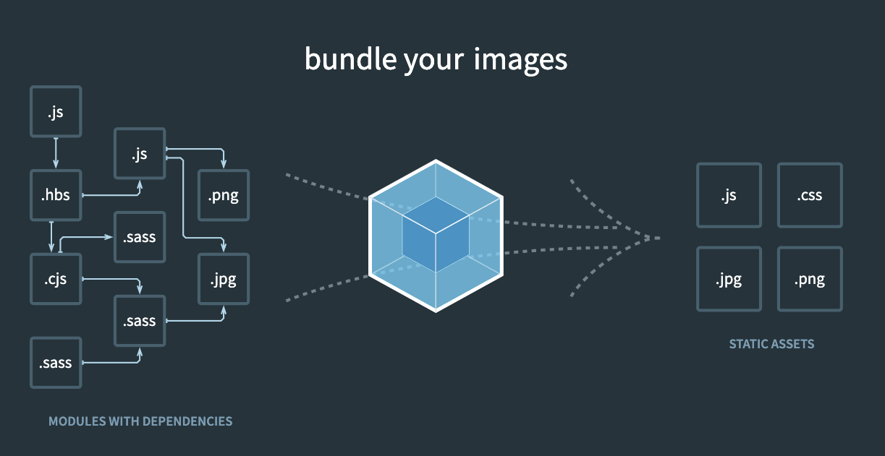

## 웹팩(Webpack)

웹팩은 웹 애플리케이션에서 사용하는 수많은 리소스를 하나의 파일로 병합 및 압축 해주는 모듈 번들러입니다.

> 🔍 **어원**
>
>Web(웹 애플리케이션) + Pack(묶다) → 웹에서 사용하는 다양한 자원을 하나로 묶어주는 도구라는 의미입니다.  
> 웹 개발에서 스크립트나 스타일 파일등 *(이것들을 모듈이라고 합니다.. 바로 아래있음!)* 이 흩어져 있었는데, 이걸 하나로 포장(pack)해서 관리하기 쉽게 하자는 철학이 이름에 담겨 있어요.

## 모듈(Module)

모듈(Module)은 하나의 파일 단위로 독립적인 기능을 가진 코드 조각을 의미합니다.  

- **JavaScript에서의 모듈** :  특정 기능을 가진 코드들을 하나의 파일로 관리합니다. import와 export를 사용하여 모듈 간의 의존성을 정의하고, 재사용이 가능한 구조를 만들 수 있습니다.  
- **웹팩에서의 모듈** : JavaScript의 모듈 뿐만이 아니라 HTML, CSS, Images, Font 등 웹 애플리케이션을 구성하는 모든 자원을 의미합니다.

## 모듈 번들링(Module Bundling)

모듈 번들링(Module Bundling)이란, 여러 개의 모듈을 하나의 파일로 합치는 작업입니다.  
브라우저는 ES Module 또는 CommonJS를 바로 이해하지 못하므로, 이를 브라우저가 이해할 수 있는 하나의 JavaScript 파일로 변환하는 과정이 필요합니다. 웹팩은 이 과정을 자동으로 수행합니다.

> 빌드, 번들링, 변환 이 세단어 모두 같은 의미! (저는 처음에 좀 헷갈렸습니다..)

아래 그림은 이미지를 번들링 하는 과정을 설명하고 있습니다.  
다양한 형태의 모듈이 합쳐져서 브라우저가 이해할 수 있는 네가지 번들 파일로 변경되는 과정입니다.



이때 중간에서 번들링을 해주는 도구를 모듈 번들러(Module Bundler)라고 합니다.  
그중 현재 프론트에서 가장 많이 쓰이는 번들러는 웹팩(Webpack)과 비트(Vite)입니다.

### 모듈 번들러 비교 (Webpack vs Vite)

| 항목            | Webpack                                                      | Vite                                                            |
|-----------------|---------------------------------------------------------------|------------------------------------------------------------------|
| **기반 기술**   | CommonJS, 자체 번들링                                        | ES Modules + Rollup 기반                                        |
| **개발 서버 속도**| 느림 (전체 번들링 후 제공)                                   | 매우 빠름 (On-demand 기반 HMR)                                  |
| **설정**        | 복잡한 설정 필요 (webpack.config.js)                         | 기본 설정만으로도 충분, 필요 시 확장 가능                      |
| **로더/플러그인**| 다양한 로더와 플러그인 생태계                                 | 플러그인은 Rollup 기반으로 동작                                 |
| **빌드 속도**   | 최적화 필요, 번들 용량 관리가 중요                            | 빠른 개발 환경, 빌드 단계는 Rollup이 처리                        |
| **사용 사례**   | 대규모 프로젝트, 정교한 커스터마이징이 필요한 경우          | 빠른 개발 피드백이 중요한 중소형 프로젝트에 적합                |
| **러닝 커브**   | 비교적 높음                                                  | 낮음 (빠르게 시작 가능)                                          |

> **Rollup이란?**
>
> Rollup은 JavaScript 모듈을 번들링해주는 모듈 번들러입니다. Vite의 프로덕션 번들링 도구로 사용되며, ES Modules(ESM) 에 최적화되어 있고 트리 셰이킹(Tree-shaking)이 강력한 특징을 가지고 있습니다.
>
> Rollup의 주요 특징:
>
> - ES Module 중심의 번들링
> - 트리 셰이킹 지원으로 불필요한 코드 제거
> - 작은 번들 크기와 빠른 로딩 시간
> - 플러그인 기반 구조로 유연한 확장 가능
> - 라이브러리 제작에 적합 (단일 번들 생성이 용이)
>
> ✅ Vite는 개발 서버에서 빠른 HMR과 즉시 시작을 지원하고, 프로덕션 빌드 시에는 Rollup을 통해 최적화된 번들링을 수행합니다.

> **On-demand 기반 HMR이란?**
>
> On-demand(온디맨드)는 "요구 시" 또는 "필요할 때마다" 라는 의미를 가집니다.  
> 처음부터 모든 것을 미리 로드하는 것이 아니라, 실제로 필요한 시점에 필요한 리소스만 로드하거나 처리하는 방식입니다.  
> On-demand 방식을 사용하면 **초기 로딩 속도를 줄이고, 필요한 부분만 동적으로 불러올 수 있어 효율적인 리소스 사용**이 가능합니다.
>
> 그래서 On-demand 기반 HMR(Hot Module Replacement)이란, 전체 애플리케이션을 다시 번들링하지 않고 변경된 모듈만 즉시 갱신하여 적용하는 방식입니다. Vite는 개발 중 변경된 파일만 빠르게 반영하고, 브라우저에 실시간으로 전달하여 빠른 피드백을 제공합니다.
>
> - 전체 번들 재생성 없이 빠른 반영
> - 빠른 개발 경험 제공
> - 메모리와 리소스 낭비 감소
>
> ✅ Vite는 ES Modules의 동적 import 기능을 활용하여 변경된 모듈만 즉시 가져오므로, 대규모 프로젝트에서도 매우 빠른 HMR 성능을 보장합니다.

## 웹팩의 등장 이유

웹 개발 초기에는 HTML 문서 내에서 여러 개의 `<script>` 태그를 사용하여 JavaScript 파일들을 불러왔습니다. 하지만 프로젝트 규모가 커지고, 의존성이 복잡해질수록 다음과 같은 문제들이 발생했습니다:

- 스크립트 로딩 순서 문제
    - 예시 : jquery.js를 먼저 로드하지 않고 jquery.plugin.js를 먼저 로드하면 오류 발생
- 네임스페이스 충돌 및 전역 변수 오염
    - 예시: `<script>` 태그를 사용 불러온 다른 두 개의 라이브러리에서 모두 utils라는 전역 객체를 사용하면 덮어써지거나 충돌 발생
- 파일 수가 많아지며 HTTP 요청 증가로 인한 성능 저하
     - 예시: 100개의 JS/CSS 파일을 각각 `<script>`나 `<link>`로 로딩하면 브라우저가 처리할 요청 수가 증가해 로딩 속도 저하
- 유지보수 및 모듈화의 어려움
    - 예시: 특정 기능이 어디서 정의되고 어디서 사용되는지 파악이 어려움 → 디버깅, 협업, 확장성이 낮음

이러한 문제를 해결하고, 모듈 기반 개발을 지원하기 위해 등장한 도구가 웹팩입니다.

### 웹 개발 작업 자동화 도구

이전부터 프런트엔드 개발 업무를 할 때 가장 많이 반복하는 작업은 텍스트 편집기에서 코드를 수정하고 저장한 뒤 브라우저에서 새로 고침을 누르는 것이었습니다. 그래야 화면에 변경된 내용을 볼 수 있었죠.

이외에도 웹 서비스를 개발하고 웹 서버에 배포할 때 아래와 같은 작업들을 해야 했습니다.

- HTML, CSS, JS 압축
- 이미지 압축
- CSS 전처리기 변환

이러한 일들을 자동화 해주는 도구들이 필요했습니다. 그래서 Grunt와 Gulp 같은 도구들이 등장했습니다.

### 웹 애플리케이션의 빠른 로딩 속도와 높은 성능

일반적으로 특정 웹 사이트를 접근할 때 5초 이내로 웹 사이트가 표시되지 않으면 대부분의 사용자들은 해당 사이트를 벗어나거나 집중력을 잃게 됩니다.

그래서 웹 사이트의 로딩 속도를 높이기 위해 많은 노력들이 있었습니다. 그 중 대표적인 노력이 브라우저에서 서버로 요청하는 파일 숫자를 줄이는 것입니다. 이를 위해 앞에서 살펴본 웹 태스크 매니저를 이용해 파일들을 압축하고 병합하는 작업들을 진행했습니다.

뿐만 아니라 초기 페이지 로딩 속도를 높이기 위해 나중에 필요한 자원들은 나중에 요청하는 레이지 로딩(Lazy Loading)이 등장했죠.

웹팩은 기본적으로 필요한 자원은 미리 로딩하는게 아니라 그 때 그 때 요청하자는 철학(HMR)을 갖고 있습니다.

### 웹팩의 이점

- 모듈화된 개발 환경 지원
- 코드 스플리팅(Code Splitting)을 통한 성능 향상
- 다양한 로더(Loader)로 CSS, 이미지 등 비JS 자원도 처리 가능
- 플러그인(Plugin) 시스템을 통한 확장성
- 트리 셰이킹(Tree-shaking)으로 불필요한 코드 제거 가능
- HMR(Hot Module Replacement)을 통한 빠른 개발 경험 제공

> **트리 셰이킹(Tree-shaking)이란?**  
트리 셰이킹은 불필요한 코드(사용되지 않는 코드)를 제거하는 최적화 기법입니다. JavaScript에서, ES 모듈을 사용하여 모듈의 의존성을 분석하고, 사용되지 않는 함수나 변수를 번들에서 제거합니다. 이는 최종 번들 크기를 줄이고 성능을 개선하는 데 도움을 줍니다.

> **코드 스플리팅(Code Splitting)이란?**  
코드 스플리팅은 애플리케이션을 여러 개의 작은 파일로 분할하는 기법입니다. 이를 통해 초기 로딩 시간을 줄일 수 있으며, 필요한 파일만 동적으로 로드하여 성능을 향상시킵니다. 웹팩에서는 dynamic import()를 사용하여 이를 구현하고, 각 코드 조각이 필요한 시점에 로드될 수 있도록 합니다.

### 웹팩과 Vite의 HMR 동작 차이

**웹팩의 HMR**  
웹팩은 전체 애플리케이션을 번들링하고, 파일 변경 시 전체 번들을 다시 갱신합니다.  
이 방식은 대규모 애플리케이션에서 느릴 수 있으며, 변경된 모듈만 업데이트하는 방식도 있지만 여전히 전체 번들 갱신 시간이 소요될 수 있습니다.

**Vite의 HMR**  
Vite는 On-demand 방식으로 HMR을 처리하며, 변경된 모듈만 즉시 반영하여 빠르게 브라우저에 전달합니다.  
ES Modules을 기반으로 하여, 빠른 개발 피드백과 효율적인 리소스 사용이 가능합니다.  
Vite는 프로덕션 빌드에서 Rollup을 사용하고, 개발 환경에서는 모듈을 즉시 반영하여 애플리케이션을 빠르게 리프레시합니다.

## 웹팩의 주요 속성 4가지

### 1. Entry

- **동작**  
    Entry는 웹팩이 어디서부터 의존성을 분석할지 정의하는 속성입니다. 즉, 웹팩이 번들링을 시작할 첫 번째 파일을 지정합니다. 웹팩은 이 파일에서부터 시작해, 그 파일이 의존하는 다른 모듈들을 모두 찾아서 의존성 그래프를 만듭니다.

- **정의 시점**  
    webpack.config.js 파일에서 entry 속성으로 정의됩니다. 보통 프로젝트의 진입점인 JavaScript 파일을 지정합니다.

    ```javascript
    module.exports = {
    entry: './src/index.js',
    };
    ```

### 2. Output

- **동작**  
    Output은 번들링된 결과물이 저장될 위치와 파일 이름을 지정합니다. 웹팩은 모든 의존성을 분석한 후, 최종적으로 하나 이상의 파일을 생성하고 이를 지정한 위치에 저장합니다. 이 때 파일 이름도 설정할 수 있습니다.

- **정의 시점**  
    webpack.config.js 파일에서 output 속성으로 정의됩니다.

    ```javascript
    module.exports = {
    output: {
        path: path.resolve(__dirname, 'dist'),
        filename: 'bundle.js',
    },
    };
    ```

    이 설정은 dist 폴더에 bundle.js라는 이름으로 번들된 파일을 저장합니다.

### 3. Loader

- **동작**  
    Loader는 웹팩이 JavaScript 외의 파일(예: CSS, 이미지, TypeScript, SASS 등)을 처리할 수 있게 도와주는 변환 도구입니다. 웹팩은 기본적으로 JavaScript 파일만 처리하지만, loader를 사용하면 다양한 파일 형식을 번들링에 포함시킬 수 있습니다.

- **정의 시점**  
    webpack.config.js 파일에서 module.rules 속성 내에 정의됩니다. 각 파일 유형에 대해 어떤 loader를 사용할지를 지정합니다.

    ```javascript
    module.exports = {
    module: {
        rules: [
        {
            test: /\.css$/,
            use: ['style-loader', 'css-loader'],
        },
        ],
    },
    };
    ```

    이 설정은 .css 파일을 처리하기 위해 style-loader와 css-loader를 사용합니다.

### 4. Plugin

- **동작**  
    Plugin은 번들링 과정 전반을 제어하거나 확장하는 기능을 제공합니다. Plugin은 웹팩의 빌드 프로세스에서 다양한 작업을 수행할 수 있습니다. 예를 들어, 파일 압축, HTML 템플릿 생성, 환경 변수 설정 등 다양한 작업을 처리할 수 있습니다.

- **정의 시점**  
    webpack.config.js 파일에서 plugins 배열 내에 정의됩니다. 여러 가지 플러그인을 배열 형식으로 추가할 수 있습니다.

    ```javascript
    const HtmlWebpackPlugin = require('html-webpack-plugin');

    module.exports = {
    plugins: [
        new HtmlWebpackPlugin({
        template: './src/index.html',
        }),
    ],
    };
    ```

    이 설정은 HtmlWebpackPlugin을 사용하여 HTML 파일을 생성하고, 그 안에 번들된 JavaScript 파일을 자동으로 포함시킵니다.

### 전체적인 흐름

1. Entry에서 시작하여 웹팩은 의존성 그래프를 생성하고 각 모듈을 분석합니다.
2. 이후 Loader를 통해 JavaScript 외의 다른 파일 형식들을 처리하며, Output에 정의된 대로 최종 결과물을 생성하고 저장합니다.
3. 이 과정에서 Plugin을 사용하여 빌드 프로세스를 확장하고, 추가적인 작업을 처리할 수 있습니다.

이 속성들은 webpack.config.js 파일에서 정의됩니다.
