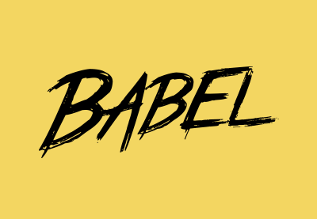
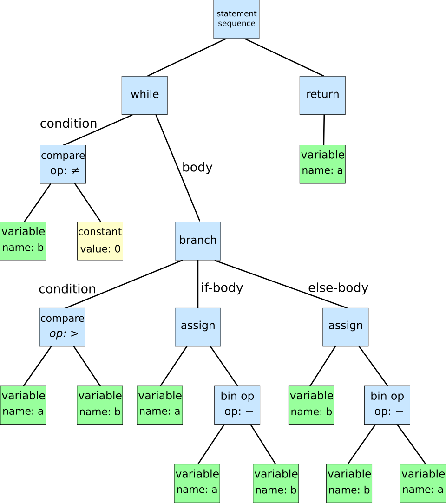

## 바벨(Babel)

사실 개발자가 아니여도 바벨이라는 단어는 종종 들어봤을텐데, 아마 바벨탑때문에 익숙할 것같아요.

본격적인 내용에 들어가기에 앞서 바벨탑에 대해 잠시 얘기해보려 합니다.

> **바벨탑 이야기**
>
> 아니 무슨 바벨 공부하러 와서 바벨탑 타령 😪
>
>이라는 생각이 들겠지만 우리가 알려는 바벨(Babel)의 이름이 붙은 유래가 바벨탑에서 나오기 때문에 한번 간단하게나마 알아보고나면 이게 나중에도 더 기억이 잘 날 것 같습니다.
>
>간단하게 설명하자면, 사람들이 아주 높은 바벨탑이라는 걸 만들고자 했는데, 각 사람들의 언어가 달라서 결국 바벨탑을 만들지 못하게 된다는 이야기입니다.
>
>핵심은 **각 사람들의 언어가 달라 의사소통이 원활하게 이루어지지 않았다는 것!**

## 바벨은 뭔데?

우리가 알고자하는 바벨(Babel)이란, 최신 Javascript 문법으로 작성 된 코드를 이전 Javascript 문법으로 변환 시켜주는 도구(트랜스파일러 - Transpiler)입니다.

> **트랜스파일러(Transpiler)**
>
>컴파일러는 들어봤어도 트랜스파일러를 잘 모르는 사람이 많은데요. 컴파일러는 사람이 이해할 수 있는 고수준 언어에서 컴퓨터가 실행할 수 있고, 이해할 수 있는 저수준 언어(기계어)로 변환해주는 것을 말합니다.
>
>그렇다면 트랜스파일러는 무엇일까요?  
>
>트랜스파일러는 컴파일러 처럼 다른 언어로 변환되는 것이 아닌, 같은 언어로 변환되지만 바뀌는 것은 문법적인 부분입니다. (Babel과 TypeScript, SASS 등)  
>
> 그렇다면 자바스크립트 언어로 개발부터 실행까지의 순서는 아래와 같지 않을까요?  
>
> - 개발자 > 고수준 언어 > 트랜스파일 > 컴파일 > 컴퓨터

Javascript는 ECMAScript라는 표준이 존재하고, 이 표준에 따라 Javascript를 개발합니다.  
ECMAScript 매년 새로운 버전을 만드는데, 그 중 ES5에서 ES6이 되면서 새로운 기능들이 많이 추가가 되었습니다. (현재 가장 많이 씀..)

그리고 여기서 한 가지 문제가 발생하는데요.  
최신 버전의 브라우저에서는 이를 잘 소화해낼 수 있었지만, 예전 브라우저를 쓰는 사람들에게는 호환이 되지 않았던 것.. (업데이트를 멈춘 브라우저를 쓰면 안되는 이유... aka 인터넷 익스플로러..)

개발자들은 ES6 이상의 문법을 ES5로 변환하는 도구를 만드는 해결법을 생각해냈고, 바벨의 시초라고 할 수 있는 [6to5](https://github.com/6to5)라는 프로젝트를 진행했습니다. 이 프로젝트가 추후 Babel이라는 이름으로 재탄생합니다. [(공식 홈페이지)](https://babeljs.io/docs/#babel-is-a-javascript-compiler)

정리하자면 **바벨은 최신 Javascript 문법을 이전 브라우저에서도 돌아 갈 수 있게끔 변환 시켜주는 도구** 라고 할 수 있습니다.

즉, 바벨탑 건설할 때 언어가 달라서 의사소통이 안됐던 것처럼, Javascript의 버전 차이로 브라우저가 문법을 몰라 실행하지 못하는 상황이었기 때문에 바벨이라는 가지게 되었습니다.

### 자주 사용되는 Babel Preset

바벨은 프로젝트 빌드 시 웹팩(Webpack)과 같은 빌드 시스템과 함께 동작시키는게 보편적인 사용법인데요. 웹팩에서는 babel-loader 모듈로 babel preset 들을 지정해줄 수 있습니다. 프리셋은 목적에 맞게 코드를 모아놓은 하나의 세트로 이해하면 되고 아래는 자주 사용하는 바벨의 preset들 입니다.

- preset-env : ES6 -> ES5 변환
- preset-react : react 변환
- preset-typescript : typescript 변환
- preset-flow : flow 변환

예시로 @babel/preset-env에 포함된 @babel/plugin-transform-arrow-functions 이라는 preset도 존재합니다. 이름 그대로 화살표 함수 문법을 ES5 형태로 변환시켜줘요. 이렇게 필요한 기능들의 프리셋만 설치해서 사용할 수 있는 장점이 있습니다.

## 바벨 동작 원리

바벨은 코드를 변환함에 있어서 크게 3단계로 나누어집니다.

- 1단계 - 파싱(parsing)
- 2단계 - 변환(transformation)
- 3단계 - 출력(printing)

### 1단계 - 파싱 (Parsing)

첫번째 단계에서는 기존 소스코드를 읽어낸 뒤, AST(추상 구문 트리)로 변환한다.

> **AST - 추상구문트리**
>
>이 트리의 각 노드는 소스 코드에서 발생되는 구조를 나타냅니다. 구문이 추상적이라는 의미는 실제 구문에서 나타나는 모든 세세한 정보를 나타내지는 않는다는 것을 의미합니다.
>

쉽게 생각하자면 소스코드를 수정하기 쉬운 구조로 변환해 두는 사전 작업입니다.

### 변환 (Transformation)

핵심이라고 할 수 있는 두 번째 단계에서는, 이전 단계에서 변환을 완료한 AST를 정해진 규칙(Rule)에 맞게 변경합니다.

> 이때 규칙(Rule)이 바벨의 플러그인 입니다.
> 개발을 하면서 이러한 플러그인을 하나만 쓰는 일은 없습니다. 이것저것을 조합해서 사용해야 할 텐데, 이걸 개발자가 일일이 추가해준다면 분명 실수하는 일이 생기겠죠.
>
> 바벨도 이를 예상하고 위에서 설명한 프리셋이라는 것을 만들었습니다! (똑똑한 사람들..) 쉽게 말하자면 자주 쓰는 플러그인들을 조합해 놓은 것으로 생각하면 좋아요.

이 과정에서 ES6+의 문법으로 작성된 코드가 ES5문법으로 변환된다고 할 수 있어요.

### 3단계 - 출력 (Printing)

ES6+에서 ES5로 코드가 변환되었지만, 아직 AST(추상 구문 트리)인 상태이기 때문에 사용할 수 없습니다.  
이후 작업을 위해 소스코드가 필요하므로 마지막 단계에서 AST를 소스코드로 변환합니다.

이 작업을 끝으로 ES6+ 문법의 코드를 ES5 문법으로 변환하는 과정이 마무리 되었습니다.

## 조금 더 공부하기 - 폴리필 (Polyfill)

폴리필은 직역하자면 충전 솜을 의미합니다. 솜이 꺼졌을 때 메우는 역할을 하는 것을 충전 솜이라고 하는데, 자바스크립트는 무엇을 메울려고 폴리필을 사용할까요?

정답은 브라우저에서 지원하지 않는 코드를 사용가능한 코드 조각이나 플러그인(추가기능)을 메우기 위해서 사용해요.

브라우저에서 지원하지 않아서 바벨이 언어를 바꿔주는 것 아닌가요? 라는 의문이 들 수 있습니다.

바벨은 ES6+ 에서 지원하는 문법을 ES5 문법으로 번역해주지만, ES5에 존재하지 않는 ES6의 API들 (예 : Map, Promise, Set, Object.assigin())은 존재하지 않으니 번역 자체를 해줄수가 없습니다.  
이 부분을 매우기 위해 polyfill 을 사용합니다.

폴리필은 Map, Promise, Set 등을 사용가능한 객체로 만들어줍니다.
